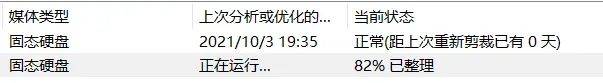
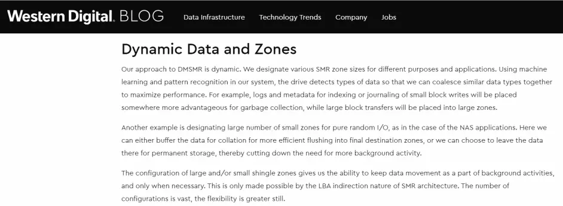
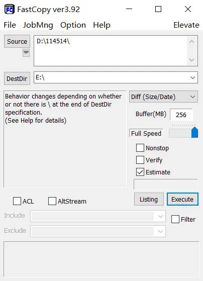
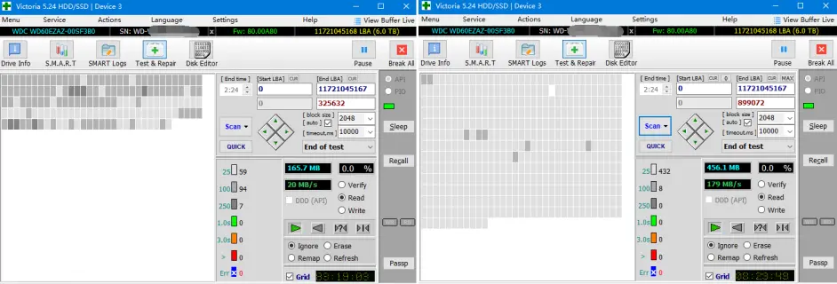
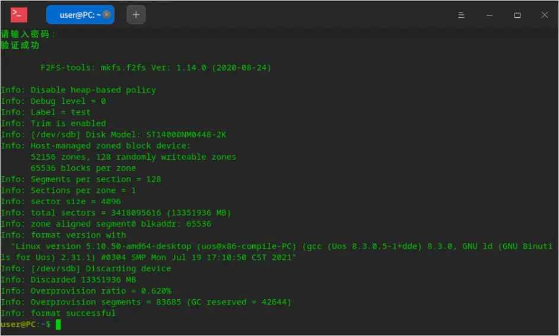

# SMR叠瓦盘原理及终极使用指南

> 文章来源：https://www.bilibili.com/read/cv13439596/

## 为什么要写这篇文章

众所周知，SMR叠瓦式硬盘是装机圈的大坑之一。许多人唯恐避之不及，转身却又掉进各种翻新“垂直硬盘”的大坑。对电脑略懂一二的人都知道“叠瓦”可以帮助机械硬盘提升密度从而降低成本，但是性能却更差，所以就可以和“垂直盘”卖一个价摆烂。但是关于叠瓦盘的工作原理却一问三不知。

在看了目前网上各种对于叠瓦式硬盘的科普及使用建议后，笔者认为大部分科普的内容并不够全面。这半年多以来通过各种渠道和自己的上手测试对这项技术有了比较清晰的认识，这篇文章便是最终的产物。

本篇文章将会结合各种论文和测试数据，从叠瓦盘的前世今生讲起，分析三家机械硬盘厂商叠瓦盘的不同策略并给出叠瓦盘使用的终极指南。

本人并不是业内人士，因此没有任何利益相关的地方。但这也意味着一些猜测的部分可能有误，欢迎各位专业人士指正。

## 摩尔定律的终结？

这一切的起因要从磁头的设计讲起。

图上的是80年代硬盘的一个磁头，工作原理很简单。滑块（Slider）的作用是引导气流使得整个磁头悬浮在盘片上方，读和写使用的是同一个线圈。写入时线圈通电产生磁场，磁化盘片上的磁性颗粒；读取则是磁化的颗粒通过线圈下方产生的感应电流经由前置放大器（Preamplifier）放大之后由主控解码数据。由于中心的磁芯是使用铁氧体制造的，因此也叫做铁氧体磁头（Ferrite Head）。

后面由于磁盘密度的增加，线圈绕制的精度已经无法满足需求，于是便出现了薄膜磁头。

薄膜磁头的核心技术是使用类似光刻的方法直接在一片硅晶圆上成像磁头的结构并进行蚀刻，由此制造的磁头精度可以非常高，这项工艺一直延续到了现在。

然后...

IBM推出了世界上第一块3.5英寸，1GB的硬盘（0663 Corsair），仅使用了8张盘片。

其中使用的一项最重要的发明是磁阻（MR）磁头，由于磁道越来越窄，仅使用线圈读取的灵敏度已经无法满足要求。IBM使用磁阻效应增加了读磁头的灵敏度，并在之后使用了巨磁阻（GMR）效应发明了比MR更加灵敏的磁头。

今天的家用硬盘使用的仍是零几年经由GMR改进的“量子力学”磁头（TMR/TGMR/TuMR，隧穿磁阻磁头）

 

不管怎样，MR磁头的发明意味着读和写磁头就此分开了。

尽管读头变得越来越灵敏，写头却一直是线圈通电产生磁场的基础款。在写入时难免会对相邻磁道造成影响，从而在一定程度上限制了磁道的密度。这个瓶颈催生了诸如磁头加热器这样的黑科技，通过热胀冷缩的原理精确控制写头离盘片的距离从而减小写入信号的影响范围。“硬盘工作时磁头离盘片仅几纳米”便是描述写磁头的。

HGST: Thermal Fly-height Control (TFC) Technology in HGST Hard Disk Drives

但即便如此，写磁头在当时依然是硬盘的主要瓶颈。为了避免写入的时候影响相邻的磁道，硬盘厂商被迫在每条磁道两边留下空白的安全区间。这同样制约了硬盘的单碟密度：单碟1TB的3.5寸硬盘的磁道宽度卡在了75nm，预言存储容量每两年便翻番的摩尔定律看似就要终结。

为了继续提升存储密度的唯一一条路只有改进写头，但是诸如热辅助磁记录之类的解决方案却迟迟未出，行业急需一个替代方案。

## 无 间 道

第一个解决方案是HGST在2013年发布的氦气填充式硬盘，通过在盘腔内部充入比空气密度更小的氦气以减小气流扰动，从而得以使用更薄的盘片。并用7张盘片堆出了6TB的容量。

He6系列充氦硬盘的14个磁头

而希捷这边也没闲着：推出了Archive HDD应战，仅用了4张盘片便达到了5TB的容量。

https://www.memory4less.com/seagate-archive-5tb-sata-6-0-gbps-hard-drive-st5000as0011

达到如此高单碟密度的方式便是叠瓦式磁记录（Shingled Magnetic Recording，SMR）。

Seagate: SMR (Shingled Magnetic Recording) Technology Increases Drive Capacity

Shingle本来的意思是屋顶的瓦片，而“叠瓦式磁记录”从字面意思上便可以看出是使用类似瓦片堆叠的方式来重叠磁道。

Toshiba Review: Shingled Magnetic Recording Technologies for Large-Capacity Hard Disk Drives

既然写入的时候会影响相邻的磁道，那干脆不去避免它就好了。每一条磁道在写入时都允许覆盖上一条磁道与之重叠的一部分，而读取磁头由于更灵敏依然可以正常读取上一条磁道未被覆盖部分的数据。

 

但是重叠磁道以提高密度的做法径直指向了一个后果：写入性能的降低

由于叠瓦式磁记录对读取并没有影响，因此顺序及随机读取性能与以前的传统磁记录（Conventional Magnetic Recording，以下简称为CMR）硬盘相比几乎没有区别。

ST4000DM004是ST3000VX009同盘体开SMR的版本。也许是由于重叠的磁道更窄导致寻道时间更长，但是顺序速度是相差不大的。

而对于写入，顺序写入也不会有太大的影响，因此并没有速度上的问题。但是到了随机写入这里就不同了：如果按照最基础的逻辑，修改一处的数据便会覆盖下一条已经被下下条磁道覆盖一部分的磁道，所以硬盘需要先读出下一条磁道将被覆盖的数据然后在上一条磁道修改完后写回去。这叫做“先读再改”（Read-Modify-Write）

但问题是写回下一条磁道的数据又会覆盖下下一条已经被下下下条磁道覆盖一部分的磁道...（阿巴阿巴）

由于这种“牵一发而动全身”的操作实在太过愚蠢，如果做出来的话简直和光盘一样（还是CD-R那种）。所以硬盘厂商一直在尝试把SMR硬盘做得尽可能像CMR硬盘。

 

第一个尝试是限制单次随机写入会影响的磁道的数量。通过将重叠的磁道分成组（Band），每个组包含几十至上百条重叠的磁道，组与组之间并不重叠。这样改写任何数据只需先读取一个band里的数据，大大提升了随机写入的性能。

但是想象很美好，现实只会打脸。仔细一算，这“大大提升”的随机写入性能还是令人发笑。如果有大量的随机写入（如大量小文件），每秒钟可能连一个io都不到。那么，对于连续的随机写入，有没有办法提升性能呢？答案是有的。

## 盘片缓存：SMR救星？

­如何通过缓存来提升性能，一直以来是硬盘开发的重点之一。在90年代，硬盘厂家开始在电路板上增加DRAM芯片作为缓存。除了在硬盘运行时暂存各项固件模块及预取数据之外，一个很重要的功能便是暂存写入的数据。这样不仅可以在短时间内暂存少量的随机写io提升性能，还使得原生指令队列（NCQ）等功能得以实现。

一块90年代的5.25寸SCSI硬盘，图中圈出来的便是DRAM缓存

https://commons.wikimedia.org/wiki/File:NCQ.svg
硬盘主控对随机读写io进行排序，减少磁头摆动的幅度以最小化延迟

但是DRAM有两个很明显的缺陷。

首先是DRAM提供的缓存太小了：至多百M级别的缓存实在不能对大量的写入io做出什么本质的提升。

其二便是DRAM缓存与你内存条上的DRAM一样，在断电后里面的数据会立即消失（易失性）。如果硬盘正在使用DRAM缓存随机写入的数据，这部分数据便会丢失。对于一些企业来说，丢失数据显然是不可接受的。因此很多企业为了保险起见都会选择手动关闭硬盘的写缓存功能，但是这样的话又无法享受到缓存对写入性能的提升。

 

对于这个难题，盘片缓存（Media Cache，又叫媒体缓存，以下简称MC）应运而生。MC的原理便是在盘片上划分出几GB对用户不可见的空间，当在短期内遇到大量的随机写入io时就先对这个io的真实位置做出标记并存储在MC中，并在闲时将MC的数据“归位”。

Seagate: BarraCuda Drives & the MTC Technology Advantage

这个方案实际上还将机械硬盘性能最差的随机写入转化为了顺序写入，对于小文件的随机写入性能提升十分明显，且在断电之后并不会丢失数据。因此MC一经发明便广泛地应用在企业盘以及一些家用盘上。

 

MC的发明也拯救了SMR硬盘“流产”的命运。希捷和东芝不约而同地在自家的SMR硬盘产品线上使用了MC。这里的MC和CMR硬盘区区几GB的MC不同，可以达到数十GB。当遇到的写入io大小小于某个阈值，便将这个数据暂存进MC并在闲置时慢慢整理写入SMR区中的真实物理位置。而对于数据的改写，在整理时则先读取待改写band（组）的数据并整合MC中的数据然后写入一个空白的band。

Toshiba Review: Shingled Magnetic Recording Technologies for Large-Capacity Hard Disk Drives

## 主机管理：最佳解决方案？

在希捷推出了8TB的第二代Archive HDD之后，HGST也坐不住了。于是将SMR与自家的氦气填充技术结合，推出了10TB的Ha10系列。

但Ha10真正特殊的地方在于它是第一块主机管理SMR硬盘。

上述的SMR逻辑可以被统称为“设备管理SMR”（Device-Managed SMR，DMSMR）。正如其名，DMSMR的核心便是尽量表现地像一块普通的硬盘，普通用户可以即插即用。

DMSMR硬盘对于家用环境来说可能体验和CMR硬盘相比没什么不同，甚至由于MC的加持随机写入跑分还能比CMR更高，正如SLC Cache加持的SSD一样。但是对于企业的工作负载来说，DMSMR的性能是“不可预测的”。一连串较大io的随机写入可以很快填满MC，造成写入性能的断崖式下跌。

Iometer：1MB，100%随机写入io，MC内可以达到近70iops并且磁头基本不移动（转换为了顺序写入）

几分钟后MC耗尽，随机写性能暴跌至1iops左右

而企业大爷们如果遇到这种不可预测的剧烈性能变化肯定很不高兴。尽管Archive HDD已经表明了它是“归档盘”，但是由于它可以和普通硬盘一样正常识别和使用，依然难免和CMR硬盘混淆。那么，为了避免混淆、使性能变得更加可预测、并最大发挥SMR硬盘的密度优势的方法只有让系统意识到这是一块SMR硬盘，且使用它的方式应该和CMR硬盘完全不同。

于是，主机管理SMR（Host-Managed SMR，HMSMR）硬盘应运而生。与之一起发布的是HMSMR硬盘的专属指令（ZBC与ZAC）。这类SMR硬盘必须使用专属的指令才能工作，且把数据管理完全扔给主机：HMSMR的底层结构对主机是完全开放的。比如主机需要管理硬盘的各种zone（区块，可以被认为是逻辑上的“band”）。

其实除了HMSMR及DMSMR之外还有HASMR（主机可感SMR，可以同时接受HMSMR专属指令和普通指令）以及对应的SPZone（Sequential-Preferred Zone），但是目前的开发重点主要还是HM及DMSMR，因此HASMR的技术细节本文不做过多展开。

对于HMSMR硬盘的更多技术细节会在文章后面更加详细说明。

 

## 希捷：真正的“叠瓦垂直混合硬盘”

对于DMSMR硬盘来说，频繁修改数据便是它最大的短板。但是即使一块硬盘不删改数据，依然有一个东西会被频繁修改：元数据。

以NTFS为例：NTFS分区中用来存储元数据的部分叫做MFT（Master File Table），一般在分区开头，包含文件结构，各个文件的物理位置、文件名及各种文件属性。如下图中最左边的红条：

假设用户的使用环境是对SMR最为友好的一种：只存储大文件并且不做任何修改。MFT依然会被经常改动。即便是只读，诸如最后访问日期等数据的更新依然需要对MFT进行修改。而这种修改恰恰是SMR硬盘最不擅长的小io写入，更不用提在写入、删除数据时也需要对MFT进行各种增改。长此以往，在逻辑上看似连续的MFT在物理上实际分散存储在盘片上的各个band及MC中，严重碎片化导致降低性能（脏盘），而且可能因为一次意外断电便使得文件结构甚至整个分区损坏。

希捷的解决方案也很简单（懒）：在用户可用空间的开头30-50GB加上一个CMR区域，专门用来存储MFT等元数据。

开头略小于30GiB速度较慢的区间便是CMR区，可以随意改写且不使用MC

但是到了实际应用中，问题远不止这一个。大多数用户的使用环境反而对SMR极其不友好：用来存储各种小文件、游戏甚至拿来装系统。经常性的删改文件使得DMSMR硬盘对各个band的管理变得异常复杂。以及当Windows定期的“碎片整理”假设的目标盘是传统的CMR硬盘，但实际上却是DMSMR硬盘时可能造成难以想象的后果。

希捷的解决方案同样很简单（懒）：2018年之后发布的DMSMR硬盘均支持TRIM指令。TRIM原本是一个固态硬盘专属的指令，就是字面意义上的“剪裁”数据。在系统定期发送TRIM指令时立即擦除已经删除的数据，增加固态硬盘的的物理可用空间。

这个指令同样可以帮助SMR机械硬盘。在格式化或者删除数据时硬盘会将这部分数据标记为空白，并在读取时直接返回全零。这样不仅可以使系统识别为固态硬盘并仅仅定期发送TRIM指令而不是进行碎片整理操作，并且可以使硬盘知道哪些band是可以直接被覆盖的。这也就是为什么带TRIM的SMR硬盘在格式化之后进行HDTune基准测试时会是一条直线的原因。

ST2000DM008是一块带TRIM的SMR硬盘，如图所示空白的部分在读取时会直接返回0。

## 西数：论机械可以多像固态

西数的传统艺能是不敢冒险，各种技术都是等竞争对手推出一两年后看市场反响不错才姗姗来迟，SMR也不例外。西数的DMSMR硬盘直到2018年才正式零售，人们很快发现西数的SMR硬盘也有TRIM指令。

而且格式化之后也和希捷带TRIM的SMR硬盘一样会返回全0

所以很长一段时间，本人也认为西数的DMSMR硬盘不过也只是和希捷一样的逻辑。

但是有几件事情很奇怪：

首先，希捷带TRIM的SMR硬盘如果全盘填0之后是可以跑出真实曲线的。

如果我们使用同样的方法对西数SMR硬盘填0，也能跑出真实的曲线。但是...

西数的SMR硬盘曲线不仅结尾有一个很奇怪的凸起，而且这个时候磁头移到了盘片外圈。

而且西数的SMR硬盘顺序速度简直是来搞笑的，同是单碟1TB 7200转的ST1000LM049和WD10SPSX相比快到不知道哪里去了。

一件更奇怪的事情是西数的MC好像根本用不完。进行同样的Iometer测试，西数的SMR硬盘一直稳定在类似希捷、东芝MC内的iops。直到写完了硬盘一半左右的空间才开始有所下跌。

曲线最后怪异的凸起和这种用了一半掉速的情况使得很多人猜测西数的SMR硬盘是“CMR和SMR的混合硬盘”。但是本人认为西数不过是照抄了希捷的逻辑，只是把CMR区或者MC放最后面了。但是这从逻辑上一直感觉有什么说不通。

事实证明，网上和我的猜测都是错的。

去年，西数在红盘“叠瓦门”事件后被迫发布了自家的SMR硬盘列表（具体见本人的《SMR叠瓦硬盘避坑指南》）。与此同时发布了一篇技术性文章详细解释了自家DMSMR硬盘的逻辑。

Western Digital Blog: Device-Managed Shingled Magnetic Recording (DMSMR)

很明显，西数发现SMR硬盘的zone与闪存的“块”和“页”很雷同（可能是收购闪迪之后SSD做多了的后遗症罢），都是进行擦写的最小单位。于是便将固态硬盘的逻辑直接套上去用了：为了提升写入性能允许进行扇区级的映射，即一个zone里面的各个扇区理论上可以被映射到逻辑上的各个地方。而且使用类似固态硬盘FTL表的“第二编译器”来存储物理到逻辑上的映射信息。

西数的0x190号模块便是第二编译器，WD10SPSX上此模块的大小为32MiB

这也就是为什么西数随机写入不会掉速的原因，因为按照西数的逻辑，整块硬盘都变成了一个超大的MC。而和SSD类似，半盘之后可用于垃圾回收，即整合未满zone的数据以腾出空白zone的空间越来越少，因此也会发生类似SSD的半盘掉速现象。而且越满随机写入性能越差，因为硬盘需要花费更多的时间进行垃圾回收以腾出可用的空白zone。

西数这篇文章同样可以解释用户区结尾在外圈的疑惑。西数在盘片的不同位置使用了不同的zone大小，由于对于较小的zone进行操作更加迅速，硬盘在垃圾回收的时候会将小的io优先存入这些zone里面。而更大的zone由于存储密度更高在垃圾回收时用于存储更大的io和顺序数据。为了尽可能提升操作速度，小的zone被置于盘片的外圈优先提供给垃圾回收等操作。而在硬盘接近满的时候，这些小的zone也会被拿来用做数据存储。

出厂未格式化的WD60EZAZ跑出的才是真实物理曲线

西数硬盘顺序速度比希捷及东芝同样密度的硬盘更慢也许是因为每个zone里面也有单独的映射表（类似一些U盘的块映射表和页映射表），这些映射表会占用更多的空间导致总体的顺序速度更慢。

WD40PURX的新“圆头”盘体便是WD60EZAZ的CMR版本，线密度（BPI）差别不大的情况下顺序却快很多

而对于西数为什么要采用这种方式，本人的猜测可能是西数当时还没有和HGST完全合并，自家家用盘并没有MC的专利因此只能剑走偏锋。而且西数的这种逻辑对于小文件的写入会更加友好，因为并不存在使用MC的断崖式掉速的问题。

但是享受这个逻辑带来的好处的同时也有代价：由于没有像希捷及东芝逻辑将数据“归位”的过程，在家用环境中使用很久之后会导致数据分散在各个zone里面，造成严重的脏盘。在这种情况下即使是顺序读写速度也会变得惨不忍睹。

WD20EZAZ严重脏盘的情况，对于这种情况只有重新格式化使硬盘全盘trim才能恢复正常

在了解御三家SMR硬盘的逻辑之后，我们便能根据各家的逻辑给出一份SMR硬盘使用终极指南。

## 一份终极使用指南

三家机械硬盘厂商绞尽脑汁做出的各种逻辑唯一的目的便是遮掩它随机写入性能低下的事实。但不管是希捷和东芝的MC，还是西数的复杂逻辑，都无法使SMR表现得和CMR一模一样：DMSMR的性能本质上就是不可预测的。那如果我们让它变得可预测，扬长避短，便能解决上述的问题，使你的SMR硬盘更加可靠。

使用SMR硬盘的核心思想便是避免小文件的写入和多线程同时写入，以避免MC的使用及西数的脏盘。但是问题在于Windows文件资源管理器自带的复制工具在从更快的硬盘复制到更慢的硬盘（如固态到机械）时会尝试同时复制多个文件以利用缓存提高小文件写入性能。这对于CMR硬盘当然不成问题，但是对于SMR硬盘就会造成MC的占用和脏盘问题。因此可以使用FastCopy等工具代替文件资源管理器复制文件。

而对于MFT的问题，希捷SMR硬盘的CMR区可以很好地解决，唯一的问题是当文件删改太多或者小文件过多时便会导致MFT“裂开”并进入SMR区导致脏盘。解决方法可以是打包小文件或者在格式化时加/l参数创建单个大的MFT

MFT和我都裂开了

对于没有CMR区的东芝和西数来说，使用时的MFT脏盘问题不可避免。但大部分情况下问题应该不大。但是如果到了文件结构加载明显变慢的程度时可以尝试用DiskFresh或磁盘哨兵刷新含MFT的部分，相当于从MC和各个zone中读取分散的MFT并写回连续的物理位置。

使用DiskFresh或磁盘哨兵刷新含MFT的LBA

使用DiskFresh刷新前和刷新后含MFT的用户区速度

按照上述的使用方法，便可以最大化SMR硬盘的存储密度优势，并且可以规避MC爆炸、西数半盘掉速等一系列问题。这也是为什么SMR硬盘经常被戏称为“大号光盘”的原因。不过叠瓦盘也没那么不抗造，只要是顺序写入，覆写也是完全可行的（硬盘知道这些zone上面的数据已被删除，可以直接覆写）。因此我个人估计在接下来的几年会有更多监控盘（如ST4000VX013，WD41PURX，DT02ABA400V等）会使用SMR技术。

## 什么？你想用主机管理SMR？

由于在普通的家用环境中大家几乎不可能见到HMSMR硬盘，所以下面只会简单说一下此类硬盘的使用。

如图为一块Exos X14z，这个“z”代表的是这块硬盘为ZBD设备，支持ZAC指令的HMSMR硬盘。

这块硬盘有两种zone。一个是CZone（Conventional Zone，图上的“CONVENTIONAL”），也就是纯CMR区，位置在开头的32GiB。这个区域可以进行随意改写，用户可自由将这块区域用作垃圾回收或者元数据存储等用途。另外一种是SRZone（Sequential-Required Zone，图上的“SEQ_WRITE_REQUIRED”），只允许顺序写入。空白的SRZone默认是打开的（open），如果读取这些空白的zone将会直接返回0。而写入的io必须从每个zone开头开始（所谓的“写指针”必须处于SRZone开头），不在SRZone开头的写入操作将直接返回io错误。

 

听起来很复杂是不是？本人也是花了很久时间才找到了一个对个人用户友好的使用方式。

F2FS（Flash Friendly File System）原本是为闪存存储优化的一种文件结构，但它同时也支持ZBD设备。这就意味着这个文件系统可以直接格式化HMSMR硬盘并挂载为分区。

 

首先下载f2fs-tools及其需要的支持库并安装，以便进行格式化操作

接着输入以上指令格式化。-m参数指定了以ZBD模式格式化这个分区，-l参数指定了分区名（test）。然后输入目标硬盘（在这个情况下为/dev/sdb）

格式化完成后可直接重启或手动挂载分区，然后便可以和普通硬盘一样使用了。

需要注意的是挂载每个F2FS分区都会占用约1.5GiB的内存预留给垃圾回收等后台进程，所以对于挂载大量HMSMR硬盘的用户需要准备足够的内存。以及F2FS最大仅支持16TB的分区，所以如果是HC650或者Exos X20z这样的20TB硬盘就不能格单个大分区了。

令人失望的是F2FS在近期内并没有支持Windows的打算，因此目前如需使用HMSMR硬盘必须得使用基于Linux内核的系统。

## 结语

尽管我们可以使用各种方式优化SMR硬盘的性能，但必须要指出的是，叠瓦技术的广泛应用终究是厂家的恰烂钱行为。

SMR最初的用途是帮助企业级硬盘冲击极限容量，而它也应该也只应被用作这个用途。它不应该被用在家用级硬盘上降低成本，更不应被用来重新利用缺陷盘片倒垃圾。

WD5000LPSX，价格可以和固态媲美的叠瓦盘

***本文感谢捣蛋鬼，乱七八皂提供的曲线和测试截图\***