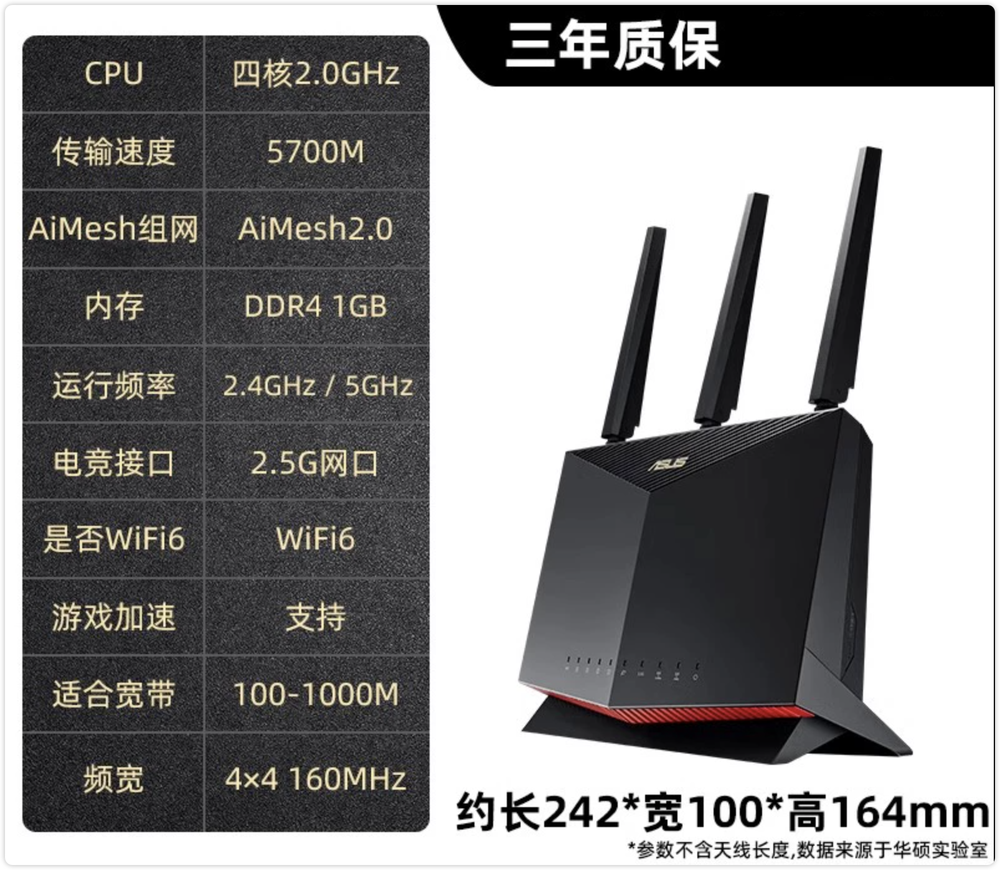
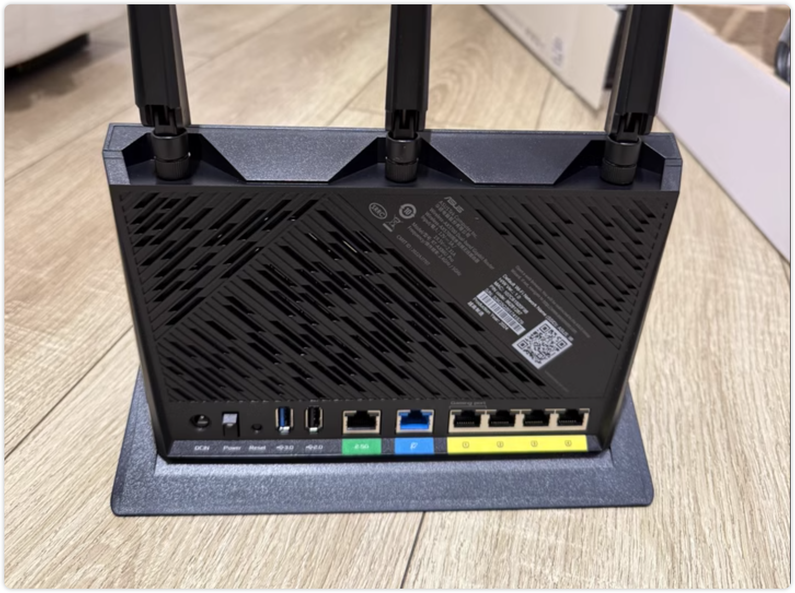

# 路由器及相关网络知识

*Created: 2025.01.08*


## ▲ 路由器

### △  华硕 AX86 Pro 路由器

```md
Add: 2025.01.08
Answer: ChatGPT 4o
```




| 特性名称       | 详细讲解                                                     | 技术科普                                                     |
| -------------- | ------------------------------------------------------------ | ------------------------------------------------------------ |
| **传输速度**   | 路由器总无线速率高达5700Mbps，分为2.4GHz（覆盖范围广）和5GHz（速度快，适合高带宽需求）。 | Mbps代表每秒传输的百万位（Megabits per second），是衡量网络传输速度的单位，理论值通常比实际速度高。 |
| **AiMesh组网** | 支持AiMesh 2.0智能组网，多台路由器无缝互联，提升覆盖范围、稳定性和负载平衡。 | AiMesh通过无线或有线方式将多台路由器连接为一体，创建一个单一Wi-Fi名称的网络，无需切换信号。 |
| **运行频率**   | 同时支持2.4GHz（覆盖范围广）和5GHz（速度快），双频并行工作可提供更大的总带宽。 | 2.4GHz频段穿透性强，适合穿墙信号；5GHz频段干扰少，速度快，但覆盖范围较小。路由器可智能分配频段给设备。 |
| **电竞接口**   | 配备2.5Gbps高速网口，可用作WAN或LAN接口，适合电竞主机或高速NAS设备，降低网络延迟。 | 2.5Gbps接口提供更高的带宽，适合需要高速稳定连接的设备，如电竞主机、NAS或高速光纤网络。 |
| **是否WiFi 6** | 支持WiFi 6协议（802.11ax），提升设备连接效率，降低延迟，提高数据传输速率，适合多设备场景。 | WiFi 6支持OFDMA和MU-MIMO技术，可将多个设备的数据打包一起发送，提高效率并减少信号拥堵。 |
| **频宽**       | 支持4×4 160MHz频宽，提供更大数据传输管道，显著提升速度和效率。 | 频宽决定单通道的数据容量，160MHz是WiFi 6的顶级频宽，适合高性能场景，如4K/8K视频或高速下载。 |



根据您提供的图片，我可以详细讲解华硕RT-AX86U Pro路由器的后置接口功能。从左到右的接口功能解释如下：

| 接口序号 | 接口名称                     | 功能描述                                                     |
| -------- | ---------------------------- | ------------------------------------------------------------ |
| 1        | 电源接口 (DC-IN)             | 用于连接电源适配器，为路由器提供电力支持。                   |
| 2        | 电源开关 (Power)             | 用于开启或关闭路由器的电源。                                 |
| 3        | 重置按钮 (Reset)             | 用于恢复路由器的出厂设置，需长按数秒才能触发。               |
| 4        | USB 3.0 接口                 | 高速 USB 接口，可用于连接存储设备、打印机或其他 USB 外设。   |
| 5        | USB 2.0 接口                 | 较低速的 USB 接口，同样用于连接外设设备，但速度稍低于 USB 3.0。 |
| 6        | WAN 接口 (蓝色)              | 用于连接宽带调制解调器或光猫，负责接入互联网。               |
| 7        | 2.5G WAN/LAN 接口 (绿色标记) | 支持 2.5Gbps 的高速连接，可配置为 WAN 或 LAN 使用，用于提升网络传输速度。 |
| 8        | LAN 接口 (黄色标记)          | 提供 4 个千兆 LAN 接口，用于连接电脑、交换机、游戏主机等有线设备。 |


## ▲ 路由器相关知识


### 路由器相关知识概览

### WAN 口 (广域网(Wide Area Network)) 和 LAN 口 (局域网 (Local Area Network) )

### WIFI 5 和 WIFI 6

### 双 WAN

### 双 LAN 聚合

### 链路聚合


### IPTV

### 中枢网关

### 内置 FEM


