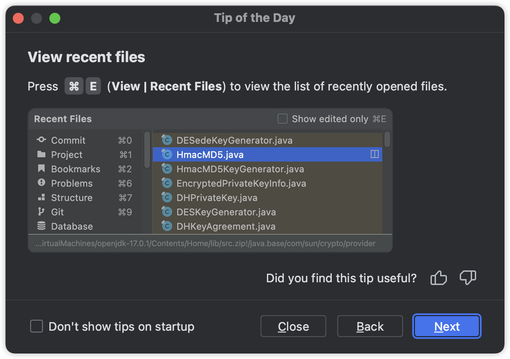
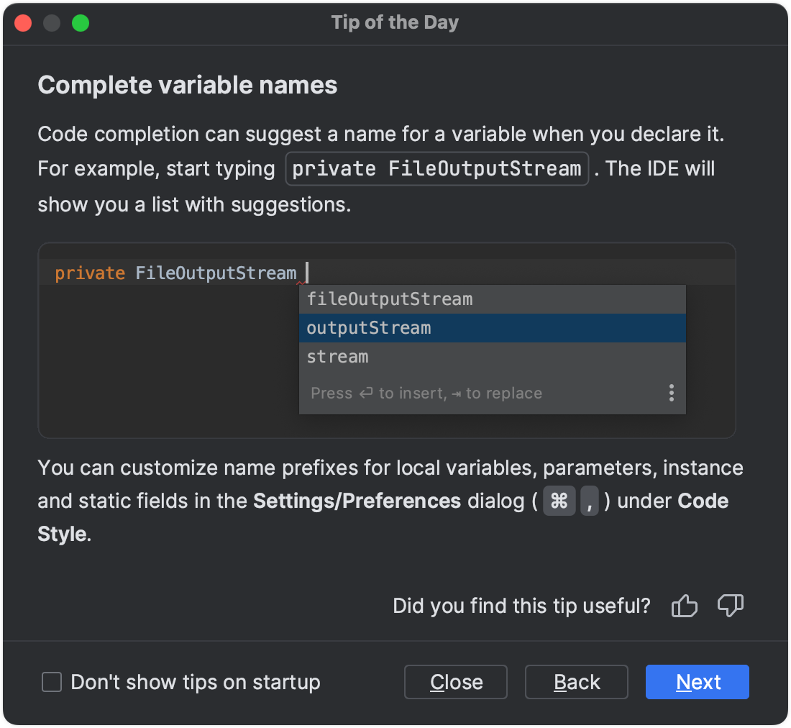
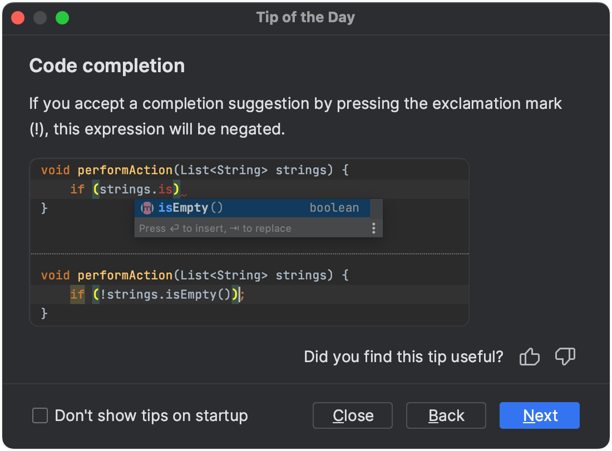
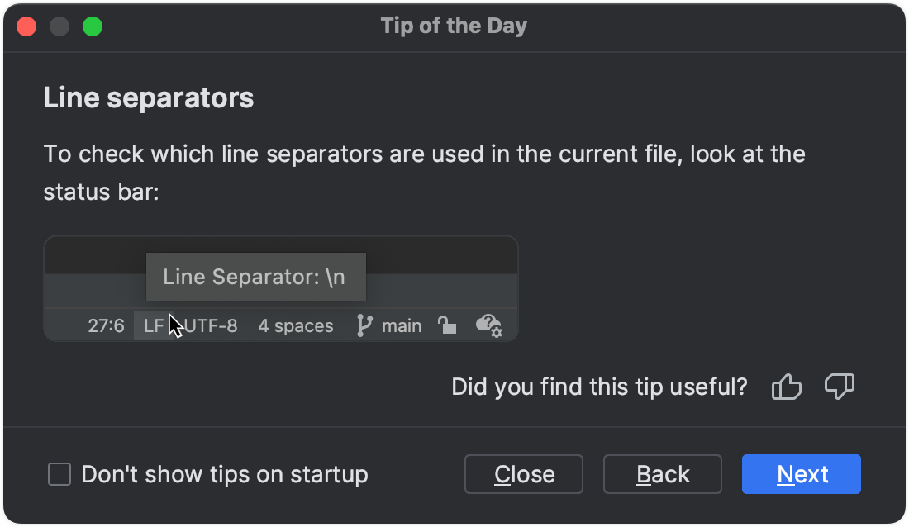
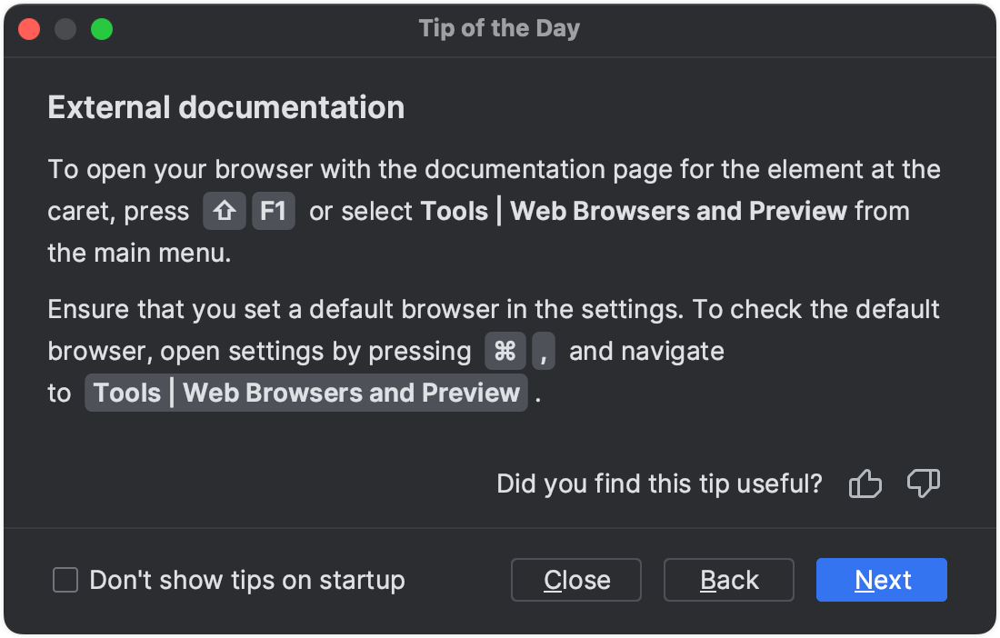
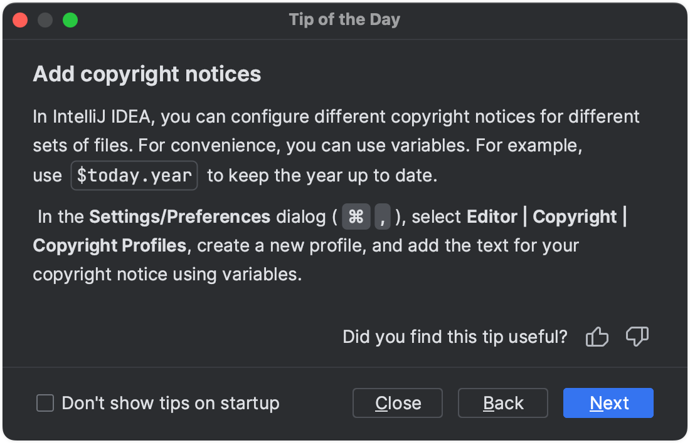

# Tip of the day

*Create: 2024.07.02*

*Last Edit: 2024.07.03*

## Code completion

When using code **completion**, you can accept the current **selection** in the suggestions list with   `⇧` `⌘` `↩ Return`  . IntelliJ IDEA will not only insert the selected string, but also turn the current code construct into a **syntactically** correct one (balance **parentheses**, add missing braces and semicolons, and so on).

## Show usages 

You can view the list of all usages of a class, method or variable across the whole project, and quickly navigate to the selected item. Place the caret at a symbol and press `⌥` `⌘` `F7` (Edit | Find Usages | Show Usages).

To jump to a usage, select it from the list and press `↩ Return`.

## The Rename refactoring 

You can easily rename your classes, methods, and variables with automatic correction of all places where they are used.

Position the caret at the symbol you want to rename, and press `⇧` `F6` (Refactor | Rename). Type the new name and press `↩ Return`.

## Improve code with context actions

Press `⌥` `↩ Return` in the editor to fix a highlighted error or warning, improve, or optimize a code construct. For some intention actions, you can open a preview or an action description by pressing `F1` (View | Quick Documentation).

## Preview search results

You can use the Preview area of the Find in Files dialog (**`⇧`** **`⌘`** **`F`**) for quicker search without leaving the dialog. The Preview dialog displays the first 100 results. 

## Speed search in tree views

Speed search is available in all tree views, for example, in the Project tool window. Start typing, and you'll quickly locate the necessary item.

## Comment and uncomment code

Use shortcuts to comment and uncomment lines and blocks of code:

**`⌘`** **`/`**: for single line comments (  //...  )

**`⌥`** **`⌘`** **`/`**: for block comments (  /*...*/  )

## Expand code selection

Press **`⌥`** **`↑`** to expand code selection. Each time you press **`⌥`** **`↑`**, the selection expands to other areas of code.

For example, the selection expands from a method name to the expression calling this method, then to the whole statement, then to the containing block, and so on.

## Live templates

Use live templates to insert frequent code constructs. 

For example, type `psvm` and press `Tab` to insert the `main()` method declaration template, then type `sout` to insert a print statement.

## Surround code fragments

You can quickly wrap a code block in useful constructs. Select it in the editor and press **`⌥`** **`⌘`** **`T`** (Code | Surround With).

The list of available options or wrappers is context-sensitive and depends on the language. 

## Code generation

IntelliJ IDEA can generate getter and setter methods for fields in your class. With the caret inside the class, press **`⌘`** **`N`** (Code | Generate).

## Version Control

IntelliJ IDEA provides out-of-the-box integration with the following version control systems: Git, Mercurial, Subversion, and Perforce.

Version your application to collaborate on it, as well as to eliminate the risks of storing all of your codebase locally. Press **`⌘`** **`9`** to view the history of the changes in the project or press **`⌘`** **`K`** to send your local changes to the repository.

## Paste from the clipboard history

Press **`⇧`** **`⌘`** **`V`** to select the text fragment that you have previously copied to the clipboard.

## Move statements up and down

The **Code | Move Statement Up/Down** actions are useful for reorganizing code lines, for example for bringing a variable declaration closer to the variable usage.
Select a code fragment and press `⇧` `⌘` `↑` or `⇧` `⌘` `↓`.
When nothing is selected in the editor, the line at the caret position will be moved.

## Quick Definitioin

Press **`⌥`** **`␣`** (View | Quick Definition) to preview the definition or content of the symbol at the caret, without opening it in a separate editor tab.

## Switch scheme

You can apply a different code style, coloring scheme, or keymap with a single keystroke right from the editor. Press `⌃` `\`` (View | Quick Switch Scheme) to specify the scheme you want to switch to.

## Show file structure
You can quickly navigate within the current file with `⌘` `F12` (Navigate | File Structure).

File structure shows the list of members of the current class. To navigate to an element, select it and press `↩ Return` or `⌘` `↓`.

To easily locate an item in the list, start typing its name.

## Select In

To quickly select the currently edited element (a class, file, method, or field) in another view, press `⌥` `F1` or call Navigate | Select In.

## Postfix code completion

Postfix code completion is applied from right to left to avoid backward caret jumps when coding. Type a dot   .   after the code fragment that you want to change and select the desired option.

To see the suggestion list with postfix templates, you can also press   ⌘   J  .

## View Git blame annotations

Git annotations show detailed information on the origin of each code line (right-click the gutter and select Annotate with Git Blame).

Right-click an annotation and choose Show Diff to review the differences between the current and the previous version of the file.

## Reformat code

To reformat code according to the current code style settings, select Code | Reformat Code from the main menu or press   ⌥   ⌘   L  .

## Create code constructs with completion

You can create code constructs using statement completion. Start typing a method declaration, a method call or a statement such as   if  ,   do -while  ,   try -catch  , or   return  . Press   ⇧   ⌘   ↩ Return   to complete the statement into a syntactically correct construct.

## Navigate to implementation

To navigate to the implementations of an abstract method, position the caret at its usage or its name in the declaration and press   ⌥   ⌘   B  .

## Find usages

Press   ⌥   F7   to quickly locate all occurrences of code referencing the symbol at the caret, no matter if the symbol is a part of a class, method, field, parameter, or another statement.

## Search Everywhere

Press   Shift   twice to search for files, actions, symbols, UI elements, Git branches and comments across your project. Pressing double   Shift   again, will extend the search to non-project items.

Use tabs or direct shortcuts   ⌘   O   for classes,   ⇧   ⌘   O   for files,   ⌥   ⌘   O   for symbols, and   ⇧   ⌘   A   for actions to narrow your search results.

 

## Project tool window

Press   ⌘   1   to open the Project tool window and switch focus to it.

## Debugger

If you want to log program state during debugging, use non-suspending breakpoints. Select the expression that you want to log, hold `Shift` , and click the gutter at the line where the expression should be logged.

In the example, `sent.size()` will be logged upon reaching line 24.

## Duplicate a code block or a line

Press `⌘` `D` in the editor to duplicate the selected code block, or the current line when no block is selected.

## Override methods

You can easily override methods of the base class by pressing   ⌃   O   (Code | Override Methods).

To implement methods of the interfaces (or of the abstract base class) that the current class implements, press   ⌃   I   (Code | Implement Methods).

##  Evaluate expression

You can execute expressions or reassign values for variables while your script is stopped by a breakpoint. The Evaluate Expression functionality helps you to obtain additional details about the program state or test various scenarios at runtime.

•  If the expression is present in the code, hold   Alt   (on Windows and Linux) or   ⌥   (on macOS) and click it. If you want to evaluate a specific code fragment, select it before clicking. 

•  To evaluate an arbitrary expression, select Run | Debugging Actions | Evaluate Expression. A separate dialog opens that supports various constructs including loops, assignments, lambdas, and so on. 

##  Extract Variable refactoring

The Extract Variable refactoring wraps a selected expression into a variable. It adds a new variable declaration and uses the expression as an initializer. Select an expression and press   ⌥   ⌘   V   (Refactor | Extract/Introduce | Variable).

## Camel case in code completion

You can narrow down a list of code completion suggestions by using camel case prefixes.

## View recent files

Press   ⌘   E   (View | Recent Files) to view the list of recently opened files.

## Quick code documentation

To quickly see the documentation for a class or method at the caret, press   F1   (View | Quick Documentation).

## Access VCS-related options

Press `^` `V` to access all VCS-related commands available in the current context.

 

## Change focus in tool windows

  ⎋ Esc   in any tool window moves the focus to the editor.

  ⇧   ⎋ Esc   moves the focus to the editor and hides the current or the last active tool window.

  F12   moves the focus from the editor to the last focused tool window.

##  Local History 

Local History lets you track all changes to files, classes, methods, or any code fragments and roll back to any stable point if necessary. To view local history, from the main menu, select File | Current File | Show History.

## Compare files and folders

To compare any two files or folders, select them in the Project tool window and press   ⌘   D  .

## Wildcards in Search Everywhere

Use text patterns in Search Everywhere (double   Shift  ) when searching for a class, file, or symbol. Use   `*`   and   `space`  :

`*` stands for any number of arbitrary characters.

 `space` marks the end of a pattern. The preceding string is considered not just a prefix but a whole pattern.

##  Type-Matching code completion

类型匹配代码完成（/补全）

The type-matching code completion analyzes the expected type of the whole expression and helps to find methods and variables that are applicable in the current context. It works after the   return   keyword, in an assignment, in the argument list of a method call, and other places. Press   ⌃   ⇧   ␣   (Code | Code Completion | Type-Matching) to get the completion list filtered.

## Type-Matching completion
Invoking Type-Matching code completion (  ⌃   ⇧   ␣  ) twice will search for chained expressions of the expected type.

## Horizontal scroll

To scroll a file horizontally, turn the mouse wheel while keeping `Shift` pressed.

## View inheritance hierarchy
To see the inheritance hierarchy for the selected class, press   ⌃   H   (Navigate | Type Hierarchy). You can also invoke the hierarchy view directly from the editor to see the hierarchy for the currently edited class.

## Fix a Javadoc
If a method signature has changed, IntelliJ IDEA highlights the documentation comment tags that ran out of sync and suggests a quick-fix:

## Highlight usages within a file
Press   ⇧   ⌘   F7   (Edit | Find Usages | Highlight Usages in File) to quickly highlight usages of a certain variable in the current file.

Press   ⌘   G   and   ⇧   ⌘   G   to navigate through the highlighted usages. Press   ⎋ Esc   to remove highlighting.

## Inspect code
Use Code | Inspect Code to run code analysis for the whole project or a custom scope and examine the results in a separate window.

## Camel case in Search Everywhere

Use camel case in the Search Everywhere popup (double   Shift  ) to filter the list of results when searching for a class, file, or symbol.

## Copy a path or a reference

Use the Edit | Copy Path/Reference action to insert a reference to a field/method/class/file into the current position in the editor.

Position the caret within the   myMethod   method name and press   ⌥   ⇧   ⌘   C  .
To paste the reference, press   ⌘   V  .

You can also copy references in the Go to Class/Go to Symbol/Go to File dialogs. Press   ⌘   C   on any element in the lookup list.

## Close all editor tabs
To close all editor tabs, right-click a tab and select Close All Tabs.

To close all tabs except the active one, press   Alt   (on Windows and Linux) /   ⌥   (on macOS) and click the Close button on the active tab.

## Copy a class
Use Refactor | Copy Class to create a class which is a copy of the selected class.

This is useful when you need to create a class similar to an existing one, and it's not feasible to put shared functionality in a common superclass.

## Compare with clipboard
To compare active editor with the clipboard contents, right-click anywhere in the editor and choose Compare with Clipboard from the context menu.

## Code completion 2

Code completion suggests the choices that are reachable from the current caret position as you type. Press   ⌃   ␣   twice to also see inaccessible classes and members.

## Code completion 3

You can accept the current selection in the code completion suggestions list with the period key (.), comma (,), semicolon (;), space, and some other characters.

## Recent search history
When searching for a text string in a file, use recent search history. Press   ⌘   F   to open the search bar and then press   ⌥   ↓   to show the list of recent entries.

## View code reference information
You can use   F1   (View | Quick Documentation),   ⌘   P   (View | Parameter Info),   ⌘   B   (Navigate | Declaration), and similar shortcuts not only in the editor but also in the suggestions list while using code completion.

## Use multiple carets
In IntelliJ IDEA, you can use multiple carets. Press and hold   Shift   Alt   (on Windows and Linux) /   ⇧⌥   (on macOS) and then click at different positions to set additional carets in the editor.

You can then press   Shift   with the left or right arrow keys to select multiple text fragments.

Press   ⎋ Esc   to remove all the carets except for the recently added one.

## See available live templates
If you do not remember a live template abbreviation, press   ⌘   J   to see a list of suggestions for the current context. 

## Compare archives

To compare two   .jar  ,   .zip   or   .phar   archives or even files inside an archive, select them in the Project tool window and press   ⌘   D  .

The Compare Archives feature is integrated with the Java bytecode decompiler and allows you to see what exactly has changed between two different versions of a library.

## Join lines
To join two lines into one and remove unnecessary spaces, press   ⌃   ⇧   J  .

## Change signature
You can move method parameters in both declaration and invocation with   ⌥   ⇧   ⌘   ←   and   ⌥   ⇧   ⌘   →  . Moreover, you can propagate such move in a method declaration to the method invocation: press   ⌥   ↩ Return   after the move and choose Update usages to reflect signature change.

## Breakpoints menu
Right-click a breakpoint marker in the gutter to quickly enable/disable the breakpoint or adjust its properties.

## Edit regular expressions
You can edit a regular expression in your code using a dedicated editor.

Start typing a regular expression, press   ⌥   ↩ Return   and click Edit RegExp Fragment. The regular expression opens in a separate tab in the editor where you can type backslashes as is.

All changes are synchronized with the original regular expression, and escape characters are presented automatically.

## Verify regular expressions
To verify that your regular expression is correct, place the caret within the expression you want to check, press   ⌥   ↩ Return  , and select Check RegExp.

In the popup, type a sample string that should match your regular expression. The   icon shows that the match occurred.

## Scratch files 临时文件

Scratch files are temporary files that let you experiment and prototype in the editor, without creating any project files.
To create a scratch file, press   ⇧   ⌘   N  , and then select the language to use.

## The Move refactoring
When you invoke the Move refactoring   F6   on an inner class that is declared static, you are prompted to either make it a top-level class, or move it to another class.

## Refactor This
If you position the caret at a symbol and press   ⌃   T  , the list of refactorings that are applicable to the current context will open.

## Highlight statements that may throw exceptions
You can view all statements within the method where certain exceptions can be thrown. Place the caret at the   throws   statement and press   ⇧   ⌘   F7  . 

## Navigate to recent locations
Press   ⇧   ⌘   E   to get a list of recently viewed or changed code fragments.

## Close editor tabs

To close all editor tabs except the current one, keep   Alt   (on Windows and Linux) /   ⌥   (on macOS) pressed and click the cross icon for the current editor tab.

## Create a UML diagram
Press   ⌥   ⇧   ⌘   U   to open a UML class diagram in a new editor tab.

## Complete variable names
Code completion can suggest a name for a variable when you declare it. For example, start typing   private FileOutputStream  . The IDE will show you a list with suggestions. 

## Code completion 4

To quickly complete a method call of a static method located anywhere in your project, a library, or a JDK, enter a prefix and press   ⌃   ␣   twice. You can press   ⌥   ↩ Return   to import the selected method.

## Manage pull requests
Manage incoming GitHub pull requests directly from IntelliJ IDEA: from the main menu select Git | GitHub | View Pull Requests. IntelliJ IDEA lets you assign and merge pull requests, view the timeline and inline comments, submit comments and reviews, and accept changes without leaving the IDE.

## Delete a line

Press   ⌘   ⌫ Del   in the editor to delete the whole line at the caret.

## Navigate to a line
You can open a file in the editor at a particular line. Press   ⇧   ⌘   O   (Navigate | File), start typing the filename, and then type   :   followed by the line number.

## Create Ant property tags
You can start referring to an Ant property or target even if it's not defined yet. Press   ⌥   ↩ Return   and choose Create property from the list of intention actions to create the necessary tag without leaving your current editing location.

## Code completion 5

If you accept a completion suggestion by pressing the exclamation mark (!), this expression will be negated.

## Code Completion 6

Code Completion helps you quickly complete code statements. It automatically provides a list of suggestions available from the current caret position as you type:

## Analyze memory snapshots
The memory viewer in IntelliJ IDEA allows you to work with a detailed breakdown of HPROF snapshots. Memory snapshots are useful to locate code that uses a large amount of memory, and to search for memory leaks.
To analyze a snapshot, go to Run | Open Profiler Snapshot | Open and select a file with the   .hprof   extension.

## Sort completion suggestions
You can sort completion suggestions by relevance or alphabetically.
To sort alphabetically, select the Sort by Name option. To sort by relevance, clear the Sort by Name checkbox.

## Search for code inspections

To quickly find and run an inspection, press   ⌥   ⇧   ⌘   I   and start typing the name of the inspection or its group. Choose the inspection from the suggestion list and specify the scope. 

## Line separators
To check which line separators are used in the current file, look at the status bar:

## External documentation
To open your browser with the documentation page for the element at the caret, press   ⇧   F1   or select Tools | Web Browsers and Preview from the main menu.

Ensure that you set a default browser in the settings. To check the default browser, open settings by pressing   ⌘   ,   and navigate to   Tools | Web Browsers and Preview  .

## Code completion in the search bar
Press   ⌃   ␣   in the search bar when you search for text in the current file   ⌘   F  , so that you don't need to type the entire string.

## Create missing targets
When you are referring to a non-existing target tag in your Ant build file, IntelliJ IDEA automatically suggests that you create the corresponding tag. This context action will not even make you change your current editing location.

## Find and replace
Press   ⌘   F   to display the search bar. Press   ⌘   R   to add another field where you can type the replace string.

In the Find in Files dialog, you can switch to replace by pressing   ⇧   ⌘   R  . Similarly, press   ⇧   ⌘   F   to hide the Replace with field and switch to regular search.

## Search structurally
Select Edit | Find | Search Structurally to search for a code pattern or a grammatical construct.

## Change code selection
In the editor, press   ⌥   ↑  /  ⌥   ↓   to extend or shrink your current code selection.

## Jump between errors
Press   F2   or   ⇧   F2   to jump to the next or previous error respectively in the current file.

## Add copyright notices
In IntelliJ IDEA, you can configure different copyright notices for different sets of files. For convenience, you can use variables. For example, use   $today.year   to keep the year up to date.

 In the Settings/Preferences dialog (  ⌘   ,  ), select Editor | Copyright | Copyright Profiles, create a new profile, and add the text for your copyright notice using variables.

## Lens mode
To preview code without actually scrolling to it, hover your mouse pointer over a warning, error stripe, or just some section of source code on the scrollbar, and you will see a lens:

To disable the lens, right-click the error stripe in the scrollbar and clear the Show code lens on scrollbar hover checkbox.

## View files side by side
You can view multiple files side by side in the editor. Right-click the desired editor tab and select how you want to split the editor (Split Right or Split Down).

Alternatively, drag a tab to any area of the editor to activate split-screen mode.

## Choose shell for the terminal
Use your favorite shell from the built-in Terminal.

In the Settings/Preferences dialog   ⌘   ,  , go to Tools | Terminal and specify the path to your shell executable.

......

......

......

15. Navigate to implementation
To navigate to the implementations of an abstract method, position the caret at its usage or its name in the declaration and press T * B.

 

