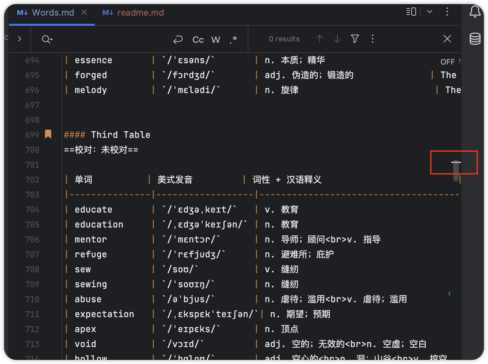
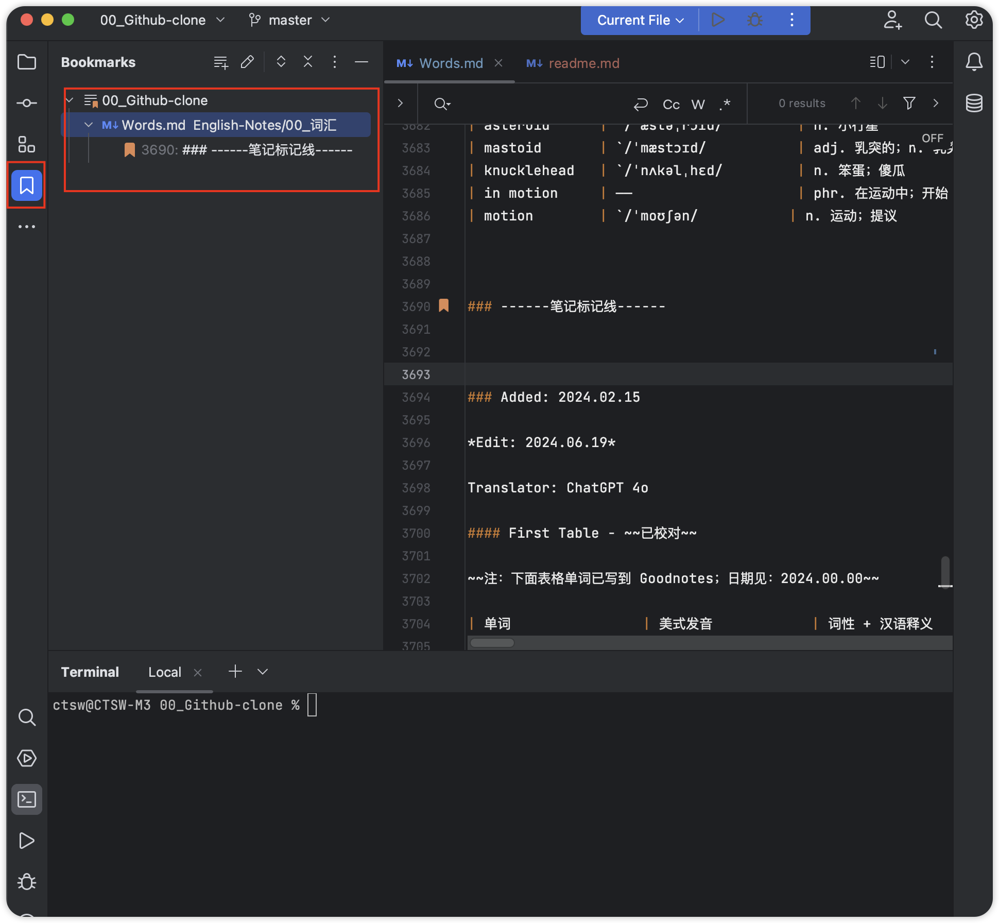

# IEDA | WebStorm 操作记录

## ▲ Mac 版本 IEDA 如何快速定位到已添加的 bookmark ？

方法一：直接点击编辑器右边的这个白色横杠是最快的方式。当前文档有几个 bookmark 就会出现几个白色横杠；图示如下：

方法二：点击侧边栏的 bookmark 图标也可以快速定位到书签所在位置。图示如下：

方法三：下面快捷键使用中：Part6 :Navigation  中的 **`Command` + `Fn` + `F3`**

## ▲ Intelligence IDEA 快捷键使用 - MAC

*Added: 2024.06.20* - *Source: https://juejin.cn/post/7134515183984214052*

### Mac 键盘符号和修饰键说明

+  `⌘` ——> `Command`
+  `⇧` ——> `Shift`
+  `⌥` ——> `Option`
+  `⌃` ——> `Control`
+  `↩︎` ——> `Return/Enter`
+  `⌫` ——> `Delete`
+  `⌦` ——> `向前删除键(Fn + Delete)`
+  `↑` ——> `上箭头`
+  `↓` ——> `下箭头`
+  `←` ——> `左箭头`
+  `→` ——> `右箭头`
+  `⇞` ——> `Page Up(Fn + ↑)`
+  `⇟` ——> `Page Down(Fn + ↓)`
+  `⇥` ——> `右制表符(Tab键)`
+  `⇤` ——> `左制表符(Shift + Tab)`
+  `⎋` ——> `Escape(Esc)`
+  `End` ——> `Fn + →`
+  `Home` ——> `Fn + ←`

### Part 1：Editing（编辑）

| 快捷键                                             | 作用            |
|-------------------------------------------------|---------------|
| `Control + Space`                               | 基本的代码补全（补全任何类、方法、变量） |
| `Control + Shift + Space`                       | 智能代码补全（过滤器方法列表和变量的预期类型） |
| `Command + Shift + Enter`                       | 自动结束代码，行末自动添加分号 |
| `Command + P`                                   | 显示方法的参数信息     |
| `Control + J`                                   | 快速查看文档        |
| `Shift + F1`                                    | 查看外部文档（在某些代码上会触发打开浏览器显示相关文档） |
| `Command` + 鼠标放在代码上                         | 显示代码简要信息      |
| `Command + F1`                                  | 在错误或警告处显示具体描述信息 |
| `Command + N`, `Control + Enter`, `Control + N` | 生成代码（`getter`、`setter`、`hashCode`、`equals`、`toString`、构造函数等） |
| `Control + O`                                   | 覆盖方法（重写父类方法）  |
| `Control + I`                                   | 实现方法（实现接口中的方法） |
| `Command + Option + T`                          | 包围代码（使用`if...else`、`try...catch`、`for`、`synchronized`等包围选中的代码） |
| `Command + /`                                   | 注释 / 取消注释与行注释 |
| `Command + Option + /`                          | 注释 / 取消注释与块注释 |
| `Option` + 方向键上                               | 连续选中代码块       |
| `Option` + 方向键下                               | 减少当前选中的代码块    |
| `Control + Shift + Q`                           | 显示上下文信息       |
| `Option + Enter`                                | 显示意向动作和快速修复代码 |
| `Command + Option + L`                          | 格式化代码         |
| `Control + Option + O`                          | 优化 import     |
| `Control + Option + I`                          | 自动缩进线         |
| `Tab / Shift + Tab`                             | 缩进代码 / 反缩进代码  |
| `Command + X`                                   | 剪切当前行或选定的块到剪贴板 |
| `Command + C`                                   | 复制当前行或选定的块到剪贴板 |
| `Command + V`                                   | 从剪贴板粘贴        |
| `Command + Shift + V`                           | 从最近的缓冲区粘贴     |
| `Command + D`                                   | 复制当前行或选定的块    |
| `Command + Delete`                              | 删除当前行或选定的块的行  |
| `Control + Shift + J`                           | 智能的将代码拼接成一行   |
| `Command + Enter`                               | 智能的拆分拼接的行     |
| `Shift + Enter`                                 | 开始新的一行        |
| `Command + Shift + U`                           | 大小写切换         |
| `Command + Shift + ]` / `Command + Shift + [`   | 选择直到代码块结束 / 开始|
| `Option + Fn + Delete`                          | 删除到单词的末尾      |
| `Option + Delete`                               | 删除到单词的开头      |
| `Command` + 加号 / `Command` + 减号               | 展开 / 折叠代码块    |
| **`Command + Shift` + 加号**                     | **展开所以代码块**   |
| **`Command + Shift` + 减号**                     | **折叠所有代码块**   |
| `Command + W`                                   | 关闭活动的编辑器选项卡   |

### Part 2：Search / Replace（查询/替换）

| 快捷键                   | 作用 |
|-----------------------| --- |
| `Double Shift`        | 查询任何东西 |
| `Command + F`         | 文件内查找 |
| `Command + G`         | 查找模式下，向下查找 |
| `Command + Shift + G` | 查找模式下，向上查找 |
| `Command + R`         | 文件内替换 |
| `Command + Shift + F` | 全局查找（根据路径） |
| `Command + Shift + R` | 全局替换（根据路径） |
| `Command + Shift + S` | 查询结构（Ultimate Edition 版专用，需要在 Keymap 中设置） |
| `Command + Shift + M` | 替换结构（Ultimate Edition 版专用，需要在 Keymap 中设置） |

### Part 3：Usage Search（使用查询）

| 快捷键                              | 作用 |
|----------------------------------| --- |
| `Option + F7` / `Command + F7`   | 在文件中查找用法 / 在类中查找用法 |
| `Command + Shift + F7`           | 在文件中突出显示的用法 |
| `Command + Option + F7`          | 显示用法 |

### Part 4：Compile and Run（编译和运行）

| 快捷键                                          | 作用 |
|----------------------------------------------| --- |
| `Command + F9`                               | 编译 Project |
| `Command + Shift + F9`                       | 编译选择的文件、包或模块 |
| `Control + Option + R`                       | 弹出 Run 的可选择菜单 |
| `Control + Option + D`                       | 弹出 Debug 的可选择菜单 |
| `Control + R`                                | 运行 |
| `Control + D`                                | 调试 |
| `Control + Shift + R`, `Control + Shift + D` | 从编辑器运行上下文环境配置 |

### Part 5：Debugging（调试）

| 快捷键                    | 作用 |
|------------------------| --- |
| `F8`                   | 进入下一步，如果当前行断点是一个方法，则不进入当前方法体内 |
| `F7`                   | 进入下一步，如果当前行断点是一个方法，则进入当前方法体内，如果该方法体还有方法，则不会进入该内嵌的方法中 |
| `Shift + F7`           | 智能步入，断点所在行上有多个方法调用，会弹出进入哪个方法 |
| `Shift + F8`           | 跳出 |
| `Option + F9`          | 运行到光标处，如果光标前有其他断点会进入到该断点 |
| `Option + F8`          | 计算表达式（可以更改变量值使其生效） |
| `Command + Option + R` | 恢复程序运行，如果该断点下面代码还有断点则停在下一个断点上 |
| `Command + F8`         | 切换断点（若光标当前行有断点则取消断点，没有则加上断点） |
| `Command + Shift + F8` | 查看断点信息 |

### Part 6：Navigation（导航）

| 快捷键                                                   | 作用 |
|-------------------------------------------------------| --- |
| `Command + O`                                         | 查找类文件 |
| `Command + Shift + O`                                 | 查找所有类型文件、打开文件、打开目录，打开目录需要在输入的内容前面或后面加一个反斜杠`/` |
| `Command + Option + O`                                | 前往指定的变量 / 方法 |
| `Control` + 方向键左 / `Control` + 方向键右                   | 左右切换打开的编辑 tab 页 |
| `F12`                                                 | 返回到前一个工具窗口 |
| `Esc`                                                 | 从工具窗口进入代码文件窗口 |
| `Shift + Esc`                                         | 隐藏当前或最后一个活动的窗口，且光标进入代码文件窗口 |
| `Command + Shift + F4`                                | 关闭活动 `run/messages/find/... tab` |
| `Command + L`                                         | 在当前文件跳转到某一行的指定处 |
| `Command + E`                                         | 显示最近打开的文件记录列表 |
| `Option` + 方向键左； `Option` + 方向键右              | 光标跳转到当前单词或中文句的左 / 右侧开头位置 |
| `Command + Option` + 方向键左；  `Command + Option` + 方向键右 | 退回；  前进到上一个操作的地方 |
| `Command + Shift + Delete`                            | 跳转到最后一个编辑的地方 |
| `Option + F1`                                         | 显示当前文件选择目标弹出层，弹出层中有很多目标可以进行选择(如在代码编辑窗口可以选择显示该文件的 Finder) |
| `Command + B`；  `Command` + 鼠标点击               | 进入光标所在的方法； 变量的接口或是定义处 |
| `Command + Option + B`                                | 跳转到实现处，在某个调用的方法名上使用会跳到具体的实现处，可以跳过接口 |
| `Option + Space`, `Command + Y`                       | 快速打开光标所在方法、类的定义 |
| `Control + Shift + B`                                 | 跳转到类型声明处 |
| `Command + U`                                         | 前往当前光标所在方法的父类的方法 / 接口定义 |
| `Control` + 方向键下 / `Control` + 方向键上                   | 当前光标跳转到当前文件的前一个 / 后一个方法名位置 |
| `Command + ]` / `Command + [`                         | 移动光标到当前所在代码的花括号开始 / 结束位置 |
| `Command + F12`                                       | 弹出当前文件结构层，可以在弹出的层上直接输入进行筛选（可用于搜索类中的方法） |
| `Control + H`                                         | 显示当前类的层次结构 |
| `Command + Shift + H`                                 | 显示方法层次结构 |
| `Control + Option + H`                                | 显示调用层次结构 |
| `F2` / `Shift + F2`                                   | 跳转到下一个 / 上一个突出错误或警告的位置 |
| `F4` / `Command` + 方向键下                               | 编辑 / 查看代码源 |
| `Option + Home`                                       | 显示到当前文件的导航条 |
| `F3`                                                  | 选中文件 / 文件夹 / 代码行，添加 / 取消书签 |
| `Option + F3`                                         | 选中文件 / 文件夹/代码行，使用助记符添加 / 取消书签 |
| `Control + 0`…`Control + 9`                           | 定位到对应数值的书签位置 |
| **`Command + F3`**                                    | **显示所有书签** 注：如果是 Macbook 那么就是 **`Command` + `Fn` + `F3`** |

### Part 7：Refactoring（重构）

| 快捷键                    | 作用 |
|------------------------| --- |
| `F5`                   | 复制文件到指定目录 |
| `F6`                   | 移动文件到指定目录 |
| `Command + Delete`     | 在文件上为安全删除文件，弹出确认框 |
| `Shift + F6`           | 重命名文件 |
| `Command + F6`         | 更改签名 |
| `Command + Option + N` | 一致性 |
| `Command + Option + M` | 将选中的代码提取为方法 |
| `Command + Option + V` | 提取变量 |
| `Command + Option + F` | 提取字段 |
| `Command + Option + C` | 提取常量 |
| `Command + Option + P` | 提取参数 |

### Part 8：VCS / Local History（版本控制 / 本地历史记录）

| 快捷键                  | 作用 |
|----------------------| --- |
| `Command + K`        | 提交代码到版本控制器 |
| `Command + T`        | 从版本控制器更新代码 |
| `Option + Shift + C` | 查看最近的变更记录 |
| `Control + C`        | 快速弹出版本控制器操作面板 |

### Part 9：Live Templates（动态代码模板）

| 快捷键                    | 作用 |
|------------------------| --- |
| `Command + Option + J` | 弹出模板选择窗口，将选定的代码使用动态模板包住 |
| `Command + J`          | 插入自定义动态代码模板 |

### Part 10：General（通用）

| 快捷键                         | 作用 |
|-----------------------------| --- |
| `Command + 1`…`Command + 9` | 打开相应编号的工具窗口 |
|  | 比如：`Command` + `1` : 显示侧边栏中的第一个 Project；`Command` + `2`: 显示侧边栏中第二个 Commit；后续以此类推...... |
| `Command + S`               | 保存所有 |
| `Command + Option + Y`      | 同步、刷新 |
| `Control + Command + F`     | 切换全屏模式 |
| `Command + Shift + F12`     | 切换最大化编辑器 |
| `Option + Shift + F`        | 添加到收藏夹 |
| `Option + Shift + I`        | 检查当前文件与当前的配置文件 |
| `Control` + `\`             | 快速切换当前的 scheme（切换主题、代码样式等） |
| `Command + ,`               | 打开 IDEA 系统设置 |
| `Command + ;`               | 打开项目结构对话框 |
| `Shift + Command + A`       | 查找动作（可设置相关选项） |
| `Control + Shift + Tab`     | 编辑窗口标签和工具窗口之间切换（如果在切换的过程加按上 delete，则是关闭对应选中的窗口） |

* * *

**IntelliJ IDEA DEFAULT KEYMAP**：[www.jetbrains.com/idea/docs/I…](https://www.jetbrains.com/idea/docs/IntelliJIDEA_ReferenceCard_Mac.pdf "https://www.jetbrains.com/idea/docs/IntelliJIDEA_ReferenceCard_Mac.pdf")

------ ------ ------

## ▲ WebStorm 中的 `皮肤` 和 `主题`
1. `皮肤`(appearance): 是显示界面
2. `主题`(Theme): 是代码主题
~~2019 年 WebStorm 支持全局的主题了, 可以装个 vscode 的主题: `Visual Studio Code Dark Plus Theme` (还是不如 IEDA 自带的主题好看)~~

## ▲ WebStorm 中去掉灰色的参数提示: `parameter name hints`
`Settings` --> 输入: `parameter hints` --> `Editor` --> `General` --> `Appearance` --> `Show parameter name hints` 去掉勾选   

## ▲ 解决 Webstorm 提交代码 `Github` 的相关问题.
(1) 无法登录 `Gtihub` 账号:
+ 解决方法: 把 `Github` 网站的 `Personal access tokens` 中的已有 token 删除, 重新生成 token 后再次添加 `github` 账号.

(2) 无法从 `github` 上 `clone` 仓库, 提示被拒:
+ R: 在第一步添加账号时, 账户下面的那行 `Clone git repositories use ssh` 但它的使用前提是我们必须在 `gighub` 配置 `SSH Key`, 并在本地生成 `id_rsa`私钥. (更多设置可见此文章: https://blog.csdn.net/dotphoenix/article/details/100130424)

## ▲ 解决 WebStorm 快捷键和 Mac 系统冲突
在 Mac 下使用进行代码多行注释, 使用 `Command` + `shift` + `/`, 结果每次成功注释之后, WebStorm 的菜单栏的 help 就会被打开, 因为快捷键和 Mac 系统自带的快捷键冲突, 因此在 `偏好` 设置 --> `键盘`中, 将 `应用快捷键` 中的 `显示帮助菜单` 的快捷键关闭或使用其他即可解决上述问题。

## ▲ WebStorm 如何使用正则给文档每段之间添加空格?
按下 `command + R` 打开全局替换, 勾选 `RegExp`, 在第一行搜索框中输入 `。\n{1}` 然后点击后面的 `Search in selection only` 按钮(tip: 就是 `三`横线旁边有个竖线的按钮)然后在第二行搜索框中输入 `。\n\r`

## ▲ 更改配色字体提示颜色
`Settings` --> `Editors` --> `colors&fonts` --> `HTML` --> 在下面黑框里点击你想设置的代码然后看到上面对应的部分(foreground)就可以设置了，如果不能设置上面的 foreground,记得把下面的 use inherited attributed 前面的对号取消就可以了。

## ▲ WebStorm 中更改文档的默认字体:
`Settings` -> `Editor` -> `Color Scheme` -> `General`

## ▲ 更改字符编码:
主界面的最下面即可看到当前文件的字符编码

## ▲ IEDA 快捷键：

| 操作描述           | Windows 快捷键             | MacOS 快捷键                                                 |
|----------------| -------------------------- | :----------------------------------------------------------- |
| 选中下一个相同内容      | `Alt + J`                  | Command + G                                                  |
| 选中所有相同内容       | `Ctrl + Shift + Alt + J`   | Command + Ctrl + G                                           |
| 在不选中的情况下复制一行   | `Ctrl + D`                 |                                                              |
| 复制选中内容，不选中时复制当前行 | `Ctrl + C`                 |                                                              |
| 后退/撤销          | `Ctrl + Z`                 |                                                              |
| 取消后退/撤销        | `Ctrl + Shift + Z`         |                                                              |
| 查找（当前文件）       | `Ctrl + F`                 |                                                              |
| 替换（当前文件）       | `Ctrl + R`                 |                                                              |
| 格式化代码          | `Ctrl + Alt + L`           | `Command` + `Option`(⌥) + `L`                                |
| 自动缩进           | `Ctrl + Alt + I`           |                                                              |
| 切换窗口           | `Ctrl + Shift + Space`     |                                                              |
| 展开/折叠当前代码      | `Ctrl` + `+/-`             | `Command`(⌘)  + `+` `Command`(⌘)  + `-`                 |
| 展开/折叠全部代码      | `Ctrl` + `Shift` + `+/-`   | `Command`(⌘) + `Shift`(⇧) + `+` `Command`(⌘) + `Shift`(⇧) + `-` |
| 全局搜索           | `Ctrl` + `Shift` + `F`     | `Command` + `Shift` + `F`                                    |
| 单行注释           | `Ctrl` + `/`               | `Command` + `/`                                              |
| 多行注释           | `Ctrl` + `Shift + `/`      | `Command` + `Shift` + `/` (注意: 和 MacOS 系统快捷键冲突)    |
| 快速在当前行上插入一行    | `Ctrl` + `Shift` + `Enter` | `Option` + `Command` + `Enter`                               |
| 快速在当前行下插入一行    | `Ctrl` + `Enter`           |                                                              |

## ▲ 解决 JavaScript 无法运行, 和 JS 文件被当做 txt 文件的问题 ?
`Preferences` --> `Editor` --> `File types` --> 在右侧方框中找到 `JavaScript` 然后在下面的 Registered Patterns 中更该为 `*.js` 

## ▲ 只修改编辑区的背景色，不改主题:
`Settings -> Editor -> Color Scheme -> General -> Text -> Default text`

## ▲ 更改 js/css/scss/less 文件的缩进:
`File -> Settings -> Editor -> Code Style --> 相应的文件格式然后更改`

## ▲ webStorm 下将 vue 的代码锁紧由 2 个空格改为 4 个空格
(1) `File -> Settings -> Editor -> Code Style -> Javascript` indent 都设置为 4.

(2) 修改 Vue 项目下的 .editConfig 中的 `indent_size = 4`

(3) 后重启 webstorm

## ▲ 安装组件
用 npm 安装 nodejs 需要的模块组件: 
+ File -> Setting -> Plugins -> Browse repositories...
+ 然后在 Settings -- Languages & Frameworks -- Node.js and NPM中配置 Node interpreter（node解释程序） C:\Program Files\nodejs\node.exe(就是node在C盘的安装路径),如果此时没有安装 node 的核心模块，会提示让在线安装，确定就好了。下面的express(代理)应该就是显示的版本号。
+ tip: 下面的 `Coding assistance` (编码助手)记得打开 -- `enabled`: 激活的；`Disable`: 禁止。

## ▲ 去掉文件窗口右边的竖线:
`Setting` --> `Editor` --> `Appearance` --> `show hard wrap guide`(configured in code style options)

## ▲ 调整字母长度分割线为80:
首先把上面的 `show hard wrap guide` 提示打开；然后 `Setting -- Editor -- Code Style --> Hard wrap at: 80` 下面的 `Visual guides` 也设置为 80

## ▲ 更改默认的浏览器:
`Setting -- Tools -- Web Browsers` 

## ▲ 在新窗口打开项目:
`Setting` --> `Appearance & Behavior` --> `System Settings` --> `Project Opening` -- `Open project in new window`

## ▲ WebStorm 左侧的折叠线展示/隐藏
`Setting --> Editor --> general --> code folding (代码折叠)` --> show code folding outline`

## ▲ WebStorm 中光标变成了白色小块：
`Setting -> Editor -> Appearance -> use block caret(使用块插入符号)`   

## ▲ WebStorm 中光标变成黑块：
windows 上是 `ins`/`Insert` 键。 Mac 是 `fn + Eenter` 键 

## ▲ 如何在 WebStorm 中使用正则快速删除空行？
按下 `Command + R` 弹出替换框，勾选 `Matches` 和 `Regexp`(Regular Expression), 然后在第一个输入框中输入正则 `\B\n` (Tip: `\B`:匹配一个单词的非边界位置。`\n`:匹配一个换行符)   

## ▲ WebStorm 好用插件集锦:

## ▲ 解决 MBP（2015 intel 芯片，不包含 M1 系列芯片）下 WebStorm 启动扫描检查(inspections) 导致电脑风扇疯狂运行的问题
- 无法停止/杀死 开机扫描文件夹建立索引(indexing) 的 `Backgournd Tasks`; 在 JetBrains
  的论坛上, 这个问题 2010 年就已经提出来了, 但是 2020 年还没有给出解决方法......LOL.
- ~~当一个文件夹下放置太多仓库, 启动 Macbook Pro 2015 后 WebStorm~~
  ~~会扫描所有的仓库来进行各种检查,这样非常耗内存和 CPU, CPU 急速运行后导致温度迅速升高,~~
  ~~为了加速散热风扇的转速也会跟着提高(tip: 我的 mbp 腾讯`lemon`~~
  ~~显示风扇转速可到 `6200 RPM` [转速单位: RPM: Revolutions Per Minute 转每分,~~
  ~~表示设备每分钟的旋转次数.] ), 这样会导致笔记本发出强烈的噪音;~~
  ~~想要解决这个问题我们就要降级 WebStorm 的检查等级, 这样就会加速大文件的读写.~~
- ~~WebStorm 的检查等级分为 3 个等级:~~
    - ~~(1) `Inspections` 为最高等级检查,可以检查 "单词拼写", "语法错误",~~
          ~~"变量使用", "方法之间调用" 等.~~
    - (2) ~~`Syntax` 可以检查单词拼写错误, 简单语法错误.~~
    - (3) ~~`None` 不设置检查.~~
- ~~我们可以从 `Settings` --> `Preferences` --> `Editor` --> `Inspections`~~
  ~~在右侧的 `Project Default` 的下面把不需要的检查项目后的 ✓ 号去除即可.~~
  ~~当然你也可以直接选择把下面 `Disable new inspections by default` 前的 ✓ 勾上.~~

## ▲ 更该 webstorm 更该内存大小
`help`  --> `Change memory settings`