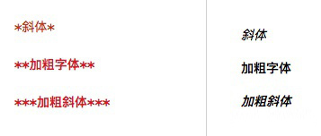
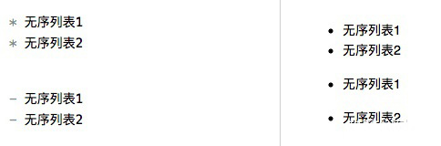
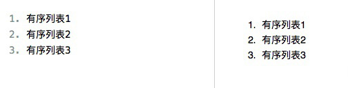
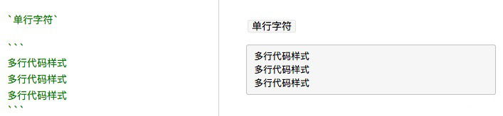

# +[详细使用教程](http://itmyhome.com/markdown/article/extension/strikethrougn.html)


> 反思 Markdown : https://sspai.com/post/37340

### Markdown 引入本地文件
- (1) 使用绝对路径
  
    + [transition-transform-animation.md](/Users/WANG/Github-clone/CSS-grocery/CSS3-过渡-转换-动画/transition-transform-animation.md)
- (2) 使用相对路径
    + [transition-transform-animation.md](File:///Users/WANG/Github-clone/CSS-grocery/CSS3-过渡-转换-动画/transition-transform-animation.md)

      注意 File 协议首字母要大写, `File://` 中英文字符不限, 文件夹亦可.


## 目录 (TOC)
1. Markdown 是什么?
2. Markdown 与 Word 的对比
3. Markdown 常用语法集合
4. 高级进阶语法


## Content

### 1. Markdown 是什么?
Markdown 是一种`轻量级标记语言(1)`, 它使用**纯文本格式**编写文档，使用一些预设的符号来代替样式, 当在 markdown 编辑器或阅读器中显示时, 会转换成有效的 HTML 文档.
- `(1)` 轻量级标记语言(Lightweight Markup Language, 简称 XML)是一类用简单句法描述简单格式的文本语言。它作为一种标记语言，可使用文本编辑器输入。

例如我们想要实现标题样式, 可以这么写 (下图左侧为书写方式, 右侧为显示效果.):


### 2. Markdown 与 Word 的对比

####  word
文字处理程序, 内置丰富的文字排版/段落排版/标题/表格等功能; 

这些强大的功能是 Word 的优点, 但同时也是缺点.

当功能多了, 我们的注意力就会分散, 比如设置字体时我们经常会遇到:

这个字体大小到底是 14px 还是 16px 好？我想强调这一句话, 是要加粗还是标红？

#### Markdown
**本质是让我们回归到内容本身，注重文章的结构，而不是样式。**

例如想要强调一句话，那么直接使用两个星号(`**`)加粗，而不需要考虑是加粗还是标红,

因为 Markdown 中默认只有黑色字体，没有其他颜色字体。


### 3. Markdown 常用语法集合

Markdown 语法只包含基础的特性，例如：标题、加粗、斜体、段落、引用、超链接、图片。。。

而书写 markdown 的编辑器，则有一些自定义的样式，例如：数学公式、TODO 列表等。

下面简单介绍一些常用的 markdown 语法。

#### 3.1 段落与换行
##### 3.1.1 段落的前后必须是空行。否则，相邻两行文本会显示在一行。

例如下面的一段引用:

```md
计算机中数据单位是 `bit(位/比特)`. 在计算机内部, 数据都是以二进制的形式存储和运行的.

二进制数据中的一个位(bit)简写为b, 音译为比特, 是计算机存储数据的最小单位. 一个二进制位只能表示0或1两种状态, 要表示更多的信息, 就要把多个位组合成一个整体, 一般以8位二进制组成一个基本单位. 
```

如果每行间没有空行，显示效果如下：

<p style="color: red; background-color: #fafafa">
计算机中数据单位是 `bit(位/比特)`. 在计算机内部, 数据都是以二进制的形式存储和运行的.
二进制数据中的一个位(bit)简写为b, 音译为比特, 是计算机存储数据的最小单位. 一个二进制位只能表示0或1两种状态, 要表示更多的信息, 就要把多个位组合成一个整体, 一般以8位二进制组成一个基本单位. 
</p>

如果想实现换行的效果，就需要在每行下添加一个空行。

<div style="background-color: #fafafa">
<p style="color: red">计算机中数据单位是 `bit(位/比特)`. 在计算机内部, 数据都是以二进制的形式存储和运行的.</p>
<p style="color: red">二进制数据中的一个位(bit)简写为b, 音译为比特, 是计算机存储数据的最小单位. 一个二进制位只能表示0或1两种状态, 要表示更多的信息, 就要把多个位组合成一个整体, 一般以8位二进制组成一个基本单位. </p>
</div>

空行指的是行内什么都没有，或者只有空白符（空格或制表符）

相邻两行文本，如果中间没有空行 会显示在一行中（换行符被转换为空格）

##### 3.1.2 如果需要在段落内换行有 2 种方法：
1. 在准备换行的字符后面添加 `<br>` 代码
2. 或者在需要换行的那个字符后面添加至少 2 个空格，然后换行写其他文字。 我们拿上面的例子来改写：
<p style="color: red; background-color: #fafafa">二进制数据中的一个位(bit)简写为b, 音译为比特, 是计算机存储数据的最小单位. <br> 一个二进制位只能表示0或1两种状态, 要表示更多的信息, 就要把多个位组合成一个整体, 一般以8位二进制组成一个基本单位. </p>


#### 3.2 标题


#### 3.3 引用


#### 3.4 列表


#### 3.5 代码


#### 3.6 分割线


#### 3.7 超链接


#### 3.8 图片


#### 3.9 强调


#### 3.10 字符转义


### 4. Markdown 扩展语法

#### 4.1 删除线
#### 4.2 代码块和语法高亮
#### 4.3 表格
#### 4.4 Task List（任务列)
#### 4.5 
#### 4.6 
#### 4.7 


### 5. 格式转换
#### 5.1 HTML
#### 5.2 PDF
#### 5.1 Word


#### 3.1 标题
用 Markdown 书写时，只需要在文本前面加上 『#』 即可创建一级标题。同理，创建二级标题、三级标题等只需要增加 『#』 个数即可，Markdown 共支持六级标题。如下所示：


**Hint:** `#` 号 和「标题」之间保留一个字符的空格，markdown 语法默认都依照此规范。

#### 3.2 样式文本

您可以使用粗体、斜体或删除线文本来表示强调。

| 样式  | 语法 | 示例  | 输出  |
| :-----: | :-----: |:-----: | :-----: |
| 粗体(加粗)| `** **` | `**这是粗体文本**` | **粗体文本** |
| 斜体 | `* *` |  `*这是斜体文本*`  | *斜体文本* |
| 加粗斜体 | `*** ***`|`***所有这些文本都很重要***` | ***加粗斜体文本***|
| 删除线  | `~~ ~~` | `~~这是错误文本~~`  | ~~删除错误文本~~ |




#### 3.3 无序列表
使用中横线(`-`)或星号(`*`)来表示无序列表，注意后面需要加个空格。




#### 3.4 有序列表



#### 3.5 引用
Markdown 标记区块引用只需要在整个段落的第一行前面加上 `>`（右箭头符号） ：
```
> 桃花坞里桃花庵，桃花庵里桃花仙。桃花仙人种桃树，又摘桃花换酒钱。
```
展示效果如下：
> 桃花坞里桃花庵，桃花庵里桃花仙。桃花仙人种桃树，又摘桃花换酒钱。

区块引用可以嵌套，只要根据层次加上不同数量的 `>` 即可(tip：和不同等级的标题类似。)； 例如：
```
> 这是第一级引用。
>
> > 这是第二级引用。
```

展示效果如下：

> 这是第一级引用。
>
> > 这是第二级引用。


#### 3.6 超链接


#### 3.7 图片


#### 3.8 代码块




#### 3.9 水平分割


#### 3.10 表格
**示例 1:**
```
| Tables        | Are           | Cool  |
| ------------- |:-------------:| -----:|
| col 3 is      | right-aligned | $1600 |
| col 2 is      | centered      |   $12 |
| zebra stripes | are neat      |    $1 |
```
**显示效果:**

| Tables        | Are           | Cool  |
| ------------- |:-------------:| -----:|
| col 3 is      | right-aligned | $1600 |
| col 2 is      | centered      |   $12 |
| zebra stripes | are neat      |    $1 |

**示例 2:**
```
dog | bird | cat
----|------|----
foo | foo  | foo
bar | bar  | bar
baz | baz  | baz
```
**显示效果:**

dog | bird | cat
----|------|----
foo | foo | foo
bar | bar | bar
baz | baz | baz


### 4. 编辑工具
因为 Markdown 本质上是一个纯文本，所以任何能打开纯文本的东西都可以来编辑 Markdown。

但如果你想要有预览功能，那么一款顺手的编辑功能还是有必要的。

在 Windows 和 MacOS 上推荐的编辑器有: **Visual Studio Code (VS code)**, **Typora**.

当然 Markdown 的编辑器还有很多, 比如对 LaTex 数学公式支持更好的 **Smark**; 内置文件管理器, 以及可以使用 iCloud 云服务器同步的 **Ulysses**, 可以多加尝试, 适合自己的才是最好用的. 


### 4. 高级进阶语法
#### 4.1 自定义大小和带边框的图片插入写法:
实际上也就是使用网页中的 HTML + CSS 源代码模式
```html

```


