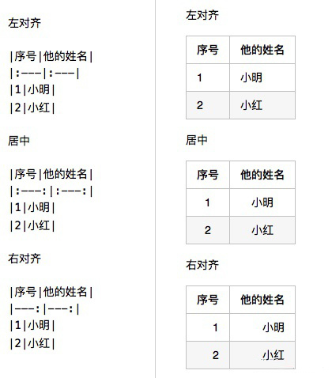

# Markdown 使用文档


全局提示：当前文档参考如下几篇文章：
> [Learning-Markdown (Markdown 入门参考)](http://itmyhome.com/markdown/index.html)
> 
> [反思 Markdown](https://sspai.com/post/37340)


## 目录 (TOC)
1. Markdown 是什么?
2. Markdown 与 Word 的对比
3. Markdown 常用语法集合
4. 高级进阶语法


## 生词 (New Words)
- **bit `[bɪt]` --n.(二进制) 位, 比特; 少量. --adj.很小的; 微不足道的.**
  **--vt.控制. --adv.相当; 有点儿. --v.咬(bite 的过去式和过去分词)**
    + 1Byte = 8 bit. 1字节 = 8 比特(位)
    + a bit(n) of paper. 纸片
    + come to bits(n) 破成碎片
    + a bit of land. 一小块土地.
    + He knows a little bit of everything. 他什么都知道一点点.
- **Latex `/'leɪteks/` --n.乳胶; 乳液.**
    + Natural Latex. 天然乳胶.
    + Latex Gloves. 乳胶手套.
- **versus `/'vɝsəs/` --prep.对, 对抗; 与...相对, 与...相比.**
    + Today's football match is France versus Brazil`/brəˈzɪl/`. 
      今天的组球赛是法国队对巴西对.
    + It is France versus Brazil in the final. 决赛是法国队对巴西队
    + Now, note the preposition, in versus on. 注意下介词, 对比 in 和 on.


## Content

### 1. Markdown 是什么?
Markdown 是一种`轻量级标记语言`$\color{red}{^{(1)}}$, 它使用**纯文本格式**编写文档, 使用一些预设的符号来代替样式, 当在 markdown 阅读器中查看时, 会被转换成有效的 HTML 文档.
- `(1)` 轻量级标记语言(Lightweight Markup Language)是一类用简单句法描述简单格式的文本语言. 


### 2. Markdown vs 一般富文本编辑器
当我们希望拿一个东西来跟 Markdown 对比的时候, 相信很多人很自然地想到了 Word, 而想到 Word 也就容易想到 Word 与 `LaTex`$\color{red}{^{(2)}}$ 之间那旷日弥久的神圣战争. Word 与 LaTex 都是排版系统, 都提供了文档从书写到展示的完整解决方案, 但是实现方式各有不同:
+ Word 是**内容与形式同时处理**; LaTex 是**内容与形式分离**.
+ Word 是**所见即所得**; LaTex 是**源码(纯文本)输入**.

`(2)` LaTex 是什么?
> LaTex 是由美国计算机科学家莱斯利·兰伯特在 20 世纪 80 年代初期开发的 一种基于 `TeX`$\color{red}{^{(3)}}$ 的排版系统，用户可以使用 TEX 所提供的强大功能，在几天甚至几小时内生成具有书籍质量的印刷品。对于生成**复杂表格**和**数学公式**，这一点表现得尤为突出。因此它非常适用于生成**高印刷质量的科技和数学类文档**。这个系统同样适用于生成从简单的信件到完整书籍的所有其他种类的文档。

`(3)` TeX 排版软件 

> TeX 是一个由美国计算机教授高德纳（Donald Ervin Knuth）编写的排版软件。TeX的~~MIME类型为application/x-tex，~~是一款自由软件。它在学术界特别是数学、物理学和计算机科学界十分流行。TeX被普遍认为是一个优秀的排版工具，尤其是对于复杂数学公式的处理。利用 LaTeX 等终端软件，TeX 就能够排版出精美的文本以帮助人们辨认和查找。

*提示：* 关于 LaTex 和 Word 的更多对比请见知乎的这篇文章: [LaTeX 相对于 Word 有什么优势？](https://www.zhihu.com/question/20542113)

其实从这个角度看, Markdown 其实跟 LaTex 有很多相似之处, 完全兼具这两个特点, 都是源码输入, 都是内容与形式分离.

所以 Markdown 与富文本编辑器的比较其实可以分解成以下两点的比较:
1. **内容与形式分离** vs **所见即所得**
2. **源码输入** vs **所见即所得.**


### 3. Markdown 常用语法集合
Markdown 语法只包含基础的特性, 例如：标题、加粗、斜体、段落、引用、超链接、图片. . .   
而书写 markdown 的编辑器, 则有一些自定义的样式, 例如：数学公式、TODO 列表等.   
下面介绍一些常用的 markdown 语法.   

#### 3.1 段落与换行
##### 3.1.1 段落的前后必须有空行. 否则相邻两段会显示成一行. 
例如下面的一段引用:
```md
计算机中数据单位是 `bit(位/比特)`. 在计算机内部, 数据都是以二进制的形式存储和运行的.

二进制数据中的一个位(bit)简写为 b, 音译为比特, 是计算机存储数据的最小单位. 一个二进制位只能表示 0 或 1 两种状态, 要表示更多的信息, 就要把多个位组合成一个整体, 一般以 8 位二进制组成一个基本单位. 
```
如果上下段间没有空行, 显示效果如下：
<p style="color: red; background-color: #fafafa">
计算机中数据单位是 `bit(位/比特)`. 在计算机内部, 数据都是以二进制的形式存储和运行的.
二进制数据中的一个位(bit)简写为 b, 音译为比特, 是计算机存储数据的最小单位. 一个二进制位只能表示 0 或 1 两种状态, 要表示更多的信息, 就要把多个位组合成一个整体, 一般以 8 位二进制组成一个基本单位. 
</p>
段落间添加一行空行后： 
<div style="background-color: #fafafa">
<p style="color: red">计算机中数据单位是 `bit(位/比特)`. 在计算机内部, 数据都是以二进制的形式存储和运行的.</p>
<p style="color: red">二进制数据中的一个位(bit)简写为 b, 音译为比特, 是计算机存储数据的最小单位. 一个二进制位只能表示 0 或 1 两种状态, 要表示更多的信息, 就要把多个位组合成一个整体, 一般以 8 位二进制组成一个基本单位. </p>
</div>
空行指的是行内什么都没有, 或者只有空白符（空格或制表符(一般特指 tab 键)）

##### 3.1.2 如果需要在段落内换行有 2 种方法：
1. 在准备换行的字符后面添加 `<br>` 代码. 
2. 在需要换行的字符后添加 2 个及以上的空格, 然后换行写其他文字.  我们拿上面的例子来改写：
<p style="color: red; background-color: #fafafa">二进制数据中的一个位(bit)简写为 b, 音译为比特, 是计算机存储数据的最小单位. <br> 一个二进制位只能表示 0 或 1 两种状态, 要表示更多的信息, 就要把多个位组合成一个整体, 一般以8位二进制组成一个基本单位. </p>


#### 3.2 标题
只需要在文本前面加上 `#` 即可创建标题.   
一个 `#`表示一级标题；  
两个 `##` 表示二级标题；  
三个 `###` 表示三级标题；  
四个 `####` 表示四级标题；  
五个 `#####` 表示五级标题；  
六个 `######` 表示六级标题；  
Markdown 中只支持六级标题.   
注意：`#` 号 和「标题」之间保留一个字符的空格. 


#### 3.3 引用
引用只需要在整个段落的第一行前面加上 `>`（右箭头符号）, 写法如下：
```
> 桃花坞里桃花庵, 桃花庵里桃花仙. 桃花仙人种桃树, 又摘桃花换酒钱. 
```
展示效果如下：
> 桃花坞里桃花庵, 桃花庵里桃花仙. 桃花仙人种桃树, 又摘桃花换酒钱. 

区块引用可以嵌套, 只要根据层次加上不同数量的 `>` 即可. 例如：
```
> 我是一级引用. 
>
> > 我是二级引用. 
> > > 我是三级引用
```

展示效果如下：

> 我是一级引用. 
>
> > 我是二级引用. 
> >
> > > 我是三级引用


#### 3.4 列表
##### 3.4.1 无序列表
使用中横线(`-`)或星号(`*`)来表示无序列表, 注意后面需要加个空格. 

#### 3.4.2 有序列表


#### 3.5 代码


#### 3.6 分割线


#### 3.7 超链接


#### 3.8 图片

#### 3.9 强调


#### 3.10 字符转义


#### 3.11 表格



### 4. Markdown 扩展语法
#### 4.1 删除线
#### 4.2 代码块和语法高亮
#### 4.3 表格
#### 4.4 Task List（任务列)
#### 4.5 markdown 引入本地文件
- (1) 使用绝对路径
  
    + [transition-transform-animation.md](/Users/WANG/Github-clone/CSS-grocery/CSS3-过渡-转换-动画/transition-transform-animation.md)
- (2) 使用相对路径
    + [transition-transform-animation.md](File:///Users/WANG/Github-clone/CSS-grocery/CSS3-过渡-转换-动画/transition-transform-animation.md)

      注意 File 协议首字母要大写, `File://` 中英文字符不限, 文件夹亦可.
#### 4.6 自定义图片插入写法:
实际上也就是使用网页中的 HTML + CSS 源代码模式
```html

```

### 5. 编辑工具
因为 Markdown 本质上是一个纯文本, 所以任何能打开纯文本的东西都可以来编辑 Markdown. 

但如果你想要有预览功能, 那么一款顺手的编辑功能还是有必要的. 

在 Windows 和 MacOS 上推荐的编辑器有: **Visual Studio Code (VS code)**, **Typora**.

当然 Markdown 的编辑器还有很多, 比如对 LaTex 数学公式支持更好的 **Smark**; 内置文件管理器, 以及可以使用 iCloud 云服务器同步的 **Ulysses**, 可以多加尝试, 适合自己的才是最好的. 


### 6. 格式转换
#### 6.1 HTML
#### 6.2 PDF
#### 6.1 Word


### 7. Markdown 使用范例
- 李笑来《人人都能用英语》 -- [everyone-can-use-english](https://github.com/xiaolai/everyone-can-use-english)
- 


#### 3.1 标题


#### 3.2 样式文本

您可以使用粗体、斜体或删除线文本来表示强调. 

| 样式  | 语法 | 示例  | 输出  |
| :-----: | :-----: |:-----: | :-----: |
| 粗体(加粗)| `** **` | `**这是粗体文本**` | **粗体文本** |
| 斜体 | `* *` |  `*这是斜体文本*`  | *斜体文本* |
| 加粗斜体 | `*** ***`|`***所有这些文本都很重要***` | ***加粗斜体文本***|
| 删除线  | `~~ ~~` | `~~这是错误文本~~`  | ~~删除错误文本~~ |


