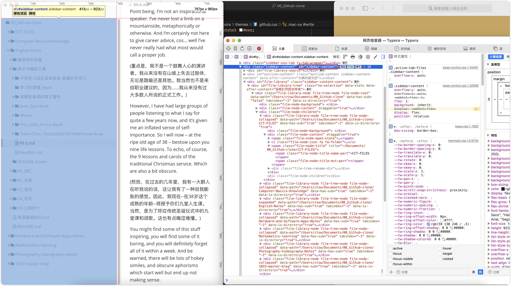

# Typora


## ▲ Typora 1.8 添加的功能：Github Style Alert (Github 风格警告)

*Added: 2024.01.25*

> [!NOTE]  
> Highlights information that users should take into account, even when skimming.

[! 注意]
突出显示用户即使在浏览时也应考虑的信息。

> [!TIP]
> Optional information to help a user be more successful.

[!提示]
帮助用户取得更大成功的可选信息。

> [!IMPORTANT]  
> Crucial information necessary for users to succeed.

[!重要]
用户成功所需的关键信息。

> [!WARNING]  
> Critical content demanding immediate user attention due to potential risks.

[!警告]
由于潜在风险，需要用户立即关注的关键内容。

> [!CAUTION]
> Negative potential consequences of an action.

[!警告]
行动的潜在负面后果。


## ▲ 更改 Typora 侧边栏 sidebar 的字体大小

*Added: 2024.01.23， Update: 2024.09.19*

首先通过控制台，找到侧边栏的样式，如下图：（注意：最新版本的 Typora, 开启控制台调试比较麻烦，按照 typora 文档操作。）



然后再找到当前主题， vscode 打开后搜索 sidebar-content，如果没有自己添加 `#sidebar-conent` 样式。


## ▲ Typora 的 Vue 主题设置宋体的 CSS 代码

```css
:root {
    --side-bar-bg-color: #fff;
    --control-text-color: #777;
    --font-sans-serif: 'Source Sans Pro', '宋体', 'Source Code Pro', sans-serif !important;
    --font-monospace: 'Source Sans Pro', '宋体', 'Source Code Pro' !important;
}

html {
    font-size: 16px;
}

body {
    font-family: var(--font-sans-serif);
    color: #000;
    -webkit-font-smoothing: antialiased;
    line-height: 1.6rem;
    letter-spacing: 0;
    margin: 0;
    overflow-x: hidden;
}

```

> ## Source Sans Pro
>
> *Added： 2024.07.02* 
>
> *来源：https://zh.wikipedia.org/wiki/Source_Sans_Pro*
>
> **Source Sans Pro**是一个由Paul D. Hunt为[Adobe Systems](https://zh.wikipedia.org/wiki/Adobe_Systems)所设计的无衬线[字体](https://zh.wikipedia.org/wiki/字体)。它是Adobe的第一个[开放源代码](https://zh.wikipedia.org/wiki/开放源代码)字体家族，以[SIL开源字体许可](https://zh.wikipedia.org/wiki/SIL開源字體授權)进行散布[[1\]](https://zh.wikipedia.org/wiki/Source_Sans_Pro#cite_note-hunt-1)[[2\]](https://zh.wikipedia.org/wiki/Source_Sans_Pro#cite_note-2)。
>
> 这个字体是由Morris Fuller Benton所设计的Gothics系列字体所启发。它提供了六种字重（常规、特细、细、半粗、粗、黑），并且皆包含斜体。此字体包含了相当多拉丁文字的支持，包含了西欧及东欧的语言、越南文、中文的罗马拼音、纳瓦霍文等[[1\]](https://zh.wikipedia.org/wiki/Source_Sans_Pro#cite_note-hunt-1)
>
> ### Adobe开放源代码字体家族
>
> - Source Sans Pro，Adobe开放源代码字体家族的第一个成员。
> - [Source Code Pro](https://zh.wikipedia.org/wiki/Source_Code_Pro)，Adobe开放源代码字体家族的第二个成员。
> - [Source Serif Pro](https://zh.wikipedia.org/wiki/Source_Serif_Pro)，Adobe开放源代码字体家族的第三个成员。
> - [Source Han Sans](https://zh.wikipedia.org/wiki/Source_Han_Sans)，Adobe开放源代码字体家族的第四个成员，也是第一个包含中日韩文字的成员。
> - [Source Han Serif](https://zh.wikipedia.org/wiki/Source_Han_Serif)，Adobe开放源代码字体家族的第五个成员，同样包含中日韩文字。

