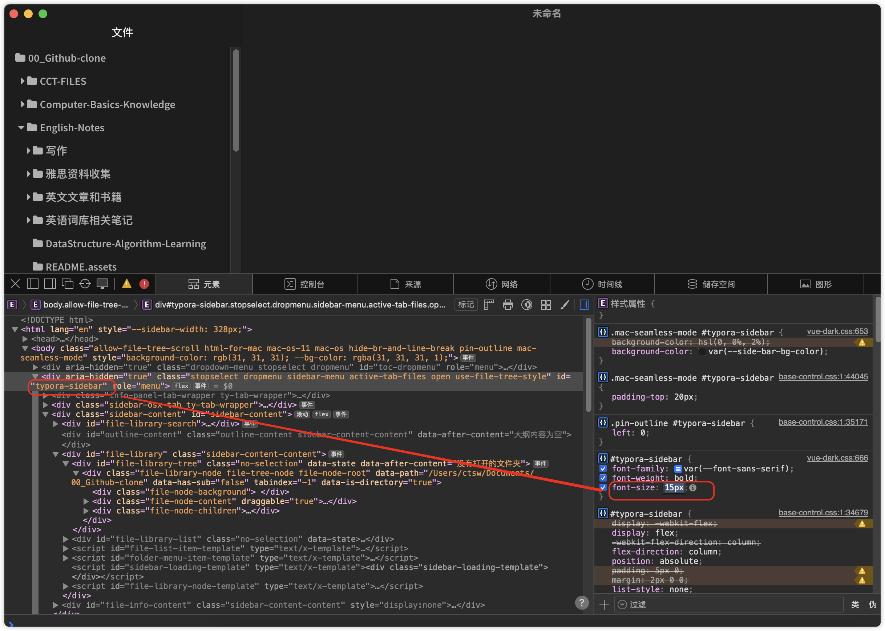

# Typora


##  ▲ 更改 Typora 侧边栏 sidebar 的字体大小

*Added: 2024.01.23*

找到当前主题（e.g.: vue-dark) vscode 打开后搜索 sidebar



## ▲ Typora 的 Vue 主题设置宋体的 CSS 代码

```css
:root {
    --side-bar-bg-color: #fff;
    --control-text-color: #777;
    --font-sans-serif: 'Source Sans Pro', '宋体', 'Source Code Pro', sans-serif !important;
    --font-monospace: 'Source Sans Pro', '宋体', 'Source Code Pro' !important;
}

html {
    font-size: 16px;
}

body {
    font-family: var(--font-sans-serif);
    color: #000;
    -webkit-font-smoothing: antialiased;
    line-height: 1.6rem;
    letter-spacing: 0;
    margin: 0;
    overflow-x: hidden;
}

```