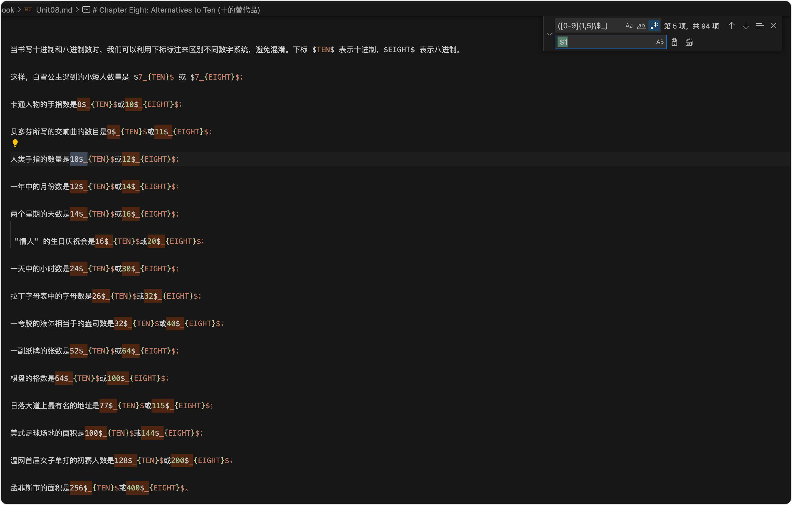
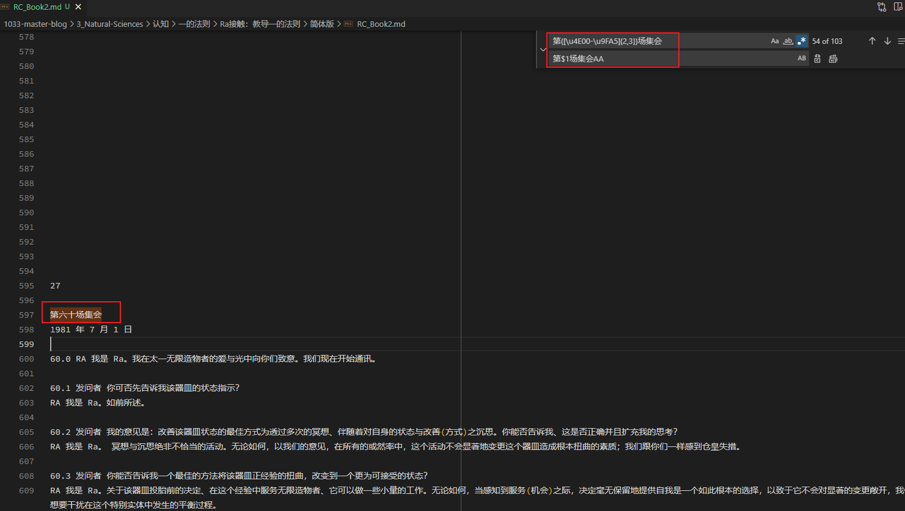

# VSCode 使用设置


## ▲ vscode 常用快捷键:
- 复制当前行：`Control/Command + C` `shift + alt +up/down`
- 代码格式化: `Shift + Alt +f`
- 格式化选定代码 ：`ctrl + k / ctrl + f`
- 代码展开: 先按下 `ctrl + K`, 再按下 `ctrl + J` ;
- 注释：
  + a) 单行注释：`[ctrl+k, ctrl+c] 或 ctrl+/`
  + b) 取消单行注释：`[ctrl+k, ctrl+u] (按下ctrl不放, 再按k + u)`
  + c) 多行注释：`[alt+shift+A]`
  + d) 多行注释：`/**`
- 折叠代码快捷键: 先按下 `Ctrl + K` 再按下 `ctrl + 0(数字0)` 
  + (Tip: 即使是折叠全部代码也不用全选文本) 


## ▲ VSCode 中使用正则表达式给 markdown 文档中内添加空格

### (1) 给中文和英文中间添加空格


### (2) 在数字前添加空格



正则表达式的讲解见：`Github-clone/DataStructure-Algorithm-Learning/正则表达式/正则表达式-特殊字符.md`

### (3) 给一些特定格式的文字添加统一后缀




### (4) 把中文后面的空格替换为逗号

正则匹配中文字符：

- `([\u4e00-\u9fa5])\u0020`

> ##### 三种空格 unicode (\u00A0, \u0020, \u3000)表示的区别
> 1. 不间断空格 `\u00A0`，主要用在office中，让一个单词在结尾处不会换行显示，快捷键 ctrl + shift + space ;
> 2. 半角空格(英文符号) `\u0020`，代码中常用的;
> 3. 全角空格(中文符号) `\u3000`，中文文章中使用;


## ▲ 1. Mac 和 Win 下的通用设置

### 1.1 快捷键

- 显示所有命令面板(show all commands): `Ctrl + Shift + p`(Windows) / `Command + Shift + p`(Mac) 
- 更该默认设置: `File` -> `Preferences` --> `Settings`

### 1.2 更改英文为中文
- 使用 Ctrl + Shift + P 调出所有命令行面板，输入 configure display language 安装中文包

### 1.3 调出 `settings.json` 编辑文件
- File -> Preference -> Settings -> 点击左上角的 `{}` 图标。

### 1.4 VSCode 打开多个项目
- Windows 下 `control + Shift + N`
- Mac 下 `command + Shift + N` 

### 1.5 VSCode 设置每行代码的长度: 
- 在 setting.json 的规则内添加:  `editor.rulers:[80]` ，添加完毕之后右侧就会自动出来达到 80 个字符的时的竖线

### 1.6 关闭 VSCode 右侧缩略图 (预览面板):

- 在 settings.json 中添加: `"editor.minimap.enabled": false,`

### 1.7 关闭 VSCode 自动换行

- settings.json 中添加 `"editor.wordWrap": "off"`

### 1.8 如何打开终端?
- 1、快捷键: `control + `(esc 下的那个按键)`
- 2、View --> Terminal

### 1.9 修改终端中的字体

- `"terminal.integrated.fontSize":14,`
- `"terminal.integrated.letterSpacing":1,`

### 1.10 Visual Studio Code 修改文件树缩进
- `"worKbench.tree.indent": 24,`

### 1.11 隐藏/显示 左侧的 activity bar (活动栏)
- Explorer (Ctrl + Shift + E) 探测器 (项目 文件)
- Search (Ctrl + Shift + F) 搜索
- Source Control (Ctrl + Shift + G): 代码控制工具 (Git: 可以查看修改了多少个文件)
- Debug (Ctrl + Shift + D) 调试
- Extensions (Ctrl + Shift + X) 插件扩展
   (横向拖动变宽在 Extensions 栏可以搜索内容的图标)

### 1.12 隐藏/显示 左侧的 side bar (侧边栏)
右上角 `view -> Appearance -> Show activity bar`

快捷键
+ Windows 下: `Ctrl + b`
+ Mac 下: `command + b`

### 1.13 快速生成文件模块
快速生成 HTML 模版:  在当前文件中输入`!` 然后按下 `Tab` 按键

### 1.14 查找某个函数在哪些地方被调用了
比如我已经在 `a.js` 文件里调用了 `foo()` 函数. 那么, 如果我想知道 `foo()` 函数在其他文件中是否也被调用了, 该怎么做呢？

做法如下: 在 `a.js` 文件里, 选中 `foo()` 函数 (或者将光标放置在foo()函数上), 然后按住快捷键 `Shift + F12`, 就能看到 `foo()` 函数在哪些地方被调用了, 比较实用. 

### 1.15 鼠标操作
- 在当前行的位置，鼠标三击，可以选中当前行。
- 用鼠标单击文件的行号，可以选中当前行。
- 在某个行号的位置，上下移动鼠标，可以选中多行。

### 1.16 创建多层子文件夹:
我们可以在新建文件夹的时候，如果直接输入, 比如 `aa/bb/cc` 的类似格式即可.

### 1.17 `.vscode` 文件夹的作用
如果你发现项目的根目录下有一个.vscode文件夹，说明这个文件夹代表的是当前项目的配置。

这个文件夹里可能包含以下集中文件: 
+ `settings.json`: 工作空间设置。只针对当前项目有效。比如说，我可以在这里面要求当前项目的代码统一使用制表符，而不需要要求每一位码农去修改各自的配置文件。
+ `sftp.json`: ftp文件传输的配置。


## ▲ Mac 下设置

### 2.2 Mac 下 `settings.json` 基本设置

```json
    {
        // - 粘贴到 vscode 的 settings.json 中时记得删除这些注释,
        // - ☆☆☆ 不用删除, vscode 中可以存在, 不报错
        "worKbench.iconTheme": "vscode-icons",
        "editor.rulers":[80],
        "editor.cursorStyle": "line",
        "editor.fontSize": 13,
        "editor.fontWeight": "400",
        "window.zoomLevel":0,
        "editor.wordWrapColumn": 80,
        // - 改完代码后立即自动保存. `onFocusChange` 是当光标离开该文件后,
        //   这个文件自动保存. 
        "files.autoSave": "afterDelay",
        // - 保存代码后, 默认不会立即进行代码的格式化.
        "editor.formatOnSave": false,
        "editor.lineHeight": 24,
        // - 自动检测(默认开启): VS Code 会根据你所打开的文件来决定该使用空格还是制表。
        //   也就是说，如果你的项目中使用的都是制表符，那么，当你在写新的代码时，
        //   按下tab 键后，编辑器就会识别成制表符。
        "editor.detectIndentation":false,
        // - 一个制表符默认等于 4 个空格.
        "editor.tabSize": 4,
        "terminal.integrated.fontSize":13,
        "diffEditor.renderSideBySide": false,
        // - 关闭左侧的缩略地图
        "editor.minimap.enabled": false,
        "marKdown.preview.fontSize": 13,
    
        // - 关闭代码片段提示
        "editor.quicKSuggestions": {
            "other": false,
        },
        // - 关闭参数提示
        "editor.parameterHints.enabled": false,
        "editor.wordBasedSuggestions": false,
        "editor.snippetSuggestions": "none",
    
        // - 设置 flow 
        "flow.useNPMPacKagedFlow": true,
        "javascript.validate.enable": false,
    
        // - 设置 Emmet
         "emmet.triggerExpansionOnTab": true,
    
         // - 配置插件: Sass/Less/Typescript/Jade/Pug Compile Hero
        "compile-hero": {
            "disable-compile-files-on-did-save-code": false,
            "javascript-output-directory": "./out",
            "javascript-output-toggle": false,
            "sass-output-directory": "./out",
            "sass-output-toggle": true
        }
    }
```

## ▲ Windows 下设置:
### Windows 下更改 VSCode 中的字体为 Source Code Pro
从 github 下载: [Source Code Pro](https://github.com/adobe-fonts/source-code-pro) 点击 latest release, 选择 otf 文件下载，放到字体文件夹 (C:\Windows\Fonts)
  + tips: 字体有2个版本，可以都安装

- 在 `settings.json` 中设置
    + "editor.fontFamily": "Source Code Variable, 'Source Code Variable Italic'"
    + 具体的字体名参照自己下的字体，同样在 C:\Windows\Fonts 中可以找到


## ▲ Win10 下 VSCode 的基本设置

### Win 下 `settings.json` 的基本设置
```json
{
    "files.autoSave": "afterDelay",
    "editor.fontFamily": "Source Code Pro, Source Han Sans SC Light",
    "editor.lineHeight": 24,
    "editor.detectIndentation":false,
    "editor.tabSize": 4,
    "terminal.integrated.fontSize":14,
    "terminal.integrated.letterSpacing":1,
    "editor.rulers":[80],
    "editor.cursorStyle": "line",
    "terminal.integrated.fontFamily": "Source Code Pro, Source Han Sans SC Light",
    "debug.console.fontFamily": "Source Code Pro, Source Han Sans SC Light",
    "marKdown.preview.fontFamily": "Source Code Pro, Source Han Sans SC Light",
    "editor.fontSize": 14,
    "editor.letterSpacing": 1,
    "window.zoomLevel":0,
    "editor.wordWrap": "on",
    "editor.wordWrapColumn": 100,
    "debug.toolBarLocation": "docKed",
    "terminal.integrated.shell.windows": "C:\\Program Files\\Git\\bin\\bash.exe",
    "diffEditor.renderSideBySide": false,
    "worKbench.tree.indent": 24,
    "editor.minimap.enabled": false
}
```
Tips: `editor.fontFamily: "Source Code Pro, Source Han Sans SC Light"` 解决了中文和英文的显示问题, 一定不要更改, `Source Code Pro` 解决的是英文显示字体,  `Source Han Sans SC Light`解决的是汉语字体显示的问题. 

### Windows VSCode 常用快捷键:
1. 注释: 
　　+ (1) 单行注释: `[Ctrl + K, Ctrl + c]` 或 `Ctrl` + `/`
　　+ (2) 取消单行注释: `[Ctrl + K, Ctrl + U] (按下 Ctrl 不放, 再按 K + U)`
　　+ (3) 多行注释: `[Alt + Shift + A]`
　　+ (4) 多行注释: `/**`
1. 折叠代码快捷键: 先按下 `Ctrl + K` 再按下 `Ctrl + 0(数字0)` 
    + (Tip: 即使是折叠全部代码也不用全选文本) 
1. 代码展开: 先按下 `Ctrl + K`，再按下 `Ctrl + J` ;
1. 移动行: `Alt + Up/Down`
1. 显示/隐藏左侧目录栏: `Ctrl + B`
1. 复制当前行: `Shift + Alt + Up/Down`
1. 删除当前行: `Shift + Ctrl + K / Mac: Shift + command + K`
1. 控制台终端显示与隐藏: `Ctrl + ~`
1. 查找文件/安装vs code 插件地址: `Ctrl + p`
1. 代码格式化: `Shift + Alt +f`
1. 新建一个窗口 : `Ctrl + Shift + n`
1. 行增加缩进: `Ctrl + [`
1. 行减少缩进: `Ctrl + ]`
1. 裁剪尾随空格(去掉一行的末尾那些没用的空格) : `Ctrl + Shift + x`
1. 字体放大/缩小: `Ctrl + ( + 或 - )`
1. 拆分编辑器 : `Ctrl + 1/2/3`
1. 切换窗口 : `Ctrl + Shift + left/right`
1. 关闭编辑器窗口 : `Ctrl + w`
1. 关闭所有窗口 : `Ctrl + K + w`
1. 切换全屏 : `F11`
1. 自动换行 : `Alt + z`
1. 显示git : `Ctrl + Shift + g`
1. 全局查找文件: `Ctrl + Shift + f`
1. 显示相关插件的命令(如: git log): `Ctrl + Shift + p`
1. 选中文字: `Shift + left / right / up / down`
1. 删除行 :  `Ctrl + Shift + K`
1. 快速切换主题: `Ctrl + K / Ctrl + t`
1. 快速回到顶部 :  `Ctrl + home`
1. 快速回到底部 : `Ctrl + end`
1. 格式化选定代码 : `Ctrl + K / Ctrl + f`


## ▲ 解决 mbp 使用 VSCode 导致风扇狂转的问题
一般情况下, vscode 的进程不会导致风扇一直狂转, 所以打开 "活动监视器" 查找是哪个占了极高的 cpu 即可.


## ▲ Gitlens 取消每行后面的代码变更记录
具体操作步骤如下:

按快捷键 `Ctrl/Command` + `,` 打开设置面板

搜索栏输入 `gitlens.toggleLineBLame`

取消 Specifies whether to provide a blame annotation for the current line, by default. Use the Toggle Line Blame Annotations command (gitlens. toggleLineBLame) to toggle the annotations on and off for the current window. (默认情况下，指定是否为当前行提供责备注释。 使用 Toggle Line Blame Annotations 命令 (gitlens.toggleLineBLame) 打开和关闭当前窗口的注释。) 前的勾选。


## ▲ 快速跳出成对的标点符号

比如：vscode 自动补充的 `""` ，在双引号写完字符串之后，直接再次按下双引号键即可。