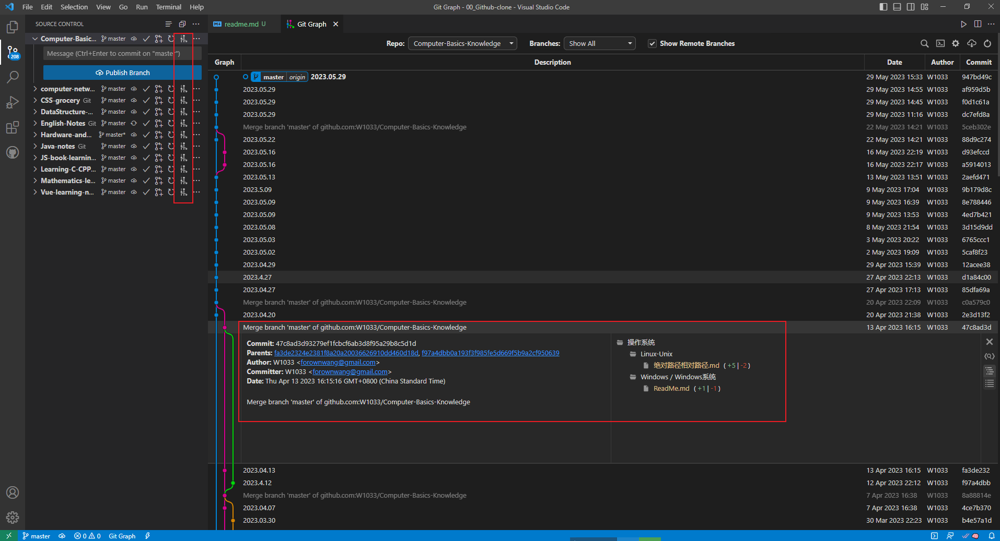
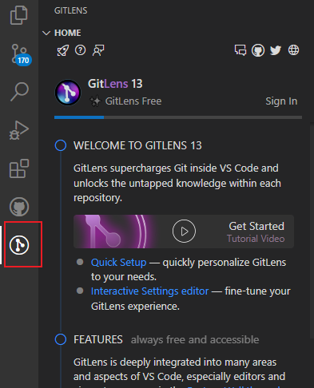
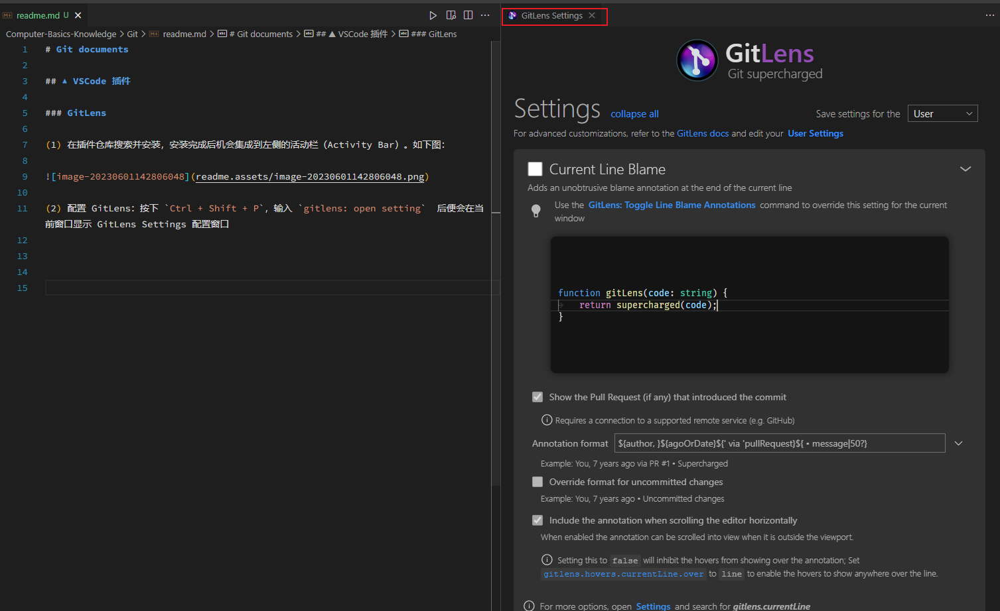

# VSCode 插件集合


## ▲ Git Graph

看 git 仓库的的提交历史。使用方式见下图：




## ▲ GetLens

**注：目前感觉没啥用。**

(1) 在插件仓库搜索并安装，安装完成后机会集成到左侧的活动栏（Activity Bar）。如下图：



(2) 配置 GitLens：按下 `Ctrl + Shift + P`，输入 `gitlens: open setting`  后便会在当前窗口显示 GitLens Settings 配置窗口。如下图：




## ▲ 标签自动补全

默认的标签补全，只需要在 Settings 中打开 Emmet 触发设置，即可实现在 html 和 css 中写入标签后按下 enter 回车键，即可实现自动补全；
代码如下：

```json
// - 标签自动补全：就是把 Emmet 的触发设置打开。
"emmet.triggerExpansionOnTab": true,
```

还有 2 个自动补全的插件：Auto Close Tag 和 Auto Rename Tag。

(1) `Auto Close Tag` 自动闭合标签
使用方式：比如写完 `<div>` 标签后，会自动补全成 `<div></div>`

(2) `Auto Rename Tag` 修改 HTML 标签时，自动修改匹配的标签。


## ▲ Icons 插件

### VSCode Great Icons

显示方式：`File` → `Preferences` → `Theme` →  `File Icon Theme` on Windows,


1. `image preview`: 光标悬浮在图片路径上, 显示图片预览.
1. `Chinese(Simplified) Language PacK for Visual Studio Code`: 安装汉化 VS Code 插件.
1. `beautify`: 自动格式化代码; 可以放大标记, 调整代码间距, 快速格式化代码, 可以让杂乱的 HTML, CSS, JS 代码瞬间变得整齐.
1. `Code Runner`: 搭建各类语言开发环境
1. `Debugger for Chrome`: 与chrome联调.
1. `ESLint`: 自动检测代码规范.
1. `Code Spell ChecKer`英语拼写检查.
1. Github 插件
    + `GitLens`: 
    + `RemoteHub`: RemoteHub 和 GitLens 是同一个作者开发出来的。
        RemoteHub插件的作用是: 可以在本地查看 GitHub 网站上的代码，而无需将代码下载到本地。
    + `Git history` : github 提交历史查看
    + `GitHub pull Requests`
1. `MarKdown + Math`: MathJax 支持插件.
1. `open in browser`: 浏览器打开.
1. `MarKdown pdf`
1. `Prettier`
1. `SVG`
1. `SVG Viewer`
1. `Terminal`
1. `Vetur`
1. `C/C++`
1. `Dart`
1. `Awesome Flutter Snippets`
1. `Python`
1. `CSS PeeK`
1. `Flutter`
1. `Path Intellisense`
1. `IntelliSense for CSS`
1. `Live Server`: 实现静态/动态页面的实时预览, 保存即可看见页面更新, 无需手动刷新.
1. `indent-rainbow`: 缩进彩虹, 不同的颜色来提示当前的缩进位置.(tip: 颜色太丑.)
1. `Local history`: 查看文件修改历史记录.
