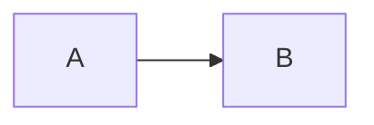

# [详细使用教程](http://itmyhome.com/markdown/article/extension/strikethrougn.html)


### Markdown 引入本地文件
- (1) 使用绝对路径
    
    + [transition-transform-animation.md](/Users/WANG/Github-clone/CSS-grocery/CSS3-过渡-转换-动画/transition-transform-animation.md)
- (2) 使用相对路径
    + [transition-transform-animation.md](File:///Users/WANG/Github-clone/CSS-grocery/CSS3-过渡-转换-动画/transition-transform-animation.md)

      注意 File 协议首字母要大写, `File://` 中英文字符不限, 文件夹亦可.


1. 标题 `#, ##, ###, ####, #####, ######`
    # 一级标题
    ## 二级标题
    ### 三级标题
    #### 四级标题
    ##### 五级标题
    ###### 六级标题
    注：# 和「一级标题」之间建议保留一个字符的空格，这是最标准的 Markdown 写法。

1. 列表格式 `-` 或 `+`
    > 在 Markdown 中，你只需要在文字前面加上 - 就可以了，例如：
        - 文本1
        - 文本2
        - 文本3
    > 在 Markdown 中，你只需要在文字前面加上 + 就可以了，例如：
        + 文本1
        + 文本2
        + 文本3
    
   如果你希望有序列表，
   也可以在文字前面加上 1. 2. 3. 就可以了，例如：
        1. 文本1
        2. 文本2
        3. 文本3
    **注：-、1.和文本之间要保留一个字符的空格。**

1. 链接和图片 `[显示文本](链接地址)`
    插入图片：
    文字链接：[Title](你的链接地址)
    图片加链接：[](你的链接地址)  

1. 引用 `>`
    + 在我们写作的时候经常需要引用他人的文字，这个时候引用这个格式就很有必要了，在 Markdown 
      中，你只需要在你希望引用的文字前面加上 > 就好了，例如：
    > 一盏灯， 一片昏黄； 一简书， 一杯淡茶。 守着那一份淡定， 品读属于自己的寂寞。
    注：> 和文本之间要保留一个字符的空格。


1. 粗体和斜体 `**粗体**`, `*斜体*`
    + Markdown 的粗体和斜体也非常简单，用两个 * 包含一段文本就是粗体的语法，用一个 * 包含
      一段文本就是斜体的语法。例如：
    + *一盏灯*， 一片昏黄；**一简书**，

1. 代码引用 `` (这个在md中写文字穿插带`<button>`这样的元素时很有用)
    + 需要引用代码时，如果引用的语句只有一段，不分行，可以用 ` 将语句包起来。
    + 如果引用的语句为多行，可以将```置于这段代码的首行和末行。

1. 删除线: `~~~~`
    + 这就是 ~~删除线~~

1. 下划线: 
    1. 方法(1) 用 MathJax: $\underline{内容}$
    2. 方法(2) 用 html 样式: 
       `<i style="border-bottom: 1p solid yellow"><i>`


1. 表格
- 示例 1：
```
    | Tables        | Are           | Cool  |
    | ------------- |:-------------:| -----:|
    | col 3 is      | right-aligned | $1600 |
    | col 2 is      | centered      |   $12 |
    | zebra stripes | are neat      |    $1 |
```
- 显示效果：
    +   | Tables        | Are           | Cool  |
        | ------------- |:-------------:| -----:|
        | col 3 is      | right-aligned | $1600 |
        | col 2 is      | centered      |   $12 |
        | zebra stripes | are neat      |    $1 |

- 示例 2：
```
dog | bird | cat
----|------|----
foo | foo  | foo
bar | bar  | bar
baz | baz  | baz
```
- 显示效果：
    +   dog | bird | cat
        ----|------|----
        foo | foo | foo
        bar | bar | bar
        baz | baz | baz


### Markdown 里使用 mermaid 画流程图 (vscode 可以安装 draw.io 插件实现)
- 流程图的定义仅由 graph 开始，但是方向的定义不止一种。
    + TB（ top bottom）表示从上到下
    + BT（bottom top）表示从下到上
    + RL（right left）表示从右到左
    + LR（left right）表示从左到右
    + TD 与 TB 一样表示从上到下


### markdown 代码块支持的语言
1. ```applescript```
1. ````actionscript3 | as3```
1. ```bash | shell```
1. ```cpp, c```
1. ```c# | c-sharp | csharp```
1. ```css```
1. ```delphi | pascal | pas```
1. ```diff path```
1. ```erl | erlang```
1. ```groovy```
1. ```java```
1. ```jfx, javafx```
1. ```js | javascript```
1. ```json```
1. ```perl | pl | Perl```
1. ```php```
1. ```text | plain```
1. ```py | python```
1. ```ruby | rails | ror | rb```
1. ```sass | scss```
1. ```scala```
1. ```sql```
1. Visual Basic ```vb | vbnet```
1. ```xml | xhtml | xslt | html```
1. ```objc | obj-c```
1. ```f# | f-sharp | fsharp```
1. ```xpp | dynamics-xpp```
1. ```r | s | splus```
1. ```matlab```
1. ```swift```
1. ```go | golang```