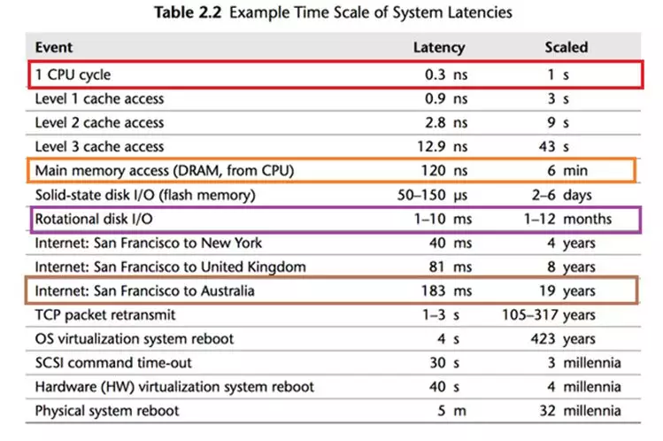
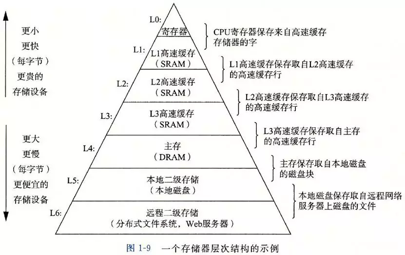

# CPU 内存 硬盘 读写速度详解

作者： 码农翻身刘欣

今天给大家分享两幅图，它们是如此的重要，以至于你看到的很多软件的设计都和他们相关， 可以说图中展示的问题都是计算机的本质问题。 

**图1 计算机各个部件的速度** 

可以看到，CPU最快，一个时钟周期是0.3纳秒，内存访问需要120纳秒，固态硬盘访问需要50-150微秒，传统硬盘访问需要1-10毫秒， 网络访问最慢，都是几十毫秒。 

**1(s) = 1000(ms) = 100 0000(μs) = 10 0000 0000 (ns)**    (1 秒 = 1000 毫秒 = 10 万微秒 = 1 亿纳秒) 

这幅图最有趣的地方在于它把**计算机世界的时间和人类世界的时间做了对比**，我常常把CPU比喻成跑得很快，但是记不住事情的“[阿甘](http://mp.weixin.qq.com/s?__biz=MzAxOTc0NzExNg==&mid=2665513017&idx=1&sn=5550ee714abd36d0b580713f673e670b&chksm=80d6787ab7a1f16c39e1258d046b199c06a4dcc95dc192ff2f285be04f616a9ab891d6b3f7d9&scene=21#wechat_redirect)”， 他的**一个时钟周期如果按1秒算**： 

**内存访问就是6分钟** 

**固态硬盘是2-6天** 

**传统硬盘是1-12个月** 

**网络访问就是几年了！** 

**如果你是CPU，你会觉得这个世界真是慢死了！**从硬盘访问数据得等待“几天”甚至“几个月”！

 

**图2 存储器的层次结构** 

来源：《深入理解计算机系统》第3版 

图 2 把 图 1 的信息变成了层次化的方式，并且增加了价格信息，它展示了一个真理：世界上没有免费的午餐。 

存储器越往上速度越快，但是价格越来越贵， 越往下速度越慢，但是价格越来越便宜。 

这两幅图有什么意义呢？

正是由于计算机各个部件的速度不同，容量不同，价格不同，导致了计算机系统/编程中的各种问题以及相应的解决方案， 我来举几个例子。 

**案例1**

CPU的速度超级快，不能老是让它闲着，要充分地压榨它！ 

这里有两个强劲的理由： 

1. 人类需要多个程序“同时”运行。我们要把CPU的时间进行分片，让各个程序在CPU上轮转，造成一种多个程序同时在运行的假象，即**并发**。 

2. 当CPU遇到IO操作（硬盘，网络）时，不能坐在那里干等“几个月”甚至“几年”。在等待的时候，一定要切换，去执行别的程序。 

说起来简单，但是程序的切换需要保存程序执行的现场，以便以后恢复执行，于是需要一个数据结构来表示，这就是**进程**了。 

如果一个进程只有一个“执行流”，当进程去等待硬盘的操作，那这个程序就会被阻塞，无法响应用户的输入了，所以必须得有多个“执行流”，即**线程**。 

**案例2**

需要持久化的数据一定要保存到硬盘中，但是硬盘超级慢，支持不了大量的并发访问，那怎么办呢？ 

可以把最访问的热点数据放到CPU的缓存中嘛， 其实CPU也是这么做的，但是CPU的L1, L2, L3级缓存实在是太小，根本满足不了需求。 

于是只好退而求其次，把热点数据放到速度稍慢的内存中，于是**应用程序的缓存**就出现了。 

缓存虽然是解决了问题，但是也带来了更多的问题，例如：

- 缓存数据和数据库数据怎么保持一致性？ 
- 缓存如果崩溃了该怎么处理？ 
- 数据在一台机器的内存放不下了，要分布到多个机器上，怎么搞分布式啊，用什么算法？.....

**案例3**

考虑一个像Tomcat这样的应用服务器，对于每个请求都要用一个线程来处理，如果现在有一万个请求进来，Tomcat会建立1万个线程来处理吗？ 

不会的，因为线程多了开销会很大 ，线程切换起来也很慢，所以它只好用个**线程池**来复用线程。 

现在假设线程池中有一千个可用线程（已经非常多了），它们都被派去访问硬盘，数据库，或者发起网络调用，这是非常慢的操作，导致这一千个线程都在等待结果的返回（阻塞了），那剩下的九千个请求就没法处理了，对吧？ 

所以后来人们就发明了新的处理办法，仅使用几个线程（例如和CPU核心数量一样），让他们疯狂运行，遇到I/O操作，程序就注册一个钩子函数放在那里，然后线程就去处理别的请求。

等到I/O操作完成了，系统会给这个线程发送一个事件， 线程就回过头来调用之前的钩子函数（也叫回调函数）来处理。 

这就是**异步，非阻塞**的处理方式。Node.js，Vert.x等采用的都是类似的思想。 

**案例4** 

**Redis使用单线程的方式来处理请求的**，为什么用单线程就可以呢？ 它为什么不像Tomcat那样使用多线程和线程池呢？ 

因为它面对的仅仅是内存，内存的速度在计算机的体系中仅次于CPU，比那些网络操作不知道要快到哪里去了（可以回头看看第一幅图中网络速度有多慢！） 

所以这个唯一的线程就可以快速地执行内存的读写操作，完成从许多网络过来的缓存请求了。单线程还有个巨大的优势，没有竞争，不需要加锁！

看到了吧，我们软件中的很多问题，其根源都是计算机各个部件的速度差异导致的。 

这里可以开一个脑洞，如果硬盘的速度和内存的速度一样快，并且可以持久化存储，不会像内存一样断电以后数据就丢失了，那我们的电脑和系统会变成什么样子呢？

（完）
