# 图文介绍进程和线程的区别

原文地址：http://r6d.cn/6mKF

原文作者：Luckylau

### 进程和线程的概念

先了解一下操作系统的一些相关概念，大部分操作系统(如Windows、Linux)的任务调度是采用时间片轮转的抢占式调度方式，也就是说一个任务执行一小段时间后强制暂停去执行下一个任务，每个任务轮流执行。任务执行的一小段时间叫做时间片，任务正在执行时的状态叫运行状态，任务执行一段时间后强制暂停去执行下一个任务，被暂停的任务就处于就绪状态等待下一个属于它的时间片的到来。这样每个任务都能得到执行，由于CPU的执行效率非常高，时间片非常短，在各个任务之间快速地切换，给人的感觉就是多个任务在“同时进行”，这也就是我们所说的并发(并发简单来说多个任务同时执行)。

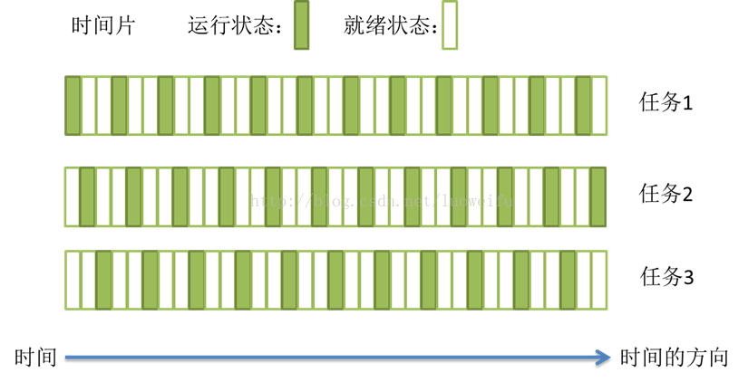

### 进程

计算机的核心是CPU，它承担了所有的计算任务；而操作系统是计算机的管理者，它负责任务的调度、资源的分配和管理，统领整个计算机硬件；应用程序侧是具有某种功能的程序，程序是运行于操作系统之上的。

进程是一个具有一定独立功能的程序在一个数据集上的一次动态执行的过程，是操作系统进行资源分配和调度的一个独立单位，是应用程序运行的载体。进程是一种抽象的概念，从来没有统一的标准定义。进程一般由程序、数据集合和进程控制块三部分组成。程序用于描述进程要完成的功能，是控制进程执行的指令集；数据集合是程序在执行时所需要的数据和工作区；程序控制块(Program Control Block，简称PCB)，包含进程的描述信息和控制信息，是进程存在的唯一标志。

**进程具有的特征：**

•动态性：进程是程序的一次执行过程，是临时的，有生命期的，是动态产生，动态消亡的；•并发性：任何进程都可以同其他进程一起并发执行；•独立性：进程是系统进行资源分配和调度的一个独立单位；•结构性：进程由程序、数据和进程控制块三部分组成。

进程的生命周期

在早期只有进程的操作系统中，进程有五种状态，创建、就绪、运行、阻塞(等待)、退出。

•创建：进程正在创建，还不能运行。操作系统在创建进程时要进行的工作包括分配和建立进程控制块表项、建立资源表格并分配资源、加载程序并建立地址空间；•就绪：时间片已用完，此线程被强制暂停，等待下一个属于他的时间片到来；•运行：此线程正在执行，正在占用时间片；•阻塞：也叫等待状态，等待某一事件(如IO或另一个线程)执行完；•退出：进程已结束，所以也称结束状态，释放操作系统分配的资源。

### 线程

在早期的操作系统中并没有线程的概念，进程是能拥有资源和独立运行的最小单位，也是程序执行的最小单位。任务调度采用的是时间片轮转的抢占式调度方式，而进程是任务调度的最小单位，每个进程有各自独立的一块内存，使得各个进程之间内存地址相互隔离。

后来，随着计算机的发展，对CPU的要求越来越高，进程之间的切换开销较大，已经无法满足越来越复杂的程序的要求了。于是就发明了线程，线程是程序执行中一个单一的顺序控制流程，是程序执行流的最小单元，是处理器调度和分派的基本单位。一个进程可以有一个或多个线程，各个线程之间共享程序的内存空间。

**一个标准的线程由线程ID、当前指令指针(PC)、寄存器和堆栈组成。而进程由内存空间(代码、数据、进程空间、打开的文件)和一个或多个线程组成。**

#### 线程的生命周期

当线程的数量小于处理器的数量时，线程的并发是真正的并发，不同的线程运行在不同的处理器上。但当线程的数量大于处理器的数量时，线程的并发会受到一些阻碍，此时并不是真正的并发，因为此时至少有一个处理器会运行多个线程。在单个处理器运行多个线程时，并发是一种模拟出来的状态。操作系统采用时间片轮转的方式轮流执行每一个线程。现在，几乎所有的现代操作系统采用的都是时间片轮转的抢占式调度方式，如我们熟悉的Unix、linux、Windows及Mac OS X等流行的操作系统。

•创建：一个新的线程被创建，等待该线程被调用执行；•就绪：时间片已用完，此线程被强制暂停，等待下一个属于他的时间片到来；•运行：此线程正在执行，正在占用时间片；•阻塞：也叫等待状态，等待某一事件(如IO或另一个线程)执行完；•退出：一个线程完成任务或者其他终止条件发生，该线程终止进入退出状态，退出状态释放该线程所分配的资源。

**线程优先级**

操作系统(如Windows、Linux、Mac OS X)的任务调度除了具有前面提到的时间片轮转的特点外，还有优先级调度(Priority Schedule)的特点。优先级调度决定了线程按照什么顺序轮流执行，在具有优先级调度的系统中，线程拥有各自的线程优先级(Thread Priority)。具有高优先级的线程会更早地执行，而低优先级的线程通常要等没有更高优先级的可执行线程时才会被执行。

线程的优先级可以由用户手动设置，此外系统也会根据不同情形调整优先级。通常情况下，频繁地进入等待状态(进入等待状态会放弃之前仍可占用的时间份额)的线程(如IO线程)，比频繁进行大量计算以至于每次都把所有时间片全部用尽的线程更受操作系统的欢迎。因为频繁进入等待的线程只会占用很少的时间，这样操作系统可以处理更多的任务。我们把频繁等待的线程称之为IO密集型线程(IO Bound Thread)，而把很少等待的线程称之为CPU密集型线程(CPU Bound Thread)。IO密集型线程总是比CPU密集型线程更容易得到优先级的提升。

**线程饿死** 在优先级调度下，容易出现一种线程饿死的现象。一个线程饿死是说它的优先级较低，在它执行之前总是有比它优先级更高的线程等待执行，因此这个低优先级的线程始终得不到执行。当CPU密集型的线程优先级较高时，其它低优先级的线程就很可能出现饿死的情况；当IO密集型线程优先级较高时，其它线程相对不容易造成饿死的，因为IO线程有大量的等待时间。为了避免线程饿死，调度系统通常会逐步提升那些等待了很久而得不到执行的线程的优先级。这样，一个线程只要它等待了足够长的时间，其优先级总会被提升到可以让它执行的程度，也就是说这种情况下线程始终会得到执行，只是时间的问题。

在优先级调度环境下，线程优先级的改变有三种方式：

1.用户指定优先级；2.根据进入等待状态的频繁程度提升或降低优先级(由操作系统完成)；3.长时间得不到执行而被提升优先级。

**多线程与多核** 上面提到的时间片轮转的调度方式说一个任务执行一小段时间后强制暂停去执行下一个任务，每个任务轮流执行。很多操作系统的书都说“同一时间点只有一个任务在执行”。其实“同一时间点只有一个任务在执行”这句话是不准确的，至少它是不全面的。我们分析一下多核的情况。

这是我的电脑的CPU情况图：

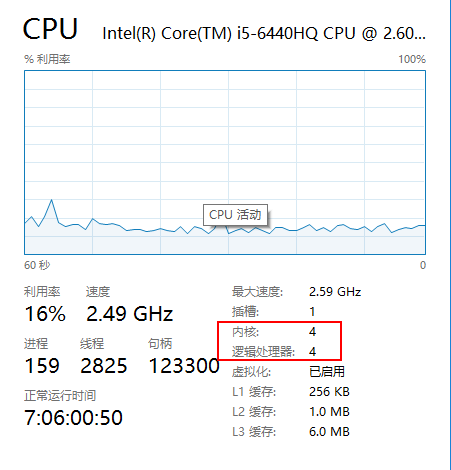

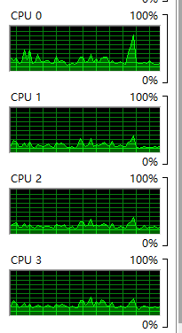

多核(心)处理器是指在一个处理器上集成多个运算核心从而提高计算能力，也就是有多个真正并行计算的处理核心，每一个处理核心对应一个内核线程。内核线程（Kernel Thread， KLT）就是直接由操作系统内核支持的线程，这种线程由内核来完成线程切换，内核通过操作调度器对线程进行调度，并负责将线程的任务映射到各个处理器上。一般一个处理核心对应一个内核线程，比如单核处理器对应一个内核线程，双核处理器对应两个内核线程，四核处理器对应四个内核线程。

现在的电脑一般是双核四线程、四核八线程，是采用超线程技术将一个物理处理核心模拟成两个逻辑处理核心，对应两个内核线程，所以在操作系统中看到的CPU数量是实际物理CPU数量的两倍。但是我的如上图是四核四线程，似乎没有用这个超线程技术。

超线程技术就是利用特殊的硬件指令，把一个物理芯片模拟成两个逻辑处理核心，让单个处理器都能使用线程级并行计算，进而兼容多线程操作系统和软件，减少了CPU的闲置时间，提高的CPU的运行效率。这种超线程技术(如双核四线程)由处理器硬件的决定，同时也需要操作系统的支持才能在计算机中表现出来。

程序一般不会直接去使用内核线程，而是去使用内核线程的一种高级接口——轻量级进程（Light Weight Process，LWP），轻量级进程就是我们通常意义上所讲的线程(我们在这称它为用户线程)，由于每个轻量级进程都由一个内核线程支持，因此只有先支持内核线程，才能有轻量级进程。用户线程与内核线程的对应关系有三种模型：一对一模型、多对一模型、多对多模型，在这以4个内核线程、3个用户线程为例对三种模型进行说明。

**一对一模型** 对于一对一模型来说，一个用户线程就唯一地对应一个内核线程(反过来不一定成立，一个内核线程不一定有对应的用户线程)。这样，如果CPU没有采用超线程技术(如四核四线程的计算机，就如上图展示的我使用的计算机)，一个用户线程就唯一地映射到一个物理CPU的线程，线程之间的并发是真正的并发。一对一模型使用户线程具有与内核线程一样的优点，一个线程因某种原因阻塞时其他线程的执行不受影响；此处，一对一模型也可以让多线程程序在多处理器的系统上有更好的表现。但一对一模型也有两个缺点：

1.许多操作系统限制了内核线程的数量，因此一对一模型会使用户线程的数量受到限制；2.许多操作系统内核线程调度时，上下文切换的开销较大，导致用户线程的执行效率下降。

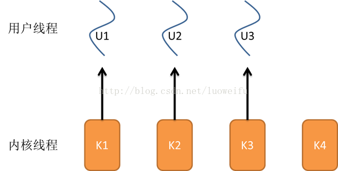

**多对一模型**

多对一模型将多个用户线程映射到一个内核线程上，线程之间的切换由用户态的代码来进行，因此相对一对一模型，多对一模型的线程切换速度要快许多；此外，多对一模型对用户线程的数量几乎无限制。但多对一模型也有两个缺点：

1.如果其中一个用户线程阻塞，那么其它所有线程都将无法执行，因为此时内核线程也随之阻塞了；2.在多处理器系统上，处理器数量的增加对多对一模型的线程性能不会有明显的增加，因为所有的用户线程都映射到一个处理器上了。

**多对多模型** 多对多模型结合了一对一模型和多对一模型的优点，将多个用户线程映射到多个内核线程上。多对多模型的优点有：

1.一个用户线程的阻塞不会导致所有线程的阻塞，因为此时还有别的内核线程被调度来执行；2.多对多模型对用户线程的数量没有限制；3.在多处理器的操作系统中，多对多模型的线程也能得到一定的性能提升，但提升的幅度不如一对一模型的高。

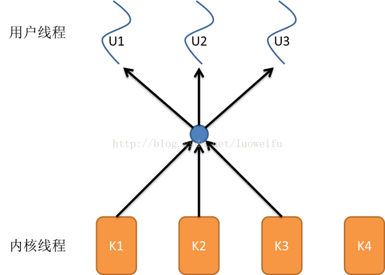

### 进程与线程的区别

线程是程序执行的最小单位，而进程是操作系统分配资源的最小单位；

一个进程由一个或多个线程组成，线程是一个进程中代码的不同执行路线；

进程之间相互独立，但同一进程下的各个线程之间共享程序的内存空间(包括代码段、数据集、堆等)及一些进程级的资源(如打开文件和信号)，某进程内的线程在其它进程不可见；

调度和切换：线程上下文切换比进程上下文切换要快得多。

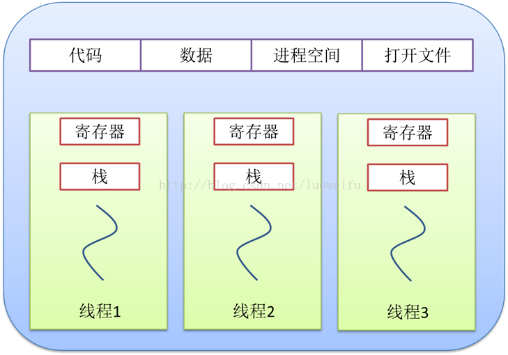

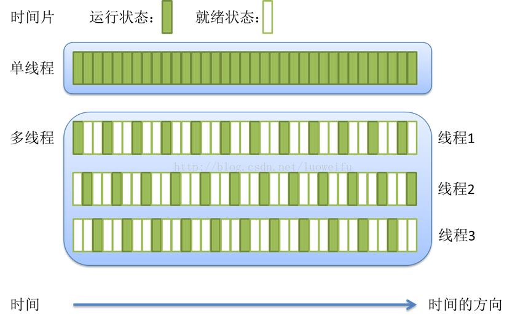

总之，线程和进程都是一种抽象的概念，线程是一种比进程更小的抽象，线程和进程都可用于实现并发。

在早期的操作系统中并没有线程的概念，进程是能拥有资源和独立运行的最小单位，也是程序执行的最小单位。它相当于一个进程里只有一个线程，进程本身就是线程。所以线程有时被称为轻量级进程(Lightweight Process，LWP）。

后来，随着计算机的发展，对多个任务之间上下文切换的效率要求越来越高，就抽象出一个更小的概念——线程，一般一个进程会有多个(也可是一个)线程。

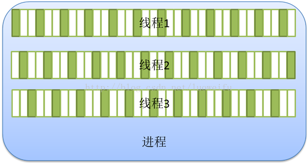

### 漫话进程和线程

1.计算机的核心是CPU，它承担了所有的计算任务。它就像一座工厂，时刻在运行。

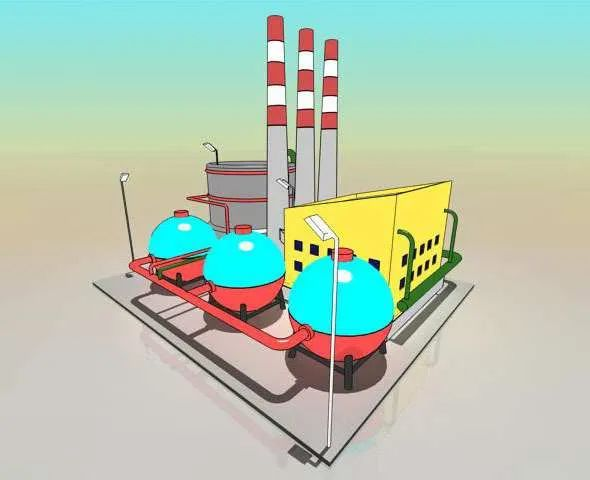

2.假定工厂的电力有限，一次只能供给一个车间使用。也就是说，一个车间开工的时候，其他车间都必须停工。背后的含义就是，单个CPU一次只能运行一个任务。

3.进程就好比工厂的车间，它代表CPU所能处理的单个任务。任一时刻，CPU总是运行一个进程，其他进程处于非运行状态。

4.一个车间里，可以有很多工人。他们协同完成一个任务。

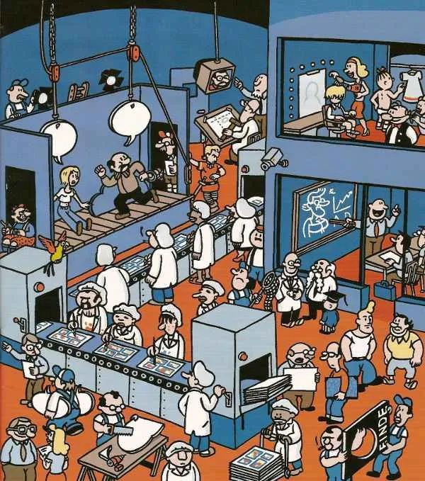

5.线程就好比车间里的工人。一个进程可以包括多个线程。

6.车间的空间是工人们共享的，比如许多房间是每个工人都可以进出的。这象征一个进程的内存空间是共享的，每个线程都可以使用这些共享内存。

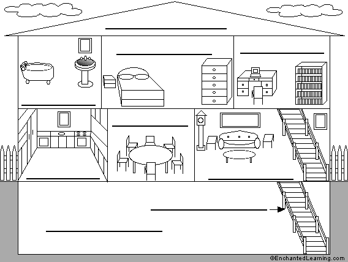

7.可是，每间房间的大小不同，有些房间最多只能容纳一个人，比如厕所。里面有人的时候，其他人就不能进去了。这代表一个线程使用某些共享内存时，其他线程必须等它结束，才能使用这一块内存。

8.一个防止他人进入的简单方法，就是门口加一把锁。先到的人锁上门，后到的人看到上锁，就在门口排队，等锁打开再进去。这就叫”互斥锁”（Mutual exclusion，缩写 Mutex），防止多个线程同时读写某一块内存区域。

9.还有些房间，可以同时容纳n个人，比如厨房。也就是说，如果人数大于n，多出来的人只能在外面等着。这好比某些内存区域，只能供给固定数目的线程使用。

10.这时的解决方法，就是在门口挂n把钥匙。进去的人就取一把钥匙，出来时再把钥匙挂回原处。后到的人发现钥匙架空了，就知道必须在门口排队等着了。这种做法叫做”信号量”（Semaphore），用来保证多个线程不会互相冲突。

不难看出，mutex是semaphore的一种特殊情况（n=1时）。也就是说，完全可以用后者替代前者。但是，因为mutex较为简单，且效率高，所以在必须保证资源独占的情况下，还是采用这种设计。

操作系统的设计，因此可以归结为三点：

（1）以多进程形式，允许多个任务同时运行；

（2）以多线程形式，允许单个任务分成不同的部分运行；

（3）提供协调机制，一方面防止进程之间和线程之间产生冲突，另一方面允许进程之间和线程之间共享资源。

