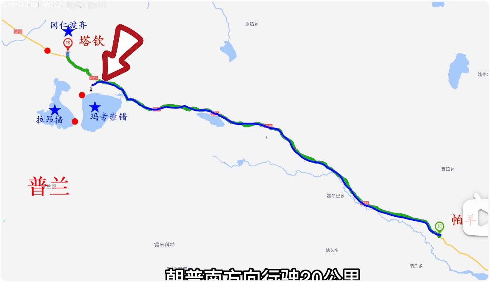
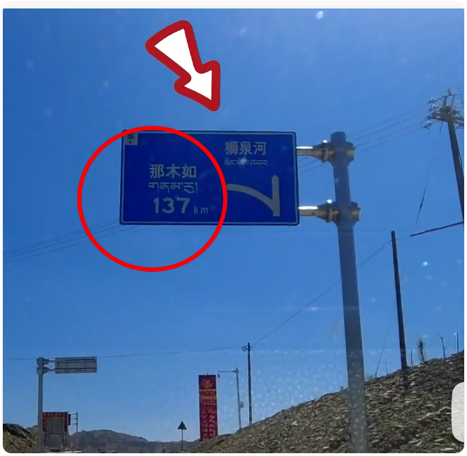
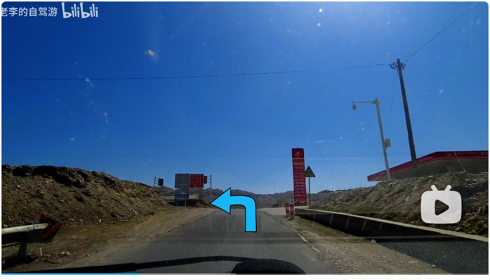
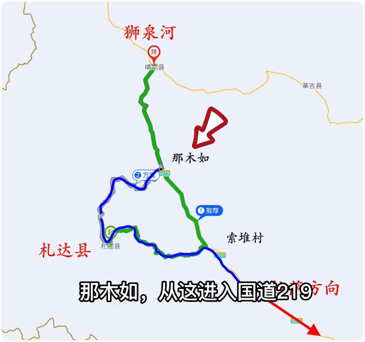
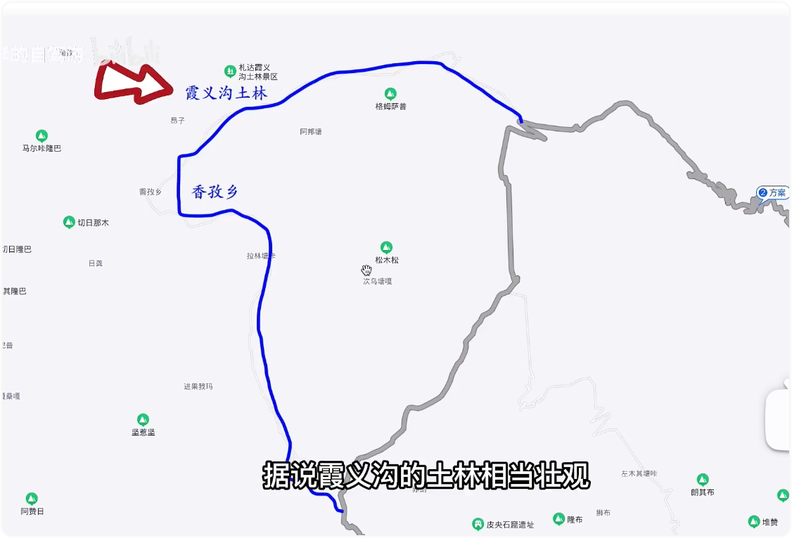
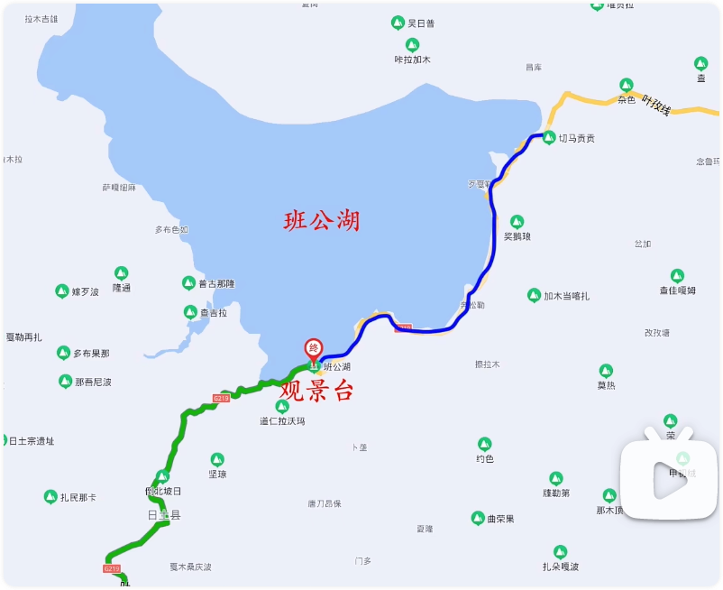

# 阿里大环线

### D1.日喀则-加措拉垭口-珠峰观景台-白坝村-岗嘎宾馆（岗嘎镇）

#### 距离：距离295公里，约6小时0分钟

#### 高速费：-

#### 累计里程：

#### 保养里程：

#### 海拔：4349m

#### 打卡：加措拉垭口（珠峰大门） 珠峰观景台

#### 住宿：1晚，岗嘎宾馆

#### 简介：

小商贩很烦人，赶紧走

要住在岗嘎宾馆，可以看到珠峰，住宿可以看到珠峰

白坝镇也可以住宿，会比较贵

### D2.岗嘎镇-萨嘎县

#### 距离：距离230公里，约3小时40分钟

#### 高速费：-

#### 累计里程：

#### 保养里程：

#### 海拔：-m

#### 打卡：岗嘎镇看珠峰，318与219分叉口，佩枯湖观景台

#### 住宿：1晚

#### 简介：

### D3.萨嘎县-帕羊镇

#### 距离：距离232公里，约3小时30分钟

#### 高速费：-

#### 累计里程：

#### 保养里程：

#### 海拔：-m

#### 打卡：五彩沙漠 塘西大草原 

#### 住宿：1晚

#### 简介：

### D4.帕羊镇-塔钦村

#### 距离：距离260+40 公里，约4小时0分钟

#### 高速费：-

#### 累计里程：

#### 保养里程：

#### 海拔：-m

#### 打卡：玛旁雍错 拉昂错 纳木那尼峰 冈仁波齐

#### 住宿：1晚

#### 简介：

从玛旁雍错游客中心，继续向前，往普南方向行驶20公里，可以看玛旁雍错，有玛旁雍错观景台，向前10公里拉昂错（鬼湖） ，纳木那尼峰，免费。

### D5.塔钦村-冈仁波齐观景台（路边）-索堆村有路牌左转-札达县

#### 距离：距离230公里，约4小时30分钟

#### 高速费：-

#### 累计里程：

#### 保养里程：

#### 海拔：-m

#### 打卡：龙嘎拉达坂的丹霞地貌，中间有个碧绿色的小湖面，过检查站后，  札达土林观景台， 古格王朝遗址

#### 住宿：1晚

#### 简介：

过索堆村后，路变窄，路上有牲畜

过检查站后，犹如在迷宫中行走。县城就在土林里，土林就在道路上

古格王朝遗址距离县城20公里，26分钟，门票65元，参观时间3小时

### D6.札达县-（那木如方向）-香孜乡-霞义沟土林-狮泉河镇

#### 距离：距离251公里，约5小时30分钟

#### 高速费：-

#### 累计里程：

#### 保养里程：

#### 海拔：-m

#### 打卡：路上可以看到喜马拉雅山脉和冈底斯山脉的分界线，也可以在路边就看到冰川。有一段起起伏伏的路面可以打卡拍照住宿：2晚

#### 简介： 

看见那木如方向的牌子，向那木如走。牌子前面有个加油站左转

阿里 噶尔县城 狮泉河镇 是同一个地方

仲巴=日喀则

 

### D7.狮泉河镇-班公湖-日土县

#### 距离：距离140公里，约2小时0分钟

#### 高速费：- 

#### 累计里程：

#### 保养里程：

#### 海拔：-m

#### 打卡：班公湖就在路边，边走边看，从日土县到湖边路尽，单程约37公里，40分钟

#### 住宿：1晚

#### 简介：

### D8.日土县-狮泉河镇-革吉县

#### 距离：距离248公里，约4小时0分钟

#### 高速费：- 

#### 累计里程：

#### 保养里程：

#### 海拔：-m

#### 打卡：

#### 住宿：1晚

#### 简介：

### D9.革吉县--雄巴乡-改则县

#### 距离：距离365公里，约5小时20分钟

#### 高速费：-

#### 累计里程：

#### 保养里程：

#### 海拔：-m

#### 打卡：戈壁和野生动物，盐湖

#### 住宿：1晚

#### 简介：

### D10.改则县-尼玛县

#### 距离：距离338公里，约5小时00分钟

#### 高速费：-

#### 累计里程：

#### 保养里程：

#### 海拔：-m

#### 打卡：洞措，车可以开到湖边

#### 住宿：1晚

#### 简介：

### D11.尼玛县-文布南村

#### 距离：距离150公里，约3小时0分钟

#### 高速费：-

#### 累计里程：

#### 保养里程：

#### 海拔：-m

#### 打卡：当穹错 当惹雍错 古象雄遗址

#### 住宿：1晚

#### 简介：

### D12.文布南村-班戈县

#### 距离：距离484公里，约8小时0分钟

#### 高速费：-

#### 累计里程：

#### 保养里程：

#### 海拔：-m

#### 打卡：色林错 西藏最大的湖

#### 住宿：1晚

#### 简介：

### D13.班戈县-巴木错-纳木错-当雄-那曲

#### 距离：距离380公里，约5小时0分钟

#### 高速费：-

#### 累计里程：

#### 保养里程：

#### 海拔：-m

#### 打卡：巴木错附近有个高坡，一定要上去看看

#### 住宿：1晚

#### 简介：

