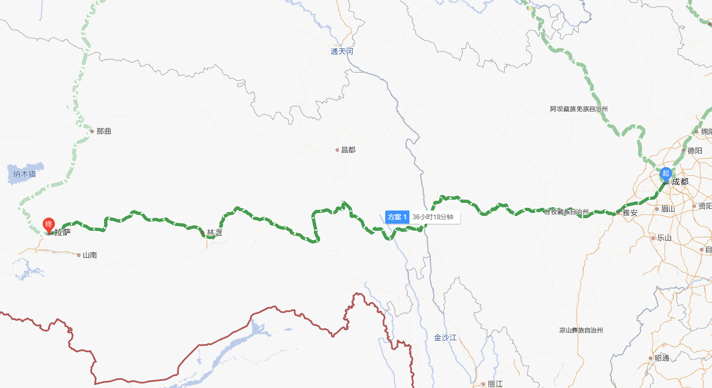

# 骑摩去西藏

## ▲ 318 进藏路线规划

全程线路预览

### 1. 成都 -- 海螺沟

#### 时间规划
后续补充

#### 海拔和主要景点
##### 雅安市：
- 海拔：641m，第一阶梯和第二阶梯的节点，然后进入横断山脉
- 景点：
##### 二郎山
- 海拔：3400m
- 景点：二郎山隧道

#### 住宿
......

3.	**泸定县，1321m，泸定桥和二郎山，贡嘎雪山7556m，四川最高峰，横断最高峰，就在海螺沟冰川上面。藏族彝族等17个民族。距离雅江188公里，约4小时41分钟。建议住宿**
4.	康定，2395m，甘孜首府，假期住宿要提前预定，提前可以住泸定一天，给海螺沟留一天时间。距离雅江150km，约3小时30分钟。
5.	折多山4298m，会堵车，回头弯的路很烂，其他很好。基本没有好天气，好天气要回头向康定看，有雪山。垭口有白塔和石头，打卡地，略作休息。不必去山顶。康巴第一关。与`成都海拔差4000米，温差20℃`。距离新都桥45公里
6.	新都桥3630m，摄影天堂。旅游交汇路口，旺季要提前订住宿。海拔高，不建议住。时间充足，向塔公草原走一段再回来，风景好。出高尔寺隧道后，是峡谷公路，可以航拍，景色壮观。过新都桥到高尔寺山，是看贡嘎雪山的最佳位置。距离雅江70多公里。
7.	**雅江县2530m，建议住宿距离巴塘县300多公里，正好一天。在雅砻江河谷中，**
8.	剪子弯山3990m，天路十八弯，上山是急弯，非常费时间。路边可以停车，是观景台。后面到姊妹湖，天气变化大，路况好，风景好，318精华路段。雨季都是鲜花。
9.	尼玛贡神山4668m，
10.	卡子拉山4718m，
11.	理塘县4014m，海拔高，但是住宿便宜住宿条件好，理塘西城门，打卡“此生必驾318”。理塘到姊妹湖的风景特别好，都是鲜花，7月份是大片花海。至姊妹湖都是直路路况好。向南 到稻城亚丁约230公里，4小时。可以不去。向巴塘走，会路过毛垭草原。过啦毛垭草原，需要翻过海子山垭口，4685m。下山就是姊妹湖。
12.	姊妹湖4685m，318明珠，风景比收费景点好，观景台有小卖部的可以休息一会儿。靠近巴塘气温会升高很快。
13.	**巴塘县2580m，海拔低，可以住宿。从此车少了。距离如美镇150公里，约3小时44分钟。距离左贡县258公里，约6小时31分钟。
14.	金沙江大桥2481m，是长江的上游，四川与西藏以金沙江为界。塌方可能严重，会堵车几个小时。界碑打卡。过了海通沟，检查站，登记身份证。**
15.	宗拉山4150m
16.	芒康县3875m，条件差，不建议住。芒康到如美镇路况不好，要多预留时间。在芒康一定要加油。
17.	拉乌山4396m，路面不平，耗时。山顶观景台风景好。
18.	**如美镇2570m，海拔低，可以考虑住宿。没有中石油。后面有怒江72拐弯。距离左贡县约110公里，2小时40分钟。距离八宿县308公里，约7个多小时。可以看藏民晒盐。一定要休息好，后面的路很烂。**
19.	觉巴山3940m，最烂的路，急弯多，急弯都很烂。翻过山谷风景好，可以稍作休息。30公里山路，2000米的落差。
20.	东达山5130m，路况补丁多，和修路，风景普通，可以赶路为主。西藏第二高垭口。要吸氧气，尽快通过，不要逗留，避免缺氧。
21.	**左贡县3750m，住宿条件稍好。经过前几天的适应，高海拔应该差不多适应了。距离邦达100多公里，路况很好。距离八宿县200公里，约4小时25分钟。距离波密县约416公里，8小时31分钟。**
22.	邦达镇4120m，住宿和吃饭的卫生条件都很差，可以看到邦达草原。
23.	业拉山4658m，怒江72拐，路况烂，沥青和水泥路。特别慢。12公里的路，2000米落差。下面是怒江大峡谷，可以航拍。
24.	**八宿县3280m，海拔低，住宿还可以，在这里可以住一晚。后面是最美精华路段，景色无可挑剔，雪山、草原、森林、峡谷，蓝色河水还有然乌湖。路况好。可以向然乌湖里面走一小段后回来。然乌湖的颜色，7月前9月后是蓝色。距离波密县约217公里，4小时22分钟。距离林芝444公里，约9小时15分钟。**
25.	然乌湖3960m，被称为天使的眼泪。湖面长20多公里，是与丙察察的交汇处。过了然乌湖后面是网红冲水点。会路过米堆冰川。快到波密县，有一段森林公路很漂亮，可以看到雪山。
26.	**波密县2725m，县城里就可以看到雪山，住宿条件好，性价比高，可以住一晚。距离林芝228公里，约5小时。距离拉萨619公里，约9小时16分。空气湿润，夏无酷暑，冬无严寒。**
27.	古乡湖2600m，运气好天气好可以看到南迦巴瓦峰，经常天气差。后面到鲁朗镇，雨季特别容易塌方，会道路中断，提前查路况，小塌方半天一天，严重的可能一周以上。没有塌方的地方路况好，风景好。
28.	通麦大桥2061m，打卡景点
29.	鲁朗镇3700m，不建议买票进景点，可以吃石锅鸡。过鲁朗镇的时候有一个扎西岗村，天气好可以去看，田园风光，免费.
30.	色季拉山4720m，鲁朗林海景区，附近有个观景台可以不用花钱看类似的景色。
31.	**林芝市3010m，海拔低，可以住宿。后面有高速了，免费，说不让摩托车走，但是还是有。318路况也好，也慢不了多少，风景好很多，尤其是米拉山。小心牲畜。距离拉萨401公里，高速5小时，318国道8小时。**
32.	工布江达县3330m，林芝到拉萨最美的一段路。
33.	米拉山5013m，垭口有大石头可以打卡，现在有隧道。过了垭口几公里有个牌子写着思金拉措湖，50元门票，景色超好，最好预留半天的时间游玩。
34.	墨竹工卡县3835m，
35. **拉萨3650m，住宿。摩托车停到布达拉宫正对面拍照打卡。住宿很贵，可以住远一点，大昭寺附近可以停摩托车，在“甘泉林（拉萨大昭寺广场）西藏特产店”，导航搜索。大昭寺和布达拉宫是主要的景点。距离日喀则273公里，约5小时。**
36.	羊卓雍措4441m，拉萨三大圣湖之一。从拉萨往返大概是200公里
37.	日喀则，3836m，有扎什伦布寺，地位可以与布达拉宫齐名。

## ▲ 317 进藏路线规划
317进藏路线-人文宗教景观大道

1.	成都，距离都江堰市72公里，约1小时。距离马尔康市约318km，4小时20分钟。
2.	都江堰，720m，都江堰水利工程和青城山。距离汶川91km。距离马尔康市250km，约3小时15分钟。
3.	汶川，1236m，有地震博物馆。前行有桃坪羌寨和甘堡藏寨。距离理县55km。
4.	理县，1888m，向前几公里有毕棚沟景区，国内十大徒步线路之一。
5.	鹧鸪山隧道，3400m，氧气含量60%，尽快通过不要逗留。
6.	卓克基土司官寨，1935年，毛主席及中央机关在此住宿一周。2003年电视剧《尘埃落定》在此拍摄。
7.	马尔康市，2641m，意为火苗旺盛的地方。如果时间晚了，就在此住宿。距离观音桥镇71公里。
8.	观音桥镇，2677m，适合住宿和休息。是大渡河的上游。位于纳勒神山的半山腰的观音庙，海拔3865m，是观音三大道场之一。距离翁达镇121公里，2小时10分。
9.	翁达镇，3370m，向西北走G548到达色达县，82km，约1小时31分。
10.	色达县，3900m，偏离航线，喇荣五明佛学院和 天葬台位于色达县洛若镇，翁达镇到洛若镇66km，约1小时20分钟。强烈建议到佛学院。色达县向西13公里的东嘎山上有个东嘎寺，是扎什伦布寺的分寺，1936年朱总司令带领长征队伍在这里修整半个月，东嘎寺僧众为我军提供了大量的军需补寄。从此可以走县道X6983,过亚龙乡、泥柯乡、四通达乡、下雄乡返回317。攻略中说翻越海拔4580m的乃龙山垭口，到达朱倭乡，返回317，需要考证。原路返回到炉霍县约147km，3小时。
11.	炉霍县，3865m。从翁达镇折返，经过老折山隧道，海拔4053米。向前70公里到充古乡。
12.	充古乡，约3500米，右手边卡萨湖，当地人称为母亲湖，观景台可休息，可以到湖边喂鱼。向前43km，到达甘孜县。
13.	甘孜县，3390m，适合住宿休息。坐落于雅砻江边上，是长江的支流。县城东南部有一个格萨尔王城。格萨尔王是藏族人民引以为傲的旷世英雄，统一了大小部落150多个。前行90多公里抵达马尼干戈镇。
14.	马尼干戈镇，4180m，古代时，是青海西藏四川商贸的一个重要集镇和驿站。前行12km，看到的雪山是雀儿山，主峰海拔6168m。山顶的冰川融化流入玉隆拉措，也叫新路海。继续沿着雀儿山峡谷前行，就是雀儿山隧道，4373m。一定要走隧道，雀儿山垭口是317上海拔最高的景色最美的，但是路况很差，随时会有碎石滑落和塌方。马尼干戈镇距离德格县约79km。
15.	德格县，3290m，适合住宿休息。德格印经院，是三大印经院之一，是藏民族文化的宝库，有藏文化大百科之称，保存着22万块木刻古印版，也是格萨尔王的出生地。向前20多公里到达金沙江边，是长江的上游。过金沙江大桥，正式进入西藏。距离江达县93公里
16.	矮拉山隧道，3970m，
17.	江达县，3246米。也可以住宿。距离昌都230km，在这里要加满油。
18.	格勒拉山垭口，4369m
19.	昌都，3257m，也适合住宿。城市两侧有两条江，西边是昂曲，东边是扎曲，汇在一起叫澜沧江。是国道317和214的交汇点，沿着214向南，可以到达318的邦达镇。距离类乌齐县90km，要穿越海拔4200m的珠角拉山隧道
20.	类乌齐县，3850m，类乌齐意思为大山。从类乌齐向北走214，进入青海。沿着317翻越海拔4710m的杰嘎尔拉山垭口，距离觉恩乡102km。一定要加满油。
21.	觉恩乡，前行11.5km左拐，再行驶11.5公里的盘山路，盘山路要拐43个弯，爬升海拔1000米，路面没有硬化，非铺装，孜珠寺，4880m。3000年历史。逆时针转山，是雍正苯教最古老的最重要的寺院之一。
22.	丁青县，在类乌齐要加满油，后面路况越来越不好，加油站也少。如果有高反，即可返程，前面就没有低海拔的县市了。距离巴青县216km，要穿越谢啦山隧道，4400m。
23.	日曲朵村，向北走13公里，可以看到布加雪山，6328米，西藏七大神山之一，有世界最密集的悬冰川。
24.	巴青县，4150m，前行30公里抵达“索县”，3990m，适合住宿。出县城可以看到赞丹寺，依山而建，气势雄伟，酷似布达拉宫。距离那曲市229公里，要翻越3座垭口，均在4000米以上。
25.	那曲市，西北面是藏北草原，我国五大牧场之一。国道109与317在此交汇，沿着109前行166公里到达当雄县。
26.	当雄县，4209米，背面就是延绵1400公里的唐古拉山脉，沿着X105翻越唐古拉山，行程66公里，到达纳木错，我国第三大咸水湖，西藏三大圣湖之一。原路折返到当雄县。距离羊巴井镇78公里
27.	羊巴井镇，丰富的地热温泉。前行88公里到达拉萨
28.	拉萨，3650m，

## ▲ 出藏

### 马尔康市-北京

1.	马尔康市，2641m，意为火苗旺盛的地方。如果时间晚了，就在此住宿。距离黄河九曲第一湾270km，约5小时5分。向前行快到唐克镇的时候，会路过若尔盖大草原。若尔盖草原宛如一块镶嵌在川西北边界上瑰丽夺目的绿宝石，素有“川西北高原的绿洲”之称，是我国三大湿地之一。其中若尔盖湿地海拔约3500米，面积超过16万公顷，2008年被列入“国际重要湿地”。若尔盖湿地独特的气候和地理环境孕育出了丰富多样的高原物种，也是多种珍稀鸟类的栖息地。、
2.	黄河九曲第一湾，3500m，海拔为3500米左右，很多人向往黄河九曲第一湾的美景，同时也担心黄河九曲第一湾海拔太高，会产生高原反应，其实一般不会产生高原反应的。九曲黄河第一湾位于四川省阿坝藏族羌族自治州若尔盖县唐克镇 [1]  ，此处是四川、青海、甘肃三省交界处。黄河缓缓流过唐克城区，从若尔盖驱车大约61公里，经过唐克镇，唐克镇以北9公里到黄河九曲第一湾，登上一座小山包，黄河九曲第一湾的美丽景象跃入眼底。索克藏寺背后的山坡是骑马登山观看第一湾的高点，骑马价格50元，来回大约1小时。距离唐克镇10公里，约10分钟，唐克镇海拔3420米。距离若尔盖县城74公里，约1小时20分钟。、露营或者在索克藏寺住宿（大约30元/床）
3.	唐克镇，海拔3420m。距离若尔盖县64公里，约1小时5分钟。距离拉卜楞寺338公里，约6小时。距离郎木寺120公里，约2小时15分。
4.	若尔盖县，海拔3406米，可以住宿。隶属阿坝藏族羌族自治州，地处青藏高原东北边缘，位于四川省北部，系四川通往西北省区的北大门，四邻分别与甘肃省玛曲县、碌曲县、卓尼县、迭部县和阿坝州内阿坝县、红原县、松潘县、九寨沟县接壤，黄河与长江分水岭将其划为东西两部。县城海拔3406米。2005年热尔大草原被《国家地理杂志》评为“中国最美的湿地”。 若尔盖县享有“中国最美的高寒湿地草原”和“中国黑颈鹤之乡”的美誉，素有“川西北高原的绿洲”和“云端天堂”之称  。距离拉卜楞寺约305公里，约5小时20分钟。距离郎木寺，88公里，约1小时35分钟
5.	郎木寺，3337米。郎木寺位于甘、青、川交界处，海拔3480米，占地面积55公顷。距南部县城97公里、省会兰州467公里，是兰州经甘南到九寨沟旅游的必经之地。郎木寺古称“南番中心”，素有“东方瑞士”、“甘南香巴拉”之美誉，又因有神奇“德合仓郎木自显天然石洞”及德合仓郎木赛赤寺院而斐声中外。郎木寺是寺院，也是地名。郎木寺镇是以地名和寺名合二为一命名的，这在藏区并不多见，仅就其名而言也很具特色。郎木寺镇地形显峡谷盆地，四面环山，奇峰怪石，参差错落，显得气势雄浑，又丰姿娟秀。山风夹着阵阵从寺院传来的法号螺声从谷里吹来，把一路风尘，全身疲惫，洗荡得干干净净。别有意趣的是谷地的山峰颜色不同，造型别致，又因为是虎穴之地，虎的故事比比皆是。郎木寺赛赤寺院，藏语全称“噶丹雪珠皖嘎尔卓委琅”，意为“兜率论修白莲解脱洲”，是西藏哲蚌寺的子寺之一，属藏传佛教格鲁派著名寺院。
6.	尕海-则岔国家级自然保护区，是中国少见的集森林和野生动物型、高原湿地型、高原草甸型三重功能为一体的珍稀野生动植物自然保护区。土壤为高山草甸土、灰褐土、暗黑色草甸土、泥炭土和沼泽土，海拔2900～4400m，高差1500m，气候属于青藏高原湿润气候区，冬季漫长，夏季温凉，是避暑纳凉休假的理想之地。特别值得一提的是位于保护区西南部的尕海湿地，尕海湿地是鸟类迁徙的必经之路，每年春秋季有数以万计的候鸟到此地歇脚，繁殖后代，享有“鸟类乐园”的美称。
7.	拉卜楞寺，海拔3200m，位于甘肃省甘南藏族自治州夏河县，藏语全称为：“噶丹夏珠达尔吉扎西益苏奇具琅”，意思为具喜讲修兴吉祥右旋寺。简称扎西奇寺，一般称为拉卜楞寺。拉卜楞寺是藏语“拉章”的变音，意思为活佛大师的府邸。是藏传佛教格鲁派六大寺院之一，被世界誉为“世界藏学府”。 寺主是第六世嘉木样呼图克图，其他领导人包括八大堪布、四大赛赤。拉卜楞寺在历史上号称有108属寺（其实要远大于此数），是甘南地区的政教中心，拉卜楞寺保留有全国最好的藏传佛教教学体系。整个寺庙现存最古老也是唯一的第一世嘉木样活佛时期所建的佛殿，是位于大经堂旁的下续部学院的佛殿。在夏河县住宿。距离兰州215公里，约5小时29分钟。
8.	兰州，住宿整顿补给修车。兰州，简称“兰”、“皋”，古称金城，兰州自秦朝以来，已有两千多年的建城史，自古就是“联络四域、襟带万里”的交通枢纽和军事要塞，以“金城汤池”之意命名金城，素有“黄河明珠”的美誉。兰州得益于丝绸之路，成为重要的交通要道、商埠重镇。兰州地势西部和南部高，东北低，黄河自西南流向东北，横穿全境，切穿山岭，形成峡谷与盆地相间的串珠形河谷。
9.	距离定边县486公里，高速6小时，国道11小
10.	定边县定边县位于陕西省西北部，榆林市最西端，陕甘宁蒙四省（区）七县(旗)交界处，古有“东接榆延，西通甘凉，南邻环庆，北枕沙漠，土广边长，三秦要塞”之说。是陕西省的西北门户、榆林市的西大门。自古以来，商贾云集，素有“旱码头”之称。“中国马铃薯特产之乡”、“中国马铃薯美食之乡”、“中国民间剪纸艺术之乡”。距离延安270公里，高速3小时11分，国道7小时。
11.	延安，革命圣地。延安古称肤施、延州，被誉为“三秦锁钥，五路襟喉” [1-2]  ，是中华民族重要的发祥地，人文始祖黄帝曾居住在这一带，是天下第一陵——中华民族始祖黄帝的陵寝：黄帝陵所在地 [3-9]       ，是民族圣地、中国革命圣地，国务院首批公布的国家历史文化名城 [10-13]    。民国二十四年（1935年）10月，中共中央和中央红军顺利到达吴起镇，延安成为中国革命的落脚点和出发点，是全国革命根据地城市中旧址保存规模最大、数量最多、布局最为完整的城市 [10]  [14-15]  。党中央和毛主席等老一辈革命家在这里生活战斗了十三个春秋，领导了抗日战争和解放战争，培育了延安精神，是全国爱国主义、革命传统和延安精神三大教育基地 [16-20]     。延安是“双拥运动”发祥地，中国优秀旅游城市，有着“中国革命博物馆城”的美誉 [16-18]   。境内有各类文物遗址点8545处，其中革命遗址445处。距离晋中445公里，高速5小时34分，国道10小时。
12.	晋中，修整。主要是休息。距离良乡460公里，高速6小时，国道12小时。
13.	良乡。

