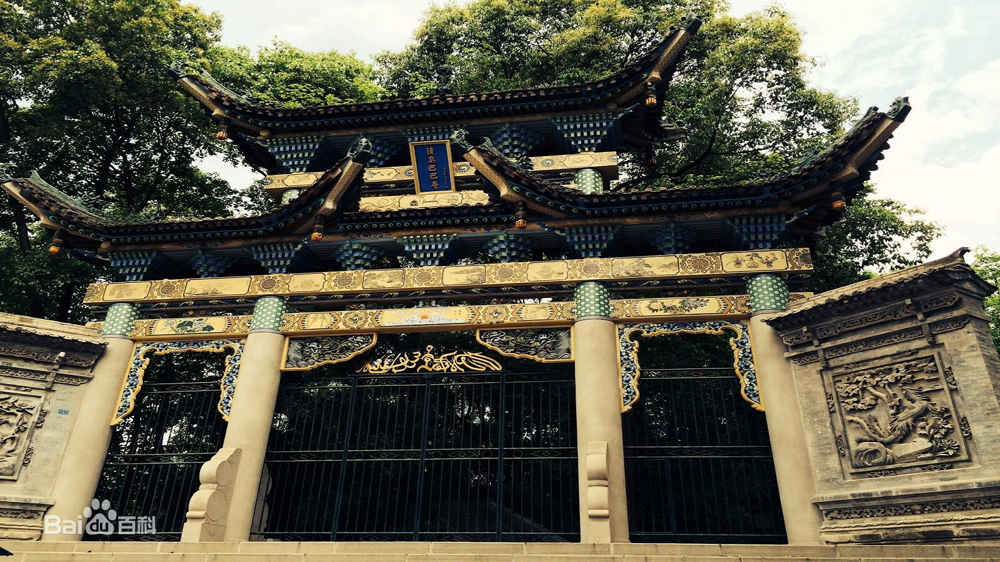
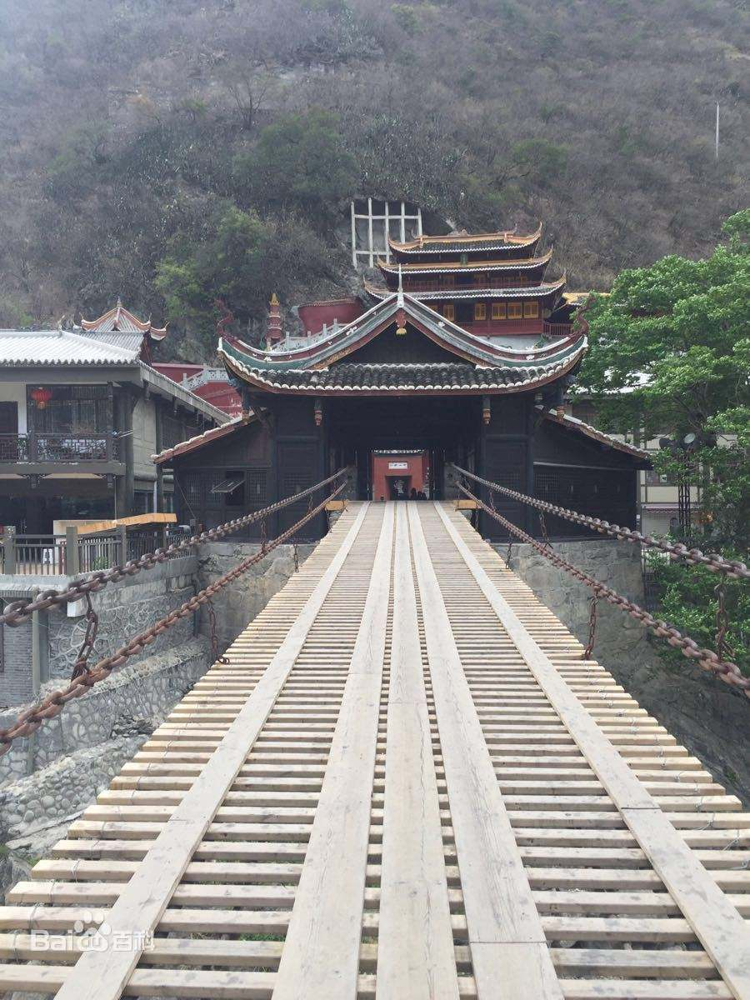
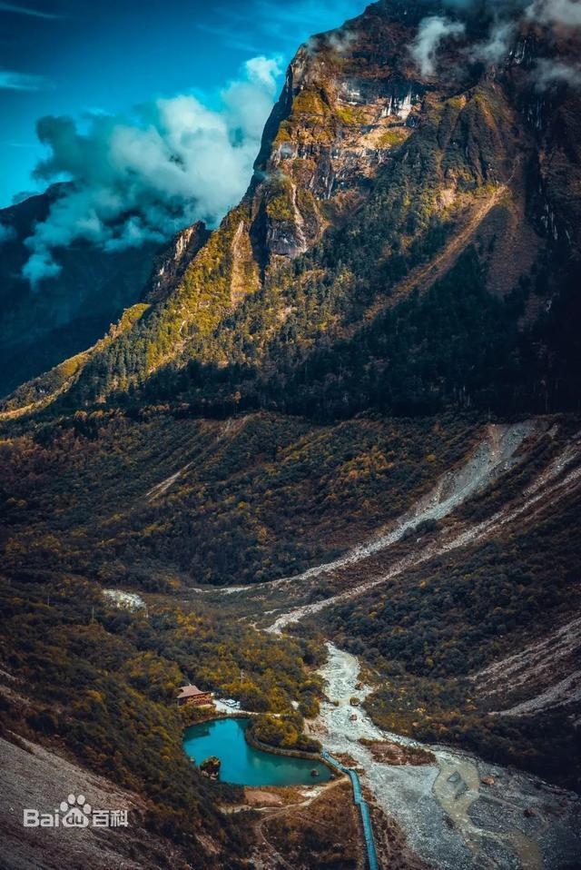
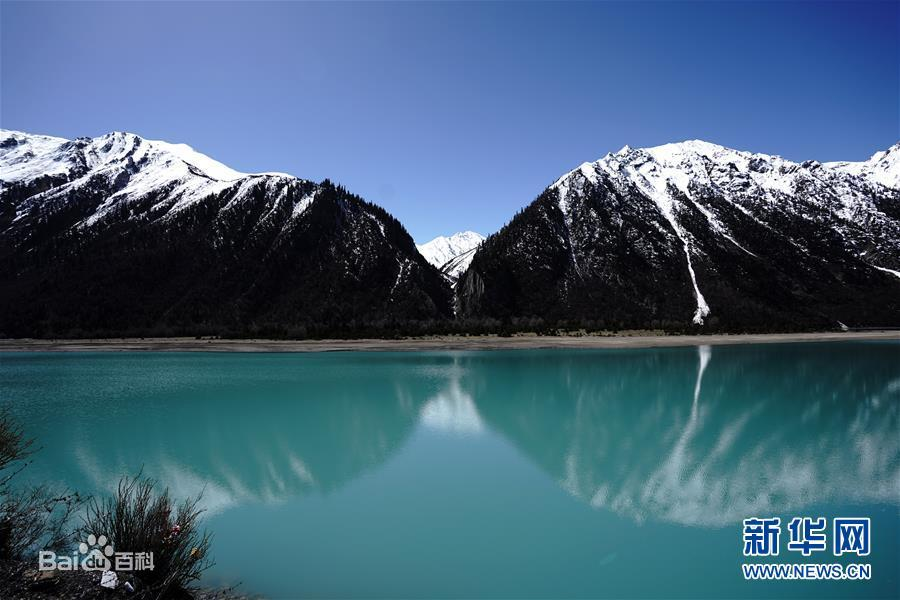
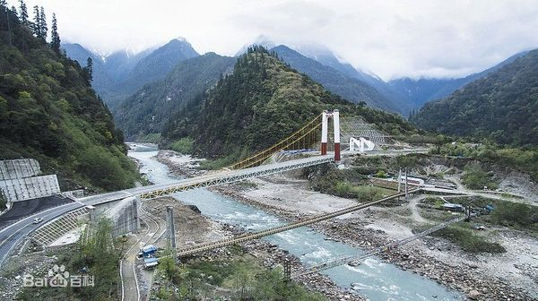
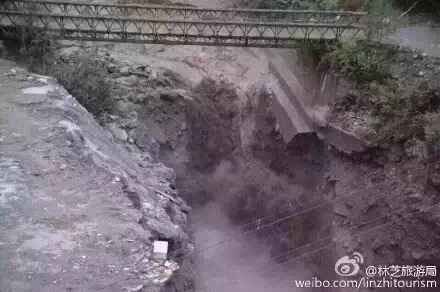
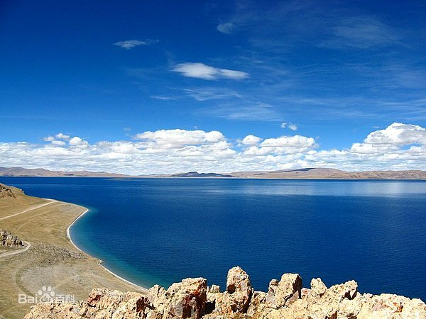
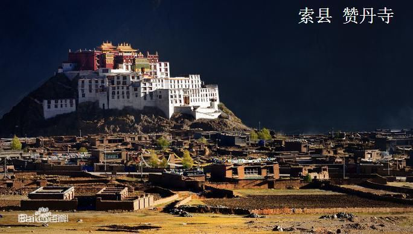
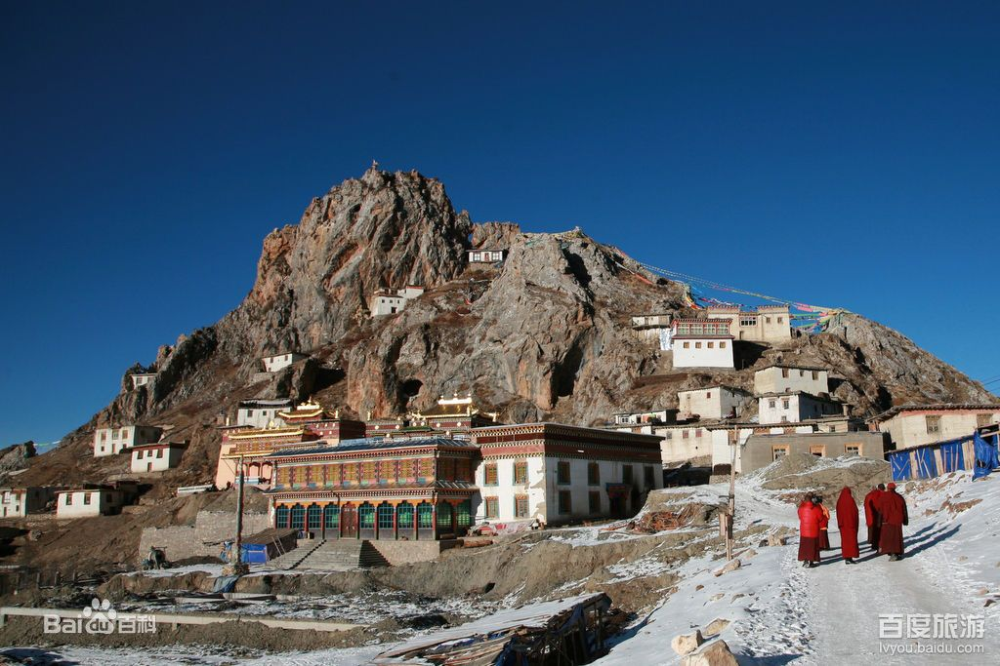
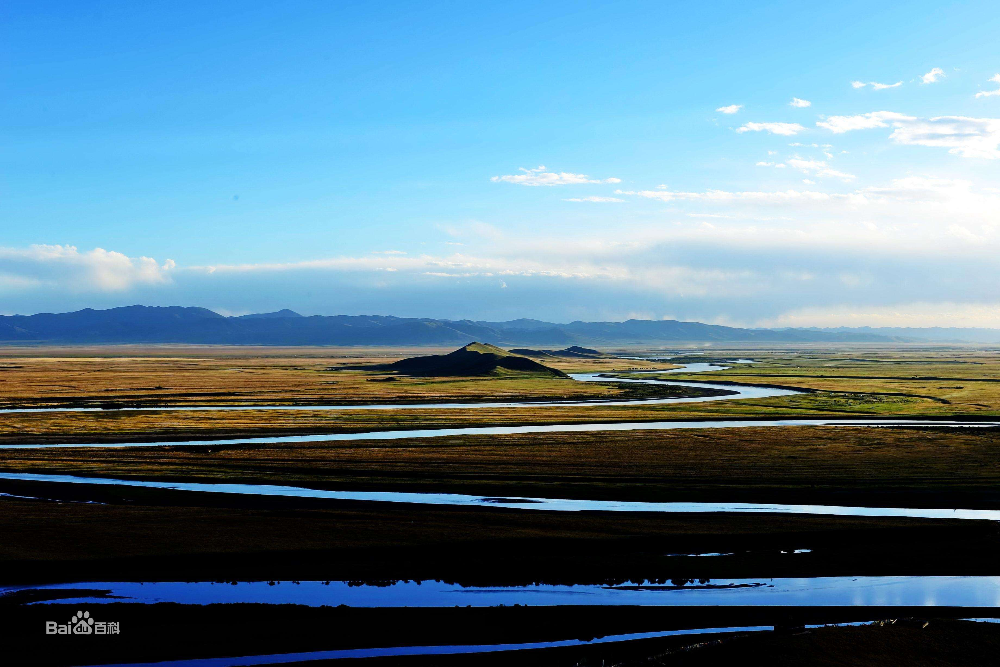

## 摩旅西藏路线（34 天）

## ▲ 注意事项和前期准备

1. 如果需要露营，提前准备：高山帐篷、防潮垫及零下睡袋等设备。

2. 灶具准备需要高压锅和汽油炉，汽油在当地很难加到散油，包括加油站。无人区和人迹罕至的地区可能小卖部可以找到散油，但是油品没有保障且数量不多。

3. 最好提前做好极限地区的攻略。

4. 提前下载好离线地图和卫星离线地图。

5. 提前下载好藏语离线翻译。最好提前学好常用语100-1000句。最好会发音，即使是藏文，藏民也可能看不懂。

6. 流浪狗很多，要做好防狗防狼的准备。

7. 有小孩子抢东西，打不得骂不得，提前把贵重物品放在“内层”。也可以提前准备糖果。小朋友口中的“铅笔”其实是钱币。

8. 高原地区尽量不要洗澡、洗头。

9. 睡觉最好不要脱秋衣秋裤，一是卫生问题，二是避免感冒。

10. 提前一个月吃红景天，进藏带好各种感冒药，尤其是缓解症状的对乙酰氨基酚和布洛芬。以及泻立停、诺氟沙星和维生素B6. 

11. 补寄尽量多带一些，一是为了避免突发状况，二是借宿的时候和当地藏民分享，以补偿藏民的热情接待。

12. 有微信的尽量加，提前做好二维码和自己的logo，将来有机会给接待过自己的藏民邮寄照片。照片是当地偏远和交通不畅地区人民的唯一娱乐。

## ▲ 北京 — 成都段（6 天）

### D1. 北京 - 平遥古城

#### 距离：距离北京543公里，高速约6小时15分钟

#### 高速费：214

#### 累计里程：543公里

#### 保养里程：543km

#### 海拔：1349m

#### 打卡：平遥古城夜景，

#### 住宿：1晚

#### 简介：

##### 平遥古城

位于山西省晋中市平遥县，始建于周宣王时期，明洪武三年（1370年）扩建，距今已有2800多年的历史 。还较为完好地保留着明清时期县城的基本风貌，是中国汉民族地区现存最为完整的古城。

平遥古城以南大街为主轴线，以街心的市楼为至高点，城隍、衙署择高处而立，一东一西，对称分布，表达了封建统治者“人神共治”的愿望。大型的宗教建筑设置在城市交通干道的两端。全城四大街、八小街、七十二条小巷道，经纬交织，主次分明 。市井商铺林立，店面相连。古民居鳞次栉比，院落重重，宅院（包括商铺）建筑中轴强烈，对称严谨，从房舍的配置上体现出长幼有序、尊卑有别的封建伦理观念。

##### 山西省

山西，位于太行山以西，吕梁山脉以东，吕梁市是唯一一座位于吕梁山西麓的地级市。

### D2. 平遥 - 潼关黄河风景区 - 西安

#### 距离：距离平遥425+142=567公里，约7小时

#### 高速费：177+86=263

#### 累计里程：1110公里

#### 保养里程：1100km

#### 海拔：500m

#### 打卡：潼关黄河风景区，西安随意

#### 住宿：潼关黄河风景区打卡拍照，赶赴西安住宿1晚

#### 简介：

潼关对面是风陵渡，属于山西省。黄河风陵渡，因为"风陵"而得名。这里有一座风陵堆，相传是黄帝时代的人物"风后"的陵墓。风陵渡位于黄河从北到南，继而从西折东的转折处。

西安，古代长安。
是中国历史上建都朝代最多、时间最长、影响力最大的都城之一。
西安是中国最佳旅游目的地、中国国际形象最佳城市之一， 有两项六处遗产被列入《世界遗产名录》，分别是：秦始皇陵及兵马俑、大雁塔、小雁塔、唐长安城大明宫遗址、汉长安城未央宫遗址、兴教寺塔。 另有西安城墙、钟鼓楼、华清池、终南山、大唐芙蓉园、陕西历史博物馆、碑林等景点。

### D3~D4. 西安 - 曾家镇（川洞庵景区）

#### 距离：距离西安483公里，约7小时

#### 高速费：251

#### 累计里程：1593公里

#### 保养里程：1593km

#### 打卡：川洞庵景区1天游玩和修整

#### 海拔：1460m

#### 住宿：曾家镇2晚

#### 简介：

##### 秦岭

秦岭是中国南北方的分界线。被称为中华龙脉，位于渭河与汉江之间。主脊在2000-2800m之间，正好可以在夏天阻挡湿润海风进去北方，也正好在冬天阻挡寒潮前往南方，因此就形成了南北方的巨大差异。

##### 大巴山脉

大巴山脉位于秦岭汉江以南，以汉江峡谷为界，北为秦岭，南为大巴山脉。

##### 川洞庵景区

川洞庵景区处于大巴山脉，在川主山里，川主山上因旧有川主庙，故得名。川洞庵是一种典型的喀斯特岩溶地貌，集地质塌陷、地下溶洞、暗河于一体，经过上亿年漫长的地质演化和复杂的地理环境变迁，石灰岩在地质活动中，石体不断受到外力挤压作用，断裂塌陷而形成独特景观。 川洞庵的主要景观就是所谓“亚洲第一”的天坑！在四川省广元市朝天区曾家场镇以南3公里的川洞庵，海拔约1400米。在岩溶水作用下，川洞庵形成了天坑、瓮形竖洞、天生桥三绝共生的地质奇观。

### D5. 曾家镇 - 阆中古城

#### 距离：距离曾家镇178公里，约3小时

#### 高速费：89

#### 累计里程：1771公里

#### 保养里程：1771km

#### 海拔：328-888m

#### 打卡：阆中古城游玩下午，或加上次日上午

#### 住宿：阆中古城1晚

#### 简介：

千年古县，中国春节文化之乡，中国四大古城之一。阆中古城位于四川盆地东北缘、嘉陵江中游，古城已有2300多年的建城历史，为古代巴国蜀国军事重镇。 

##### 风水文化

阆中古城立于山环水绕的穴场吉地，其建筑布局，也严格遵循风水穴法规划布局。阆中山环水绕而择定的城市中心，建有[中天楼]，以应风水“[天心十道]”之喻。城内其余街巷，均以中天楼为核心，以十字大街为主干，层层展开，布若棋局。各街巷取向无论东西、南北，多与远山朝对，古城中大量的民居院落上千座，主要为明清建筑，[歇山]单檐式木质穿斗结构，鳞次栉比，青瓦粉墙，雕花门窗。院落或坐北朝南，坐东朝西，以纳光避寒；或靠山面水，接水迎山，以藏风聚气。

##### 三国文化 

阆中古城是三国文化旅游线的重要组成部分。三国时蜀汉大将张飞，任巴西太守，驻阆中达7年之久（公元214—221），在这里他率精卒万人，打败了曹操的上将张郃带领的三万人的进攻，取得了“保境安民”的胜利。张飞伐吴前夕，他被部下范强、张达所杀，身葬于阆中，后人为其建的“桓侯祠”，今为国家级文物保护单位。此外，三国蜀汉名仕周群、谯周、程畿，镇北将军黄权，镇南大将军马忠等都是阆中人。

##### 民俗文化

阆中古城民俗文化多姿多彩。动人心魄的打钱棍，朴实酣畅的[花灯戏](https://baike.baidu.com/item/花灯戏/6525394?fromModule=lemma_inlink)、太平牛灯，风情万种的剪纸、[川北皮影](https://baike.baidu.com/item/川北皮影/2755103?fromModule=lemma_inlink)，被誉为戏剧活化石的阆中傩戏，深情优美的山歌调、打夯歌，耐人寻味的川剧座唱，抑扬顿挫的茶馆评书等等，构成了民俗文化的瑰丽长廊。 

##### 饮食文化

阆中古城饮食文化远近闻名。久负盛名的[保宁醋](https://baike.baidu.com/item/保宁醋/201011?fromModule=lemma_inlink)、白糖蒸馍、保宁压酒、松花皮蛋、酸菜豆花面、锭子锅盔、酥锅盔、热凉面（牛肉凉面）、牛羊杂碎面、吊汤扯面、川北凉粉、热凉粉等充满古城民俗民风的饮食小吃，足以使人们一饱口福。 [21] 

##### 红色文化

阆中古城是[第二次国内革命战争](https://baike.baidu.com/item/第二次国内革命战争/1028608?fromModule=lemma_inlink)时期[川陕苏区](https://baike.baidu.com/item/川陕苏区/8005940?fromModule=lemma_inlink)的重要组成部分，1933年至1935年，[红四方面军](https://baike.baidu.com/item/红四方面军/3297658?fromModule=lemma_inlink)在[徐向前](https://baike.baidu.com/item/徐向前/802995?fromModule=lemma_inlink)、[李先念](https://baike.baidu.com/item/李先念/115208?fromModule=lemma_inlink)、[许世友](https://baike.baidu.com/item/许世友/1285341?fromModule=lemma_inlink)、[廖承志](https://baike.baidu.com/item/廖承志/161921?fromModule=lemma_inlink)等老一辈无产阶级革命家的指挥下，转战阆中三年之久。全县共有19000多人参加红军和地方武装组织，红军撤离川陕苏区时，有11000多人随队[长征](https://baike.baidu.com/item/长征/22312?fromModule=lemma_inlink)，其中女红军500余人。据统计，在历次革命战争中牺牲的阆中籍红军战士共7500多人，其中红军女战士200多人。仍留有中共阆南县委旧址、阆南县苏维埃旧址、保宁镇红军石刻标语群、阆中红军纪念馆等众多红色遗迹

### D6. 阆中古城 - 成都（科创中心）

#### 距离：距离阆中古城271公里，约3小时

#### 高速费：148

#### 累计里程：2042公里

#### 保养里程：2042km清零

#### 海拔：500m

#### 打卡：谭moto考察学习，保养维修摩托车。

#### 重要事项：补给物资，尤其是户外和骑行装备

#### 住宿：成都1-2晚

#### 简介：

成都具有悠久而独特的历史始原，文化积淀极其深厚。早在距今约4500年至3700年，成都平原已出现被后世称为“宝墩文化”的一系列古蜀先民的聚落中心。这些聚落中心均已夯筑了城墙，建筑了祭祀和集会的场所。根据“金沙遗址”出土的大量历史遗存，基本可以推定，至迟在殷商晚期至西周初期，成都一带已经成为古蜀王国的中心都邑所在。

## ▲ 成都 - 拉萨（318进藏）（12 天）

### D1&D2. 成都 - 雅安市 - 二郎山隧道 - 泸定县（海螺沟景区）

#### 距离：距离成都227公里，约3小时

#### 高速费：133

#### 累计里程：2269公里

#### 保养里程：227km

#### 海拔：1321m

#### 打卡：泸定桥打卡，海螺沟景区1-2天。

#### 重要事项：补给物资，尤其是户外和骑行装备

#### 住宿：泸定县1-3晚

#### 简介：

##### 雅安市

海拔641m，第一阶梯和第二阶梯的节点，然后进入横断山脉

##### 二郎山隧道

海拔3400m

##### 泸定桥

泸定桥和二郎山，贡嘎雪山7556m，四川最高峰，横断最高峰，就在海螺沟冰川上面。藏族彝族等17个民族。

泸定桥全长103.67米，宽3米，由13根锁链组成，为一座历史悠久的古桥；该桥因“[飞夺泸定桥](https://baike.baidu.com/item/飞夺泸定桥/64087?fromModule=lemma_inlink)”战斗而闻名中外。

##### 海螺沟：

海螺沟发源于“蜀山之王”贡嘎雪山东坡，沟长约30.7千米，面积约220平方千米，海螺沟冰川形成于1600万年前，地质学称其为现代海洋性冰川。 [22-23]  景区处于甘孜藏族自治州的泸定、康定和雅安市的石棉三县交界区，幅员面积906.13平方千米 [4]  ；沟内有高山雪峰、冰川、冰瀑、原始森林、地热温泉、野生动植物园、红石公园、冰川森林等景观景点。

名字由来
法王命名
贡嘎山是藏语，意思是雪白圣洁、至高无上的山。
传说明代时，唐东杰布法王在泸定帮助工匠完成泸定桥13根铁索链的架设，后取道海螺沟翻越雪山，夜宿海螺沟冰川巨石岩穴下。早晚在石穴前念经，面向贡嘎雪山跪拜，吹海螺引来禽鸟动物听他念经。法王离去后，曾托梦给他的弟子，说贡嘎山神已经以他的随身海螺命名他经过的那条深沟为“海螺沟”。 [5] 
近代说
说法一，探险家、登山者站在冰瀑布4300米处，居高临下，目力所及范围内纵观海螺沟冰川，整个弧拱构造清晰明快、对称，加上细碎有序、呈辐射状张性裂隙的点缀，巨大的冰体形状像一只海螺，便有了海螺沟冰川的称呼。
还有一种传说是早期冰川形状如同城门洞，河风吹入洞内发出像海螺鸣奏的声响，海螺沟由此而得名。

气候特点
海螺沟地处四川盆地的过渡地带，这里的高山、低海拔现代冰川、高山湖泊、温泉、原始森林、珍稀动植物种类丰富，形成了世界上完整的生物气候带，可以体验“一沟有四季，十里不同天”的自然变化。 [8] 
海螺沟气温最冷为1月，最低温度可达-12℃，日均气温为3.9℃；最高气温8月，日均温度为13℃左右，最高气温为22℃，年均气温为5℃，积雪厚度为35厘米。

- **旅游信息**

海螺沟景区有4大住宿营地，一号营地距离磨西古镇15千米，这里也是海螺沟景区的验票站点。二号营地有较多的温泉可泡，冬季也可沐浴。三号营地有酒店等住宿设施。 [11] 四号营地观景台是观赏贡嘎山主峰的位置

### D3. 泸定县 - 康定 - 折多山 - 新都桥 - 雅江县

#### 距离：距离泸定县188公里，约4小时

#### 高速费：-

#### 累计里程：2457km

#### 保养里程：415km

#### 海拔：2530m

#### 打卡：详见简介

#### 重要事项：必须在此住宿，距离下一低海拔县城还有300多公里

#### 住宿：雅江县1晚

#### 简介：

##### 康定

海拔2395m，甘孜首府，假期住宿要提前预定，提前可以住泸定一天，给海螺沟留一天时间。距离雅江150km，约3小时30分钟。

康定市位于四川省甘孜藏族自治州东部，是甘孜州州府。康定具有悠久灿烂的历史文化，是川藏咽喉、茶马古道重镇、藏汉交汇中心。自古以来就是康巴藏区政治、经济、文化、商贸、信息中心和交通枢纽。

《康定情歌》（原名《[跑马溜溜的山上](https://baike.baidu.com/item/跑马溜溜的山上/7056008?fromModule=lemma_inlink)》）是一首流传在四川康定的民歌 [1] ，改编自康定地区的民歌小调“溜溜调”，由[吴文季](https://baike.baidu.com/item/吴文季/4824215?fromModule=lemma_inlink)采编，[江定仙](https://baike.baidu.com/item/江定仙/5617200?fromModule=lemma_inlink)编配，伍正谦于1947年首次演唱，[喻宜萱](https://baike.baidu.com/item/喻宜萱/2863074?fromModule=lemma_inlink)于1948年灌录了唱片并发行

20世纪70年代，《康定情歌》入选美国太空局“世界最具代表性的十首歌曲”，随着[旅行者2号探测器](https://baike.baidu.com/item/旅行者2号探测器/9332004?fromModule=lemma_inlink)在太空播放；90年代后期，被联合国教科文组织列为“全球最具影响力”十首民歌之一，被不少国家选入教材

**歌曲原型**

《康定情歌》原型大概有三个版本：

- 有人说，是唱一位绝色美人，一位卖松光的藏族姑娘，名叫朵洛。
- 有人说，是传颂一对攻克艰难，有情人未成眷属的故事。当年[李依若](https://baike.baidu.com/item/李依若/4296920?fromModule=lemma_inlink)在成都读大学时，与一位同姓李的同学恋爱，姓李的同学是康定人。李依若与女友结伴到康定跑马山游玩时，根据“溜溜调”编了一首《跑马歌》，唱给“李家溜溜的大姐”听，以示求爱，即后来的《康定情歌》。
- 还有人说，是康定北关外雅拉沟一带农牧民原创的一首民歌，属于“溜溜调”，后由他人填词而流传。

##### 折多山

海拔4298m，会堵车，回头弯的路很烂，其他很好。基本没有好天气，好天气要回头向康定看，有雪山。垭口有白塔和石头，打卡地，略作休息。不必去山顶。康巴第一关。与成都海拔差4000米，温差20℃。距离新都桥45公里

[折多山](https://baike.baidu.com/item/折多山/6831391?fromModule=lemma_inlink)位于四川省甘孜州康定市境内，海拔4962米，是康巴第一关。折多山又是重要的地理分界线，西面为高原隆起地带，有[雅砻江](https://baike.baidu.com/item/雅砻江/1209212?fromModule=lemma_inlink)，右为高山峡谷地带，有大渡河。大渡河流域在民族、文化形态等方面处于过渡地带，主要分布着有“嘉绒”之称的藏族支系。其地域往北可至四川省阿坝州的[大小金川](https://baike.baidu.com/item/大小金川/23169209?fromModule=lemma_inlink)一带，折多山以东是山区，而折多山以西则是青藏高原的东部，真正的藏区。“折多”在藏语中是弯曲的意思，写成汉语又是“折多”二字。站在山顶上，可以眺望到“蜀山之王”-海拔7556米的贡噶山。自从[二郎山隧道](https://baike.baidu.com/item/二郎山隧道/7271390?fromModule=lemma_inlink)的贯通，折多山便成了川藏线上的第一座具有挑战性的高山，318国道在这里穿过了4298米的垭口后一路下行就进入了摄影家的天堂-新都桥。

##### 新都桥

海拔3630m，摄影天堂。旅游交汇路口，旺季要提前订住宿。海拔高，不建议住。时间充足，向塔公草原走一段再回来，风景好。出高尔寺隧道后，是峡谷公路，可以航拍，景色壮观。过新都桥到高尔寺山，是看贡嘎雪山的最佳位置。距离雅江70多公里

[新都桥](https://baike.baidu.com/item/新都桥/5362696?fromModule=lemma_inlink)是令人神往的“摄影天堂”，地处在公路318国道南、北线分叉路口，是一片如诗如画的世外桃源。

##### 雅江县

海拔2530m，建议住宿。距离巴塘县300多公里，正好一天。在雅砻江河谷中

雅江**，**位于四川[甘孜藏族自治州](https://baike.baidu.com/item/甘孜藏族自治州/591673?fromModule=lemma_inlink)南部。县治在[雅砻江](https://baike.baidu.com/item/雅砻江/1209212?fromModule=lemma_inlink)边而得简称之名

[雅江县](https://baike.baidu.com/item/雅江县/10960314?fromModule=lemma_inlink)地处[青藏高原](https://baike.baidu.com/item/青藏高原/849?fromModule=lemma_inlink)东缘的高山峡谷与草原的过渡带，受其复杂地形的影响，形成了独特而神奇的自然景观；又因雅江县位于[康巴](https://baike.baidu.com/item/康巴/62041?fromModule=lemma_inlink)地区腹地，立于茶马古道上，积淀下了丰富的[康巴人](https://baike.baidu.com/item/康巴人?fromModule=lemma_inlink)文景观。因而，享有“中国香格里拉文化旅游大环线第一县”和“茶马古道第一渡”之称。

清代诗人李苞在《过雅江西行》一诗中写道：“昨日穿去林，今朝过雪山；咫尺风土异，苍茫宇宙宽……”这是对雅江县美丽风光的真实写照。

出雅江城，就有景观：如石笋般站成品字形的三座巨石像藏胞野饮熬茶的三锅桩。藏名叫“格萨涛嘎”，意为格萨尔熬茶的灶。相传这是当年格萨尔征战时，在这里休整熬茶用过的灶。

### D4. 雅江县 - 剪子弯山 - 尼玛贡神山 - 卡子拉山 - 理塘县 - 姊妹湖 - 巴塘县

#### 距离：距离雅江县302多公里，约6小时

#### 高速费：-

#### 累计里程：2759公里

#### 保养里程：717km

#### 海拔：2580m

#### 打卡：理塘西城门

##### 重要事项：

#### 住宿：巴塘县1晚

#### 简介：

##### 剪子弯山

海拔3990m，天路十八弯，上山是急弯，非常费时间。路边可以停车，是观景台。后面到姊妹湖，天气变化大，路况好，风景好，318精华路段。雨季都是鲜花。

##### 尼玛贡神山

海拔4668m，

##### 卡子拉山

海拔4718m，

##### 理塘县

海拔4014m，海拔高，但是住宿便宜住宿条件好，理塘西城门，打卡“此生必驾318”。理塘到姊妹湖的风景特别好，都是鲜花，7月份是大片花海。至姊妹湖都是直路路况好。向南 到稻城亚丁约230公里，4小时。可以不去。向巴塘走，会路过毛垭草原。过啦毛垭草原，需要翻过海子山垭口，

藏族人民的服饰美观大方、色彩艳丽因季节与环境的不同，更变换出风格各异。由于受生存条件和自然环境等多方面因素的影响，藏族人民对自身的穿衣打扮有着独特的文化视角，其服饰最贴近大自然，男子服饰，妇女装束衬托朴素凝重、温柔贤淑、风情万种的柔美。尤其是理塘妇女的发饰，相传为格萨尔王妃子“珠姆”路经理塘时流传，妇女们发辫皆为块头大小若干条弧形披于背后，间用彩色丝线相连并以金银饰饼装饰。
##### 理塘藏戏

藏历铁龙年（1940年）5月，理塘香根喇嘛洛绒丁增赤乃嘉措新临理塘寺附近的东呷坝即七世达赖噶桑嘉措降生地，为理塘藏戏团的创立、演出举行庆祝仪式。自比始，每年农历五月十一“日皎节”起演出藏戏六天，成为传统节目。

##### 海子山垭口 

海拔4685m。下山就是姊妹湖。

##### 姊妹湖

海拔4685m，318明珠，风景比收费景点好，观景台有小卖部的可以休息一会儿。靠近巴塘气温会升高很快。

海子山姊妹湖是川藏线上一颗耀眼的明珠——海子山自然保护区位于巴塘和理塘的中间，是青藏高原最大的古冰川遗迹，以“稻城古冰帽”著称于世。”“姊妹湖”，也叫“眼镜湖”，静静地平躺在海子山上，象两个美丽羞涩待嫁的少女，显得是那么圣洁。周围是白雪皑皑的雪峰，她犹如两颗璀璨的明珠、又像雪山的两滴眼泪，洒在山脚。

##### 巴塘县

海拔2580m，海拔低，可以住宿。从此车少了。

距离如美镇（海拔2570m）150公里，约3小时44分钟。距离左贡县（3750m）258公里，约6小时31分钟。

### D5. 巴塘县 - 金沙江大桥 - 宗拉山 - 芒康县 - 拉乌山 - 如美镇

#### 距离：距离巴塘县150多公里，约3小时

#### 高速费：-

#### 累计里程：2909公里

#### 保养里程：867km

#### 海拔：2570m

#### 打卡：详见简介

#### 重要事项：如美镇一定要住宿1晚，一定要休息好，后面的路很烂。在芒康县一定要加满油。

#### 住宿：如美镇1晚

#### 简介：

##### 金沙江大桥

海拔2481m，是长江的上游，四川与西藏以金沙江为界。塌方可能严重，会堵车几个小时。界碑打卡。过了海通沟，检查站，登记身份证。

2021年12月29日，巴塘县竹巴龙金沙江大桥建成通车。

竹巴龙金沙江大桥是连接四川甘孜巴塘县和西藏昌都芒康县的重要通道，是出川进藏的交通要塞。2018年11月，原金沙江大桥被白格堰塞湖泄洪冲毁。2020年5月，甘孜交投集团开始新桥建设，并提前14个月完成大桥施工任务。

该桥全长361.54米，桥面全宽11.5～19.1米、为双向两车道，设计时速40km/h。大桥通车标志着国道318线竹巴龙金沙江段承担着单向通车的临时钢桥使命结束，实现了过江车辆双向通车。

##### 宗拉山

海拔4150m

##### 芒康县

海拔3875m，条件差，不建议住。芒康到如美镇路况不好，要多预留时间。

在芒康一定要加油。

##### 拉乌山

海拔4396m，路面不平，耗时。山顶观景台风景好。

##### 如美镇

海拔2570m，海拔低，可以考虑住宿。没有中石油。后面有怒江72拐弯。距离左贡县约110公里，2小时40分钟。距离八宿县308公里，约7个多小时。

可以看藏民晒盐。

一定要休息好，后面的路很烂。

### D6. 如美镇 - 觉巴山 - 左贡县 - 八宿县

#### 距离：距离如美镇308多公里，约7小时

#### 高速费：-

#### 累计里程：3217公里

#### 保养里程：1175km

#### 海拔：2725m

#### 打卡：详见简介

##### 重要事项：如美镇一定要住宿1晚，一定要休息好，后面的路很烂。在芒康县一定要加满油。

#### 住宿：如美镇1晚

#### 简介：

##### 觉巴山

海拔3940m，最烂的路，急弯多，急弯都很烂。翻过山谷风景好，可以稍作休息。30公里山路，2000米的落差。

##### 东达山

海拔5130m，路况补丁多，和修路，风景普通，可以赶路为主。西藏第二高垭口。要吸氧气，尽快通过，不要逗留，避免缺氧。

##### 左贡县

海拔3750m，住宿条件稍好。经过前几天的适应，高海拔应该差不多适应了。距离邦达100多公里，路况很好。距离八宿县200公里，约4小时25分钟。距离波密县约416公里，8小时31分钟。

##### 邦达镇

海拔4120m，住宿和吃饭的卫生条件都很差，可以看到邦达草原。

##### 业拉山

海拔4658m，怒江72拐，路况烂，沥青和水泥路。特别慢。12公里的路，2000米落差。下面是怒江大峡谷，可以航拍。

##### 八宿县

海拔3280m，海拔低，住宿还可以，在这里可以住一晚。后面是最美精华路段，景色无可挑剔，雪山、草原、森林、峡谷，蓝色河水还有然乌湖。路况好。可以向然乌湖里面走一小段后回来。然乌湖的颜色，7月前9月后是蓝色。距离波密县约217公里，4小时22分钟。距离林芝444公里，约9小时15分钟。

### D7. 八宿县 - 然乌湖 - 波密县 

#### 距离：距离波密县约217公里，4小时22分钟。距离林芝444公里，约9小时15分钟

#### 高速费：-

#### 累计里程：3434公里

#### 保养里程：1392km

#### 海拔：3280m

#### 打卡：1.然乌湖。2.冲水点。

#### 重要事项：建议住宿波密县。

#### 住宿：波密县1晚

#### 简介：

##### 然乌湖

海拔3960m，被称为天使的眼泪。湖面长20多公里，是与丙察察的交汇处。过了然乌湖后面是网红冲水点。会路过米堆冰川。快到波密县，有一段森林公路很漂亮，可以看到雪山。

成因是由于山体滑坡或泥石流堵塞河道而形成的堰塞湖，在地质运动活跃的藏东南一带有很多这样形成的堰塞湖，然乌湖就紧靠川藏公路。湖畔西南有岗日嘎布雪山，南有阿扎贡拉冰川，东北方向有伯舒拉岭。

乌湖海拔3850米，面积22平方公里，为藏东第一大湖。 
然乌湖周围高山危耸峻峭，众多海拔5000米以上的高峰皆有冰川发育。

##### 波密县

海拔2725m，县城里就可以看到雪山，住宿条件好，性价比高，可以住一晚。距离林芝228公里，约5小时。距离拉萨619公里，约9小时16分。空气湿润，夏无酷暑，冬无严寒。

县城周围群山环抱，葱郁深林与皑皑雪山交相辉映，宁静中蕴含着灵气，活泼中凸显出多彩，拥有全国最美冰川之一米堆冰川，全国最美原始森林之一岗云杉林，以及易贡国家地质公园、嘎朗王宫遗址等一大批享誉全国的景区景点，波堆桃花谷被评为上海大世界吉尼斯总部评为中国最大桃花谷。

### D8-D9. 波密县 - 古乡湖 - 通麦大桥 - 鲁朗镇 - 色季拉山 - 林芝—布久喇嘛林寺—三座雪山观景台（索松村）—林芝

#### 距离：距离林芝228公里，约5小时

#### 高速费：-

#### 累计里程：3662公里

#### 保养里程：1620km

#### 海拔：3010m

#### 打卡：南迦巴瓦峰-通麦大桥-色季拉山。

#### 重要事项：鲁朗镇石锅鸡

#### 住宿：林芝2晚

#### 简介：

##### 古乡湖

海拔2600m，运气好天气好可以看到南迦巴瓦峰，经常天气差。后面到鲁朗镇，雨季特别容易塌方，会道路中断，提前查路况，小塌方半天一天，严重的可能一周以上。没有塌方的地方路况好，风景好。

古乡湖由古乡沟的泥石流堵塞帕隆藏布而形成的。1953年以来的半个世纪，古乡沟源头区泥石流频频爆发，次数居然有6000余次，最多时一年竟有85次。所以，这里交通常常被中断，前往此处需提前了解最新路况。

##### 南迦巴瓦峰

南迦巴瓦峰藏语意为“直刺蓝天的战矛”，主峰高7782米，有冰山之父的美誉。南迦巴瓦峰山脚处温泉众多，植物异常繁密。

南迦巴瓦峰海拔7782米，是世界第28高峰（独立山峰，非卫峰）。它还有另一个名字“木卓巴尔山”，其巨大的三角形峰体终年积雪，云雾缭绕，从不轻易露出真面目，传说十人九不遇，所以它也被称为“羞女峰”。南迦巴瓦在藏语中有多种解释，一为“雷电如火燃烧”，一为“直刺天空的长矛”，还有一为“天山掉下来的石头”。后一个名字来源于《格萨尔王传》中的“门岭一战”，在这段中将南迦巴瓦峰描绘成“状若长矛，直刺苍穹”。

##### 通麦大桥

海拔2061m，打卡景点，通麦天险（待查）

通麦大桥是川藏公路南线318国道著名通麦天险路段上的咽喉工程，在同样的位置分布着不同历史时期的三座跨江大桥，主要通车的为通麦特大桥为单塔斜跨大桥，原来的两座已经暂停了机动车辆的通行。
如今三座大桥成为了一道风景线。最低矮的那座为一座铁索桥。

##### 通麦天险

通麦天险指的是通麦镇的[通麦大桥](https://baike.baidu.com/item/通麦大桥/2237483?fromModule=lemma_inlink)到排龙乡的路段很崎岖。

通麦镇（通麦大桥开始）——排龙乡的路段天险，号称“通麦坟场”（有的人统称为通麦天险，有的人细分为通麦天险—排龙天险）：川藏线经过了通麦镇，从通麦大桥 开始的这段路，异乎寻常的艰难，比通麦镇之东的古乡沟险路还要险。一边是帕隆藏布江，一边是深渊、高山滚石、泥石流等。路窄导致错车的空间极小。帕隆藏布江紧贴路边或悬崖之下。那些悬崖上的石头总有摇摇欲坠的感觉，并且很多新鲜截面表明刚刚有石头脱落。旁边的疏松山体经常有落石掉下。
相对海拔很低
相对海拔很低
通麦路段是川藏线最险的一段路，号称“通麦坟场”、“通麦天险”！这是一段让司机谈“路”色变险路。通麦天险，在波密县城和八一镇之间，全长14公里，这段路平均要走两个小时左右。这里号称“亚洲第二大泥石流群”（甘肃省舟曲县号称亚洲第一大滑坡和泥石流多发地带），“川藏难，难于上西天”。行走川藏南线，沿线的山体土质较为疏松，且附近遍布雪山河流，一遇风雨或冰雪融化，极易发生泥石流和塌方，故通麦、排龙一线有“死亡路段”之称。据说，建成通车后，已经有发生了数千起车毁人亡的严重事故。

这个老虎嘴的路况极为特殊，下行车辆行驶到拐弯处，如果和上行的车辆在此交汇，由于彼此看不到对方，下行车往往由于惯性，使车辆失去控制。最恐怖的后果就是径直冲下山崖，掉入江中。安全驶过老虎嘴后，虽说路面还比较平整，但是绝对不能掉以轻心，必须时刻保持高度警惕性，严防对面突然出现的车辆，这里又是两车迎面相撞的事故多发地带。

通麦天险在波密和八一之间，全长14公里
在不适合错车的路上强行错车，外侧车辆会发生坠崖的惨剧。
每年雨季的山洪常将谷地两侧的山石冲垮
从进入通麦天险开始，就如“眼观六路，耳听八方”的仙人一般，既要保持车速提防山上滚落的飞石，又要观察路面宽窄和即将交汇的往来车辆。

**排龙天险**

从波密县走向[排龙乡](https://baike.baidu.com/item/排龙乡?fromModule=lemma_inlink)和[鲁朗镇](https://baike.baidu.com/item/鲁朗镇?fromModule=lemma_inlink)，紧接着通麦天险的是排龙天险，以险峻奇绝闻名于世，**与通麦合称“死亡路段**”。千仞绝壁，飞瀑直泻，驱车于此，等待大家的是恶劣路况的极限，险、窄、陡、泞一应俱全，并随时面临泥石流和塌方的险境，可谓险象环生。征服排龙天险，对于勇气以及驾驭能力都是一次非凡的考验。

**当地人介绍，通麦天险（和排龙天险）就是一个大坟场。在这段14公里的死亡道路上，每天都有事故发生，每年都有很多车辆坠崖报废，并造成大量的人员伤亡和财产损失**，甚至有些人永远消失在这条帕隆藏布江中。特殊的地理环境和特殊的山体、路基构造，使这段路每年都被损毁。虽然年年都修，但终不能抵挡恶劣的自然条件对这段路的严重毁坏。

出了帕隆1号隧道就是排龙天险

##### 加拉白垒峰

在排龙天险南侧，近处的是加拉白垒，远处的是南迦巴瓦，南迦巴瓦不一定看得到

##### 鲁朗镇

海拔3700m，不建议买票进景点，可以吃石锅鸡。过鲁朗镇的时候有一个扎西岗村，天气好可以去看，田园风光，免费.

##### 南迦巴瓦峰

##### 色季拉山

海拔4720m，鲁朗林海景区，附近有个观景台可以不用花钱看类似的景色。

##### 林芝市

海拔3010m，海拔低，可以住宿。后面有高速了，免费，说不让摩托车走，但是还是有。318路况也好，也慢不了多少，风景好很多，尤其是米拉山。小心牲畜。距离拉萨401公里，高速5小时，318国道8小时。国道比高速慢不了多少。

林芝风景秀丽，很多地带被誉为“西藏江南”，有林芝桃花节，有丰富多彩的南伊沟等，还有被誉为西藏西双版纳的墨脱县和察隅县。

#### 布久喇嘛林寺

##### 布久喇嘛林寺

是男女同修的寺院，里面有精美的壁画，

##### 三座雪山观景台（索松村，门票150）

三座雪山观景台，雅鲁藏布大峡谷。近距离看加拉白垒峰和南迦巴瓦峰。看完住在附近或者返回林芝。

### D9~D11. 林芝（索松村） - 工布江达县 - 米拉山-思金拉错 - 墨竹工卡县 - 拉萨

#### 距离：距离拉萨401公里，约5小时，国道8小时

#### 高速费：-

#### 累计里程：4063公里

#### 保养里程：2021km，做保养清零

#### 海拔：3650m

#### 打卡：南迦巴瓦峰-通麦大桥-色季拉山。

#### 重要事项：给思金拉错留半天玩儿，门票60

#### 住宿：拉萨1-3晚

#### 简介：

##### 工布江达县

海拔3330m，林芝到拉萨最美的一段路。

##### 米拉山

海拔5013m，垭口有大石头可以打卡，现在有隧道。过了垭口几公里有个牌子写着思金拉措湖，50元门票，景色超好，最好预留半天的时间游玩。

##### 墨竹工卡县

海拔3835m，

##### 拉萨

海拔3650m，住宿。摩托车停到布达拉宫正对面拍照打卡。住宿很贵，可以住远一点，大昭寺附近可以停摩托车，在“甘泉林（拉萨大昭寺广场）西藏特产店”，导航搜索。大昭寺和布达拉宫是主要的景点。距离日喀则273公里，约5小时。

##### 布达拉宫

布达拉宫位于中国西藏自治区首府拉萨市区西北的玛布日山上，是一座宫堡式建筑群，最初是吐蕃王朝赞普松赞干布为迎娶尺尊公主和文成公主而兴建   。于17世纪重建后，成为历代达赖喇嘛的冬宫居所，为西藏政教合一的统治中心。

300余年来，布达拉宫大量收藏和保存了极为丰富的历史文物。其中有2500余平方米的壁画、近千座佛塔、上万座塑像、上万幅唐卡；还有贝叶经、甘珠尔经等珍贵经文典籍；表时历史上西藏地方政府与中央政府关系的明清两代皇帝封赐达赖喇嘛的金册、金印、玉印以及大量的金银品、瓷器、珐琅器、玉器、锦锻品及工艺珍玩，这些文物绚丽多彩、题材丰富。

门票要提前预约

##### 大昭寺

大昭寺（Jokhang Temple），又名“祖拉康”、“觉康”（藏语意为佛殿），位于拉萨老城区中心，是一座藏传佛教寺院，是藏王松赞干布建造，拉萨之所以有“圣地”之誉， 与这座佛像有关。寺庙最初称“惹萨”，后来惹萨又成为这座城市的名称，并演化成当下的“拉萨”。大昭寺建成后，经过元、明、清历朝屡加修改扩建，才形成了现今的规模。 
大昭寺已有1300多年的历史，在藏传佛教中拥有至高无上的地位。大昭寺是西藏现存最辉煌的吐蕃时期的建筑，也是西藏最早的土木结构建筑，并且开创了藏式平川式的寺庙市局规式。环大昭寺内中心的释迦牟尼佛殿一圈称为“囊廓”，环大昭寺外墙一圈称为“八廓”，大昭寺外辐射出的街道叫“八廓街”即八角街。以大昭寺为中心，将布达拉宫、药王山、小昭寺包括进来的一大圈称为“林廓”。这从内到外的三个环型，便是藏民们行转经仪式的路线。  
大昭寺融合了藏、唐、尼泊尔、印度的建筑风格，成为藏式宗教建筑的千古典范。 寺前终日香火缭绕，信徒们虔诚的叩拜在门前的青石地板上留下了等身叩头的深深印痕。万盏酥油灯长明，留下了岁月和朝圣者的痕迹。

### D12. 拉萨 - 羊卓雍措 - 拉萨

#### 距离：距离羊卓雍措往返约200公里，约5小时

#### 高速费：-

#### 累计里程：4263公里

#### 保养里程：200km

#### 海拔：4441m

#### 打卡：

#### 重要事项：当日往返，尽量住羊巴井镇，其次住拉萨

#### 住宿：拉萨1晚

#### 简介：

##### 羊卓雍措

海拔4441m，羊卓雍措与纳木错、玛旁雍错被称为拉萨三大圣湖之一，由于玛旁雍错在西藏阿里地区，相比其他两个更偏僻，路途也更加艰辛，所以去纳木错和羊卓雍错的游客相对多一些。从拉萨往返大概是200公里。

羊卓雍措，“羊”，上面；“卓”，牧场；“雍”，碧玉；“错”湖。连起来就是“上面牧场的碧玉之湖”。这是字面上对羊卓雍措的解释，而羊卓雍措在藏人心目当中被看做是“神女散落的绿松石耳坠”，因为无论在那个角度，都不能看到羊卓的全貌，她有三个姐妹，空母错，沉错，巴久错，以即古羊卓雍错四姐妹在巨大的湖盆中，手足相连，难以割舍，共同组成了肉眼看不到边的圣湖。

羊卓雍措是集高原湖泊、雪山、岛屿、牧场、温泉、野生动植物、寺庙等多种景观为一体的、独特的自然风景区， 与纳木措、玛旁雍措并称西藏三大天湖， 周围还有常年不溶的雪山冰峰，最高的达海拔7000多米。湖泊、雪峰与蓝天融为一体。 
羊卓雍措的蓝色会随着照射光线的变化而变化，产生不同的湖水颜色，浅蓝、深蓝、孔雀蓝……湖水总是蓝，却蓝得不尽相同。当天空布满乌云时，湖面又会变成灰色。

## ▲ 羊卓雍措/拉萨 - 马尔康市/成都（317 出藏）（11 天）

### D1.羊卓雍措/拉萨-羊巴井镇

#### 距离：距离羊巴井镇210公里，约5小时30分，国道6小时10分

#### 高速费：-

#### 累计里程：4473公里

#### 保养里程：300km

#### 海拔：4300m

#### 打卡：温泉

#### 重要事项：见油站就加满油

#### 住宿：羊巴井镇1晚，温泉酒店

#### 简介：

##### 羊巴井镇

羊巴井镇海拔4300m，具有丰富的地热温泉。距离拉萨88公里。距离羊卓雍措300公里。西藏之旅可以在羊巴井镇选择温泉酒店，洗去一身的疲惫。因海拔较高，是否留宿羊巴井镇要慎重考虑。

### D.2羊巴井镇-当雄县/纳木错

#### 距离：距离羊当雄县75公里，约50分，国道1小时21分。距离纳木错141公里

#### 高速费：-

#### 累计里程：4614公里

#### 保养里程：441km

#### 海拔：4150m

#### 打卡：纳木错

#### 重要事项：见油站就加满油

#### 住宿：当雄县1晚

#### 简介：

当雄县背面就是延绵1400公里的唐古拉山脉，沿着X105翻越唐古拉山，行程66公里，到达纳木错，我国第三大咸水湖，西藏三大圣湖之一。与羊卓雍措、玛旁雍错并称为西藏三大圣湖。原路折返到当雄县。

“念青唐古拉”，藏语意为“灵应草原神”，由此可见藏民对它的崇敬和希望，念青唐古拉峰是藏族人民心目中的神山，是藏传佛教四大神山之一。在西藏古老的神话里，念青唐古拉峰和纳木措不仅是神山圣湖，且是生死相依的情人。

念青唐古拉山脉

位于中国西藏自治区，属断块山。西接冈底斯山脉，东南延伸与横断山脉伯舒拉岭相接，中部略为向北凸出，同时将西藏划分成藏北.藏南.臧东南三大区域。长700千米，终年白雪皑皑，云雾缭绕。西北侧为藏北大湖区，其中最大的是纳木错湖。拉萨市位于山脉东南侧。在拉萨市与纳木错之间，有三峰并峙，主峰念青唐古拉峰海拔7111米，山岭陡峻。

##### 纳木错

##### 宗教圣地

纳木措，蒙古语称“腾格里诺尔”（或“腾格里海”），藏语全称为“纳木措普摩”，意为富裕天湖（或天湖、灵湖或神湖），两种名称都是“天湖”之意。
历史文献上记载，纳木措湖像蓝天降到地面，故称“天湖”。而湖滨牧民说因湖面海拔很高如同位于空中，故称“天湖”。藏语中，“措”是“湖”的意思。当地藏族人民叫它“腾格里海”，意思是“天湖”。信徒们尊其为四大威猛湖之一，传为密宗本尊胜乐金刚的道场，是藏传佛教的著名圣地。
纳木措是西藏的“三大圣湖”之一，也是古象雄佛法雍仲本教的第一神湖，在雍仲苯教的经典中记载：“纳木措有七十二个圣地”。 [2]  后来纳木措成为著名的佛教圣地之一。伸入湖心的扎西多半岛上的札西寺。香火旺盛。每当藏历羊年，成百上千的信徒前来朝圣”。
纳木措还是预卜凶吉祸福的圣湖，据说如果是“命大”之人登上湖边的山丘，即可见到湖中的灵异现象，因此，过去这里常成为藏传佛教进行圆光卜的场所。每逢夏天，有不少喇嘛前往朝圣，以湖中显现的灵异景象来预卜未来。 [2] 
12世纪末，藏传佛教达隆嘎举派创始人达隆塘巴扎西贝等高僧，曾到湖上修习密宗要法，并始创羊年环绕纳木灵湖之举。信徒传说，每到羊年的时候，诸佛、菩萨、护法神集会在纳木湖设坛大兴法会，如人此时前往朝拜，转湖念经一次，胜过平时朝礼转湖念经十万次，其福无量。所以每到藏历羊年僧俗信徒不惜长途跋涉，前往转湖。这一活动在每年4月15日达到高潮。 [8]  纳木措湖畔玛尼堆遍布，如有教徒经过这里，总会投下一颗石子。纳木措每年都吸引着西藏当地和青海、四川、甘肃、云南的教徒们来转湖朝圣，以寻求灵魂的超越。作为世界海拔最高的湖，纳木措是朝圣者心目中的圣地。

##### 神话传说

##### 念青唐古拉传说

##### 相传“纳木措是帝释天的女儿，念青唐古拉的妻子”。它们的造像分别为：念青唐古拉——头戴盔甲、右手举着马鞭、左手拿着念珠，骑白马；纳木措——腾云驾雾地骑着飞龙、右手持龙头禅杖、左手拿佛镜。念青唐古拉山在北方诸神灵中最具影响力，它拥有广大无边的北方疆域和丰富的财宝。
在西藏古老的神话里，在苯教或藏传佛教的万神殿中，在当地牧羊人和狩猎者的民歌和传说里，念青唐古拉山和纳木措不仅是西藏最引人注目的神山圣湖，而且是生死相依的情人和夫妇。念青唐古拉山因纳木措的衬托而显得更加英俊挺拔，纳木措因为念青唐古拉山的倒映而愈加绮丽动人。 [16-18]   
保吉山传说
在纳木措北岸约30公里处有一座山叫保吉山，与念青唐古拉山遥遥相望。当年威严峻拔的保吉山常与念青唐古拉山的爱妻——纳木措窃窃私语、缠缠绵绵，他们生下一个儿子——唐拉札杰。保吉山和纳木措为了不让念青唐古拉山发现唐拉扎杰，把唐拉札杰藏在保吉山以西约6公里处的大坝。奇怪的是，纳木措以北地区无论从什么角度都能目睹念青唐古拉山的尊容，可就是站在唐拉札杰山看不到念青唐古拉山。
尽管唐拉札杰没有被念青唐古拉看到，可不幸的事情还是发生了。一次它们正在幽会时念青唐古拉发现了自己的妻子与保吉山私通保吉山正欲拔腿北逃，念青唐古拉的长刀砍断了它的双腿，保吉山从此再也无法站立了。

### D.3当雄县-赞丹寺/索县

#### 距离：当雄镇距离索县402公里（纳木错+66公里），约6小时30分，国道7小时31分

#### 高速费：-

#### 累计里程：5082公里

#### 保养里程：909km

#### 海拔：3990m

#### 打卡：赞丹寺打卡

#### 重要事项：见油站就加满油

#### 住宿：索县1晚或纳木错乡1晚

#### 简介：

##### 那曲市

海拔4450m，西北面是藏北草原，我国五大牧场之一。国道109与317在此交汇，距离当雄县166公里。

##### 赞丹寺

赞丹寺整寺地依山而建，气势雄伟壮观，分红白两个建筑群，远看外形酷似布达拉宫，该寺是藏北地区最早的黄教寺庙。
该寺分为两部分，白宫和红宫。居中的是红宫，主要用于供奉佛神和宗教事务，两旁和后面是白宫，僧人生活起居的主要场所就在这里。
寺内珍藏大量的佛像、壁画、藏经印册等，具有很高的文物价值和艺术价值

一些人称之为那曲索县小布达拉宫

###### 赞丹寺传说

传说当时修建时完全准备依照布达拉宫样式的，但在带图纸返回时，有部分图纸丢了，所以才与布达拉宫没有完全一样。寺内珍藏大量壁画和藏印经册。——另外，江孜古堡被有的人称为宗山“小布达拉”，位于江孜镇正中的宗山上，是一座外观酷似布达拉宫的宫殿遗址，只是规模小些。据民间传说，当时后藏人听说拉萨的布达拉宫无比辉煌，便想仿造一个，于是派工匠们将布达拉宫的图样刻在了萝卜上，回去后按照模型盖起了一座宫殿。但怎么看都不如布达拉宫，原来从拉萨赶回日喀则时，那个萝卜模型已经干得缩小变形了。
真相如何呢？布达拉宫现存样式修建于17世纪，而江孜古堡修建于14世纪，其后续建筑桑珠孜宗堡大体同期，都早于布达拉宫现存样式。应该是14世纪宗堡建筑的优秀特征影响了后来的建筑，同时各据环境特征和其它考虑而修建。

##### 索县 

在县城以南可以看到赞丹寺（317出藏时，先抵达赞丹寺），依山而建，气势雄伟，酷似布达拉宫。距离那曲市229公里，要翻越3座垭口，均在4000米以上。

### D3&D4.索县-巴青县-日曲朵村--丁青县/孜珠寺-觉恩乡

#### 距离：距离觉恩乡286公里，约5小时42分

#### 高速费：-

#### 累计里程：5368公里

#### 保养里程：1195km

#### 海拔：3660m

#### 打卡：孜珠寺转山

#### 重要事项：见到油站就加油

#### 住宿：觉恩乡2晚可能没有住宿的地方，丁青县更靠谱一些

#### 简介：

##### 巴青县

海拔4150m，距离“索县”30公里，3990m，适合住宿。

##### 日曲朵村

向北走13公里，可以看到布加雪山，6328米，西藏七大神山之一，有世界最密集的悬冰川。

##### 丁青县

在类乌齐要加满油，后面路况越来越不好，加油站也少。如果有高反，即可返程，前面就没有低海拔的县市了。距离巴青县216km，要穿越谢啦山隧道，4400m。

##### 孜珠寺

孜珠意为六座山峰，这里异峰突起，挺拔险峻，怪石嶙峋，禅祠叠叠。这座寺庙已经成为研究藏族古老雍仲苯教的重要场所。 
经典记载孜珠寺是观音菩萨的道场，“孜珠”意为“六座山峰”，六座山峰象征观音菩萨用慈悲和智慧度化所有六道众生，帮助他们从烦恼中走向解脱之路，代表六度万行中的：布施、持戒、忍辱、精进、禅定、般若，以及对众生的贪婪、愚痴、嗔怒、傲慢、嫉妒、邪见的对治之道。

苯教有四大神山之说，主要有阿里的岗底斯山、林芝的本日神山，昌都的孜珠山、德钦的梅里雪山 。

与格鲁派藏传佛教不同，苯教转山逆时针。

##### 觉恩乡

海拔3660m，向西11.5km左拐，再行驶11.5公里的盘山路，盘山路要拐43个弯，爬升海拔1000米，路面没有硬化，非铺装，孜珠寺，4880m。3000年历史。逆时针转山，是雍正苯教最古老的最重要的寺院之一。

出藏路过孜珠寺。

### D5.觉恩乡-类乌齐县-昌都-格勒拉山垭口-江达县

#### 距离：距离江达县420公里，约8小时30分

#### 高速费：-

#### 累计里程：5806公里

#### 保养里程：1615

#### 海拔：3246m

#### 打卡：昌都扎区和昂曲汇合口

#### 重要事项：见到油站就加油

#### 住宿：江达县1晚

#### 简介：

##### 类乌齐县

类乌齐县要加满油，自此路会好走一些。

##### 昌都

海拔3257m，也适合住宿。城市两侧有两条江，西边是昂曲，东边是扎曲，汇在一起叫澜沧江。是国道317和214的交汇点，沿着214向南，可以到达318的邦达镇。距离类乌齐县90km，要穿越海拔4200m的珠角拉山隧道

##### 格勒拉山垭口

海拔4369m

##### 江达县

海拔3246米。也可以住宿。距离昌都230km，在这里要加满油。

### D6&D7.江达县-矮拉山隧道-德格县-马尼干戈镇-甘孜县

#### 距离：距离甘孜县276公里，约5小时30分

#### 高速费：-

#### 累计里程：6082公里

#### 保养里程：1891km

#### 海拔：3390m

#### 打卡：德格印经院打卡，格萨尔王城半天加出发

#### 重要事项：

#### 住宿：江达县2晚

#### 简介：

##### 甘孜县

海拔3390m，适合住宿休息。坐落于雅砻江边上，是长江的支流。县城东南部有一个格萨尔王城。格萨尔王是藏族人民引以为傲的旷世英雄，统一了大小部落150多个。前行90多公里抵达马尼干戈镇。

##### 马尼干戈镇

海拔4180m，古代时，是青海西藏四川商贸的一个重要集镇和驿站。前行12km，看到的雪山是雀儿山，主峰海拔6168m。山顶的冰川融化流入玉隆拉措，也叫新路海。继续沿着雀儿山峡谷前行，就是雀儿山隧道，4373m。一定要走隧道，雀儿山垭口是317上海拔最高的景色最美的，但是路况很差，随时会有碎石滑落和塌方。马尼干戈镇距离德格县约79km。

##### 德格县

海拔3290m，适合住宿休息。德格印经院，是三大印经院之一，是藏民族文化的宝库，有藏文化大百科之称，保存着22万块木刻古印版，也是格萨尔王的出生地。向前20多公里到达金沙江边，是长江的上游。过金沙江大桥，正式进入西藏。距离江达县93公里

##### 矮拉山隧道

海拔3970m，

### D8.甘孜县-充古乡-炉霍县-洛若镇/色达县

#### 距离：距离甘孜县220公里，约4小时10分

#### 高速费：-

#### 累计里程：6302公里

#### 保养里程：2111km

#### 海拔：3900m

#### 打卡：色达喇荣五明佛学院，天葬台

#### 重要事项：

#### 住宿：洛若镇2晚

#### 简介：

##### 色达县

海拔3900m，偏离航线，喇荣五明佛学院和 天葬台位于色达县洛若镇，翁达镇到洛若镇66km，约1小时20分钟。强烈建议到佛学院。色达县向西13公里的东嘎山上有个东嘎寺，是扎什伦布寺的分寺，1936年朱总司令带领长征队伍在这里修整半个月，东嘎寺僧众为我军提供了大量的军需补寄。从此可以走县道X6983,过亚龙乡、泥柯乡、四通达乡、下雄乡返回317。攻略中说翻越海拔4580m的乃龙山垭口，到达朱倭乡，返回317，需要考证。原路返回到炉霍县约147km，3小时。

##### 色达喇荣五明佛学院、天葬台

喇荣寺五明佛学院。1880年，德绛多吉修建一处藏传佛教宁玛派的“日追”（修行处）。

喇荣五明佛学院，是全世界最大的佛学院，可以观赏数万僧房密布山坡的奇观。
在转经塔西南方向满是经幡的山坡上可以俯视整片佛学院，这里可以拍摄出整个佛学院的全貌。
以中心的经堂为界，坡上是喇嘛的领地，坡下则住着觉姆，大殿旁边分布着一些餐厅和商店。
绛红色的藏式平房连绵几公里，住着成千上万的喇嘛和觉姆，非常壮观。

##### 炉霍县

海拔3865m。从翁达镇折返，经过老折山隧道，海拔4053米。向前70公里到充古乡。

##### 充古乡

海拔约3500米，右手边卡萨湖，当地人称为母亲湖，观景台可休息，可以到湖边喂鱼。向前43km，到达甘孜县。

### D10&D11.洛若镇-翁达镇-观音桥镇-马尔康市/卓克土司官寨

#### 距离：距离卓克土司官寨262公里，约5小时10分

#### 高速费：-

#### 累计里程：6564公里

#### 保养里程：2373km

#### 海拔：2641m

#### 打卡：

#### 重要事项：

#### 住宿：马尔康市1晚或卓克土司官寨

#### 简介：

##### 马尔康市

海拔2641m，意为火苗旺盛的地方。如果时间晚了，就在此住宿。距离观音桥镇71公里。

##### 观音桥镇

海拔2677m，适合住宿和休息。是大渡河的上游。位于纳勒神山的半山腰的观音庙，海拔3865m，是观音三大道场之一。距离翁达镇121公里，2小时10分。

##### 翁达镇

海拔3370m，向西北走G548到达色达县，82km，约1小时31分。

##### 卓克基土司官寨

1935年，毛主席及中央机关在此住宿一周。2003年电视剧《尘埃落定》在此拍摄。

卓克基土司官寨，官寨依山而建，坐北朝南，被国际友人赞誉为“东方建筑史上的一颗明珠”。官寨始建于1718年清朝乾隆年间，为四层碉房，1935年毁于大火（1935年6月红军占领官寨后，一位土司手下的人带领10名土兵，乘着夜色回来将官寨焚毁，红军被烧死、烧伤数百人，伤亡惨重。  ）1938年-1940年，土司索观赢组织人力进行重建。1935年7月，毛泽东同志及中央机关长征途中曾在官寨住宿一周。

## ▲ 马尔康市 - 夏河县/拉卜楞寺（3 天）

### D1. 马尔康市 - 黄河九曲第一湾/若尔盖县

#### 距离：距离若尔盖314公里，约5小时10分

#### 高速费：-

#### 累计里程：6880公里

#### 保养里程：2687km

#### 海拔：3460m

#### 打卡：黄河九曲第一湾，唐克古城遗址，若尔盖大草原

#### 重要事项：

#### 住宿：若尔盖县城1晚，或赶路到夏河县

#### 简介：

##### 黄河九曲第一湾

黄河发源于青海巴颜卡拉山自西向东，迂回曲折，在四川若尔盖县唐克镇与白河汇合，形成了壮美的九曲黄河第一大转弯，隔河与甘肃省相望。她是黄河四川唯一一段。登高远眺，但见黄白二河争流，风姿绰约、款款而来，蜿蜒而去，似飞天飘带和哈达，从天之尽头飘然而来。

九曲黄河第一弯作为黄河大草原最具代表性的景点，它以一种大度的姿态、平和的心态表现了黄河精神“宁静致远”的阴柔之美，而黄河壶口瀑布则以一种大气的姿态、豪迈的心态表现了黄河精神“灵动飞扬”的阳刚太极之气。这一动一静、一阴一阳的两大独特景观可谓对黄河精神的最好诠释，是对中国阴阳太极学说的立体再现，是典型的“物化”和“人化”资源，被深深地打上黄河精神的印记，具有明显的历史积淀性、时代精神性和民族文化性，可谓全球华人对黄河母亲河的情感认同之所在。

“万涓成水汇大川，千转百回出险滩。滔滔长流济斯民，力发黄河第一弯。”母亲河——黄河发源于青海巴颜卡拉山自西向东，迂回曲折，在四川[若尔盖县](https://baike.baidu.com/item/若尔盖县?fromModule=lemma_inlink)唐克乡与白河汇合，形成了壮美的九曲黄河第一大转弯，隔河与甘肃省相望。她是黄河四川唯一一段。登高远眺，但见黄白二河争流，风姿绰约、款款而来，蜿蜒而去，似哈达，似玉带，似长龙，似飞天飘带和哈达，从天之尽头飘然而来。

##### 唐克古城遗址

在黄河第一弯就能看到

##### 若尔盖大草原

若尔盖草原宛如一块镶嵌在川西北边界上瑰丽夺目的绿宝石，素有“川西北高原的绿洲”之称，是我国三大湿地之一。

若尔盖的主要河流有嘎曲、墨曲和热曲，从南往北汇入黄河。北部和东南部山地系秦岭西部迭山余脉和岷山北部尾端，境内山高谷深，地势陡峭，海拔2400米至4200米，主要河流有白龙江、包座河和巴西河。若尔盖草原水源充足，河流蜿蜒曲折，牛轭湖星罗棋布，独成一湾风景。

若尔盖草原沼泽在分布上有以下三个特点：一、分布广。沼泽不仅分布在平坦宽阔的河滩、湖群洼地和阶地上；而且在某些无流宽谷和伏流宽谷地带也有分布。二、面积大。这里的沼泽面积有30万公顷，是中国最大的一片泥炭沼泽。三、沼泽率高，沼泽率一般达20%～30%。黑河流域比白河流域高，而且两河流域的中下游均多于上游。

### D2. 若尔盖县 - 夏河县/拉卜楞寺

#### 距离：距离拉卜楞寺308公里，约5小时18分

#### 高速费：-

#### 累计里程：7175公里

#### 保养里程：2995km

#### 海拔：3200m

#### 打卡：拉卜楞寺

#### 重要事项：

#### 住宿：夏河县2晚

#### 简介：

##### 尕海则岔自然保护区

是中国少见的集森林和野生动物型、高原湿地型、高原草甸型三重功能为一体的珍稀野生动植物自然保护区。土壤为高山草甸土、灰褐土、暗黑色草甸土、泥炭土和沼泽土，海拔2900～4400m，高差1500m，气候属于青藏高原湿润气候区，冬季漫长，夏季温凉，是避暑纳凉休假的理想之地。特别值得一提的是位于保护区西南部的尕海湿地，尕海湿地是鸟类迁徙的必经之路，每年春秋季有数以万计的候鸟到此地歇脚，繁殖后代，享有“鸟类乐园”的美称。

##### 桑科草原

可在参观拉卜楞寺后，乘15分钟汽车即到；也可从夏河租自行车到桑科草原，一天10元；

这里是著名的英雄格萨尔王烟祭铸神、赛马称王的地方.藏语中称烟祭为桑火,进行烟祭为煨桑,因此称此地为桑科（煨桑的地域）.这里群山环抱,中间开阔平坦,大夏河水从南到北缓缓流过。

##### 拉卜楞寺

拉卜楞寺

藏语全称为：“噶丹夏珠达尔吉扎西益苏奇具琅”，意思为具喜讲修兴吉祥右旋寺。简称扎西奇寺，一般称为拉卜楞寺。拉卜楞寺是藏语“拉章”的变音，意思为活佛大师的府邸。是藏传佛教格鲁派六大寺院之一，被世界誉为“世界藏学府”。鼎盛时期，僧侣达到4000余人，1980年对外开放旅游。2018中国西北旅游营销大会暨旅游装备展上，入围“神奇西北100景”榜单。

位于甘肃省夏河县城西1公里大夏河滨的桑科草原上，旧称扎西奇寺，是中国著名的藏传佛格鲁派（黄教）六大寺院之一，曾经是甘、青、川毗邻地区藏族的政治、宗教、文化中心。"拉卜楞"是藏语之译音，意为佛宫所在之地。拉卜楞寺占地8.2公顷，建筑面积82.3万平方米，始建于清康熙四十八年（1709年）。主要建筑面有闻思院（又称大经堂）、续部下院、续部上院、时轮院、医药院、喜金刚院等六大扎仓（学院）和十八囊欠（活佛公署）、十八拉康（佛寺）。还有经塔、辩经坛、藏经楼、印经院等建筑。整个建筑布局周密，造型宏丽，富丽堂皇，风格独具。寿禧寺是全寺最高建筑，为六层宫殿式。

闻思院为全寺之中枢，分前殿、正殿、后殿三大部分。前殿供松赞干布像。正殿内悬有乾隆皇帝御赐匾额。大经堂中有大庭院，可供4000人同时诵经。
寺内有许多铜质佛塔，其中有的来自印度、尼泊尔等国。寺内还有一尊鎏金佛像，高达10米，是尼泊尔工匠的杰作。这里还珍藏一部用金银汁书写的《甘珠经》，为稀世之宝。寺内珍藏文物数万件，藏文经典、书籍6万余册，在中国喇嘛寺中很有影响。

## ▲ 夏河县 - 北京（2 天）
### D1. 夏河县 - 兰州 - 定边县

#### 距离：距离定边县695公里，约8小时40分

#### 高速费：94+151=245

#### 累计里程：7870公里

#### 保养里程：3690km，夏河县保养清零或兰州保养清零，兰州保养需要住宿1天

#### 海拔：350m

#### 打卡：兰州白老七牛肉面

#### 重要事项：兰州吃碗面就走，距离白老七蓬灰牛肉面约230公里3小时，中午前要赶到兰州

#### 住宿：定边县1晚，或兰州1晚

#### 简介：

##### 兰州，中山桥，牛肉面（待查）

##### 白银市

##### 中卫市

##### 盐池县

### D2. 兰州/定边县 - 延安

#### 距离：距离定边县235公里，约3小时10分，国道6小时20分

#### 高速费：134

#### 累计里程：7410公里

#### 保养里程：689km

#### 海拔：1200m

#### 打卡：

#### 重要事项：

#### 住宿：延安2晚

#### 简介：

#### 延安

延安古称肤施、延州，被誉为“三秦锁钥，五路襟喉” [，是中华民族重要的发祥地，人文始祖黄帝曾居住在这一带，是天下第一陵——中华民族始祖黄帝的陵寝：黄帝陵所在地  ，是民族圣地、中国革命圣地，国务院首批公布的国家历史文化名城    。民国二十四年（1935年）10月，中共中央和中央红军顺利到达吴起镇，延安成为中国革命的落脚点和出发点，是全国革命根据地城市中旧址保存规模最大、数量最多、布局最为完整的城市。党中央和毛主席等老一辈革命家在这里生活战斗了十三个春秋，领导了抗日战争和解放战争。

##### 黄帝陵（AAAAA）
距离延安158公里。中华民族始祖黄帝轩辕氏的陵墓，位于延安市黄陵县城北桥山；1961年，国务院公布为第一批全国重点文物保护单位，编为“古墓葬第一号”，号称“天下第一陵”。黄帝陵为中国首批确定的5A级旅游景区。黄帝陵古称“桥陵”，为中国历代帝王和著名人士祭祀黄帝的场所。据记载，最早举行祭祀黄帝始于秦灵公三年（前422年）   ，自唐大历五年（770年）建庙祀典以来，一直是历代王朝举行国家大祭的场所。

##### 宝塔山（AAAAA）
古称丰林山，宋时改名为嘉岭山。又称为宝塔山。位于延安城东南方，海拔1135.5米，是名城延安的标志，是中国革命圣地的象征。在塔旁边有一口明代铸造的铁钟，中共中央在延安时，曾用它来报时和报警。此外山上还有长达260米的摩崖石刻群和碑林，石刻岸面整齐，岸石完整，山上建为宝塔山公园。宝塔山是延安市的标志性建筑，曾经为第二套人民币贰圆券的正面图案。

##### 延安革命纪念馆

延安革命纪念馆始建于1950年1月，原馆址在南关交际处，是中华人民共和国成立后最早建立的革命纪念馆之一。1954年迁往杨家岭原中共中央机关旧址，定名为“延安博物馆”。1955年迁至城内凤凰山麓革命旧址院内，改名为“延安革命纪念馆”，1973年6月迁往王家坪现址。展馆正门上方悬挂着红色匾牌，上有郭沫若1971年来延参观时题写的馆名。

该馆馆藏文物有3.5万多件，历史照片5500多张，图书资料1.2万余册。其中，一、二级文物有1700余件，延安时期出版发行的报刊杂志100余种。
延安革命纪念馆展出的大量珍贵革命文物、文献和照片，按历史顺序分列11个单元，400多米长的展览大厅，以1000多幅历史照片和800多件革命文物。主要介绍1937年10月至1948年3月将近12年间，党中央和毛泽东同志在延安和陕甘宁边区领导中国人民英勇斗争的光辉历史。 
展览主要介绍党中央和毛泽东同志在延安和陕甘宁边区领导中国人民英勇斗争的光辉历史，同时介绍了毛泽东、刘少奇、周恩来、朱德等老一辈与无产阶级革命家的丰功伟绩，介绍了马克思列宁主义和中国革命具体实践相结合的毛泽东思想。

##### 中共中央西北局旧址

旧址现存石窑洞17孔及土窑洞数十孔。

### D2. 延安 — 北京

#### 距离：距离北京915公里，约12小时

#### 高速费：378

#### 累计里程：8325公里

#### 保养里程：1604

#### 海拔：45m

#### 打卡：保定吃驴肉火烧

#### 重要事项：

#### 住宿：

#### 简介：

##### 保定

