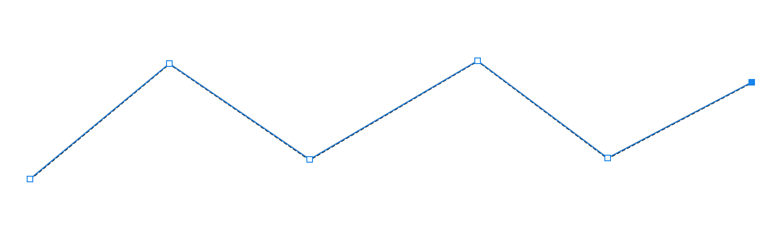

# PhotoShop 

[Photoshop 的精髓是什么？为什么？](https://www.zhihu.com/question/20329343)

## 生词(New Words)

## ◆ 推荐几个配色网站
- [Color Hex - ColorHexa.com](http://www.colorhexa.com/)
- [colourcode - find your colour scheme](http://www.colourco.de/)
- [Colours](http://webcolourdata.com/)
- [Color Safe - accessible web color combinations](http://colorsafe.co/)
- [NIPPON COLORS - 日本の伝統色](http://nipponcolors.com/#jinzamomi)
- [配色网-致力色彩搭配方案的交流与学习](http://www.peise.net/)
- [色見本と配色サイト - color-sample.com](http://www.color-sample.com/)
- [豆豆猫的窝 &gt; 配色手册 &gt; 关于颜色](http://www.ddcat.net/sheji/peise/menu01.htm)
- [Color Scheme Designer 3_高级在线配色器_配色网](http://www.peise.net/tools/web/)
- [147 Colors | CSS Color Names](http://www.colors.commutercreative.com/grid/)

## ◆ PS `矩形选框工具(M)` 怎么填充颜色
在工具栏的 选框工具 上右键, 可以看到其包含:
+ 矩形选框工具
+ 椭圆选框工具
+ 单行选框工具
+ 单列选框工具

#### 1st 方法：
使用矩形选框工具创建选框后, 单击右键, 下拉菜单里面点击 `填充`: 
- 矩形选框工具:
  
#### 2nd method: 使用拾色器填充
#### 3rd method: 使用油漆桶填充
#### 4th method: 使用前景色和背景色 (快捷键见: `./PS-快捷键`)

## ◆ PS 绘制多条等间距的直线/矩形
tip: Mac 几个重要的快捷键
+ `⌘` == Command
+ `⇧` == Shift
+ `⌥` == Alt/Option

(1) 首先使用 `矩形工具 (U)` 下的 `圆角矩形工具` 画出一个自定义的圆角矩形;

(2) 
+ (a) 接着使用 `Command/Control` + `J` 快捷键复制一个图层;
+ (b) 在当前复制的图层上按下`Command` + `T`(也可以通过顶部的导航栏 `编辑` --> `自由变换` 来实现), 使用鼠标向右拖动一个想要的距离, 完成后按下 `Command + Enter` 确定.

(3) 仍然选中当前复制的图层, 按下 `Command/Control` + `J` 再复制一个图层, 此时按下 `Command` + `Shift` + `T`(即是: `编辑` --> `变换` --> `再次`), 这个快捷键实现的操作就是第 (2) 步 (b) 的操作. 

(4) 重复第 (3) 步的操作, 直到创建完所有你想要的数量.

## ◆ PS 画单弧度曲线
(1) 在文件中, 新建图层.(不然画完了曲线是在背景图层里, 不能调整)

(2) 选中`钢笔工具`, 把大致的路线画出来. 在 2 步之间拉出一个自己想要的曲线, 上面 `选项` 栏的设置如下图:

+ (1) 工具模式选择: 形状;
+ (2) 填充: 红色斜线表示不填充;
+ (3) 描边: 为描边颜色;
+ (4) 2像素: 为自己设置的曲线宽度;
+ (5) 描边类型: 可自己设置, 有 "实线"/"虚线" 或 自定义.
- (3) 然后 `Ctrl` + `回车` 把路径变成形状. 此时当前仍会有虚线的路径框,按下 `Ctrl` + `D` 去除.
  

## ◆ PS 画多个折点的曲线:
(1) 和上面 “PS 画单弧度曲线”  的步骤 (1) 相同

(2) 选中`钢笔工具`, 把大致的路线画出来. 主要是建立多个折点, 上面选项设置和 "PS 画单弧度曲线" 中步骤(2)的图片一样. 下面是一个画出多个折点的形状:

(3) 点击 `钢笔工具` 右键, 选择 `转换点工具`, 把鼠标放在画的每个折点上, 就可以调整了.

(4) 调整好后 `Ctrl` + `回车` 把路径变成形状. 此时当前仍会有虚线的路径框, 按下 `Ctrl` + `D` 去除.

## ◆ PS 如何快速画出三角形
(1) 在 `矩形选框` 工具上右键, 选择 `多边形工具`;

(2) 在上面 `选项` 栏中把, `边` 设置为 `3` 即可.

## ◆ PS 插件
1. 磨皮插件 Portraiture 3
2. 

## ◆ PS 制作九宫格方法
- (1) 新建一个 1800 * 1800px 空白文件
- (2) 找到顶部导航中的 `视图` --> ``新建参考线版面` 列: 数字填 3,装订线 30px(自定义) 行数: 数字填 3, 装订线自定义; 下面的边距: 上下左右 默认和装订线的设置相同, 但也可以根据自己的需求来.
- (3) 拉入图片, 调整大小和位置, 即可. 

## ▲ Photoshop 智能选择主体对象的两种方法

### 技能说明

从Photoshop CC 2018 版本开始增加了基于人工智能技术的抠图工具和命令，包括【对象选择工具】和【选择主体】命令。使用这些工具和命令可以轻松且快速地选中场景中的人物、物等对象。

### 应用实战

#### 1. 使用对象选择工具选择对象

【对象选择工具】可简化在图像中选择单个对象或对象的某个部分（人物、汽车、家具、宠物、衣服等）的过程。只需在对象周围绘制矩形区域或套索，软件会自动分析并选择已定义区域内的对象。使用【对象选择工具】选择对象的具体操作步骤如下。

**Step01**：打开 “素材文件\鸟.jpg” 文件。选择【对象选择工具】，如下图所示。

**Step02**：在选项栏设置【模式】为矩形，如下图所示。

**Step03**：在对象周围拖动鼠标绘制矩形框，如下图所示。

**Step04**：释放鼠标后，创建选区并选择选框内的对象，如下图所示。

**Step05**：按【Ctrl++】组合键放大视图并按【空格键】键移动视图，显示未选中的脚的图像，如下图所示。

**Step06**：单击选项栏中的【添加到选区】按钮，设置【模式】为套索，沿着未选中的对象边缘拖动鼠标，创建选区，如下图所示。

**Step07**：释放鼠标后，选择脚对象，如下图所示。使用相同的方法将其他为选中的区域添加到选区，完成对象的选择。

#### 2.使用【选择主体】命令快速选择对象

选择主体由先进的机器学习技术提供支持，在经过训练后，这项功能可识别图像上的多种对象，包括人物、动物、车辆、玩具等等。执行【选择】【主体】命令后，即可选择图像中最突出的主体。使用【选择主体】命令选择对象的操作步骤如下。

**Step01**：打开“素材文件\车.jpg”文件，如下图所示。

**Step02**：执行【选择】【主体】命令，软件会自动分析图像并选择主体对象，如下图所示。

发布于 2021-12-09 12:37

