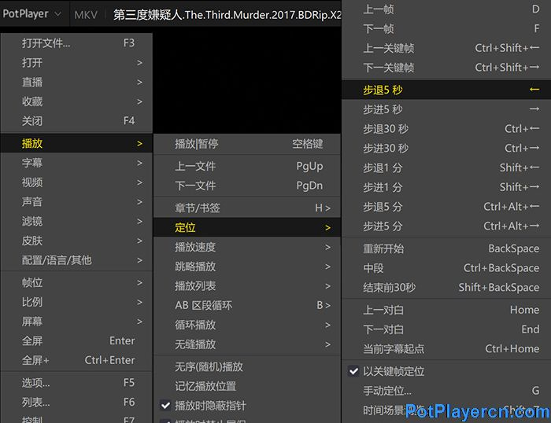

# PotPlayer 视频播放器

## ▲ PotPlayer播放视频怎样快进快退？前进与后退的设置教程

> 来源：http://www.potplayercn.com/course/2966.html

2019-04-29 - 1,456

使用PotPlayer播放视频时，当需要快进及后退时可快速定位，达到快速定位目的。

右键点击PotPlayer画面--播放--定位。PotPlayer提供了多种定位功能，可精确到帧、5秒、30秒、1分钟、5分钟。只是快退被翻译成步退，快进翻译成步进。

使用快捷键操作更方便，PotPlayer定位快捷键：

| ←            | 后退5 秒   |
| ------------ | ---------- |
| Shift+←      | 后退1 分   |
| Ctrl+←       | 后退30 秒  |
| Ctrl+Shift+← | 上一关键帧 |
| Ctrl+Alt+←   | 后退5 分   |
| →            | 前进5 秒   |
| Shift+→      | 前进1 分   |
| Ctrl+→       | 前进30 秒  |
| Ctrl+Shift+→ | 下一关键帧 |
| Ctrl+Alt+→   | 前进5 分   |

此外还可以设定时间跨度：

右键点击PotPlayer画面--选项--播放--时间跨度--时间定位。可设置四挡前进后退秒数。

如果勾选了“如存在关键帧数据则以关键帧为移动单位”，若视频存在关键帧，快进快退时则不按秒数定位，会以关键帧定位。

可取消勾选该项目以免跳转时间不准确。