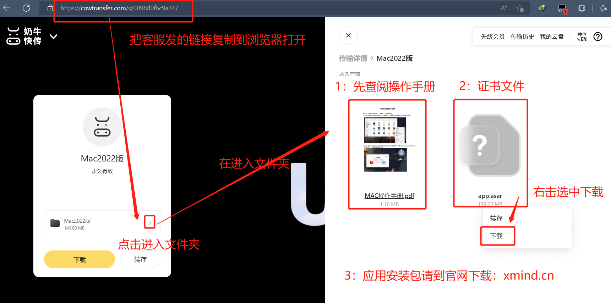

# XMind 文档

> 官网下载地址：

## ▲ XMind Mac 安装
淘宝购买记录

> Mac2022.最新版版链接：https://cowtransfer.com/s/0098d0f6c9a747 亲，请复制到浏览器打开，按下图进入文件夹，查阅操作手册，有不明白随时咨询售后客服，五星好评后领取：源文件模板520套+使用课程，提供永久售后服务。

### Mac 系统安装步骤

1. 卸载已经安装过的 XMind。 因为苹果电脑有SIP模块记录之前下载渠道，不重新安装无法激活【这一步骤很重要】

2. 正常安装[官网](xmind.cn) 下载的 XMind.

3. 找到已经安装的 XMind，双击图标打开(提示登录 --> 跳过登陆) ——【打开这一步很重要，否则替换后文件会损坏打不开应用】

4. 打开应用后 --> 打开左上角XMind 图标 --> 首选项 --> 选择关闭自动更新 --> 应用  --> 退出应用(有的安装后打开进入会让登录——直接跳过或关闭登录即可)

5. 打开 Finder 访达 --> 【应用程序】 --> 找到装好的应用图标 --> 右击依次选择“显示包内容” --> Contents --> Resources

6. 将下载的 app.asar 证书文件拷贝到上面的 Resources 文件夹 --> 同意替换 完成 
    - 若: 部分电脑拷贝——黏贴项目——不弹出替换情况 可以把下载的 app.asar 拖到桌面，再从桌面拖进去点替换。

7. 替换成功后，打开应用，右上角没有试用图标即永久激活。    

## ▲ XMind Windows 安装

最新版链接：https://wwt.lanzouv.com/b03vf11ah 密码:17mc

亲，请复制链接到浏览器，打开查阅文档，有不明白随时咨询售后客服，五星好评后领取（精美模板+官方使用教程），提供永久售后服务。

第一步:安装——XMind-for-Windows-64bit-2022.10.XXX.exe (最新版可自行到官网下载:www.xmind.cn)——下载后双击安装等待 

第二步:关闭应用——安装好，软件会默认打开启动台—点击+新建进入应用——右上角 X关闭应用 

第三步:下载证书文件:——【 https://wwt.lanzouv.com/b03vf11ah 】 密码:17mc 把链接复制到浏览器——输入密码(17mc)——点击下载——解压出证书文件(winmm.dll) 

第四步:打开安装位置——桌面找到安装好的XMind图标——右击选择——打开文件所在的位置——把上一步解压 出来的证书文件(winmm.dll)——复制进来

第五步:回到桌面双击打开软件——右上角没有试用图标即永久激活会员功能使用部分电脑:第一次开启试用图标还在——重复关闭开启应用或重启电脑即可
  

## 