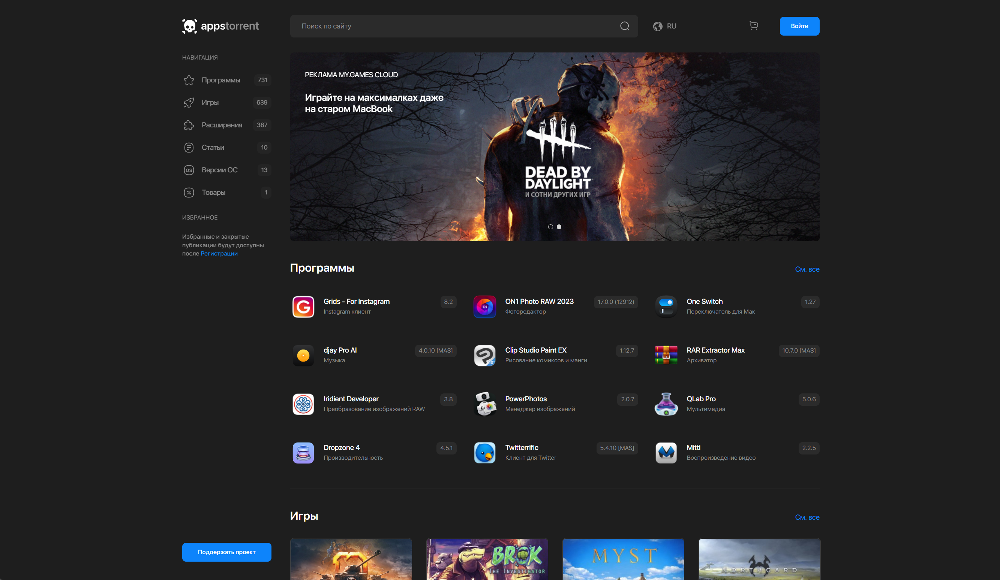
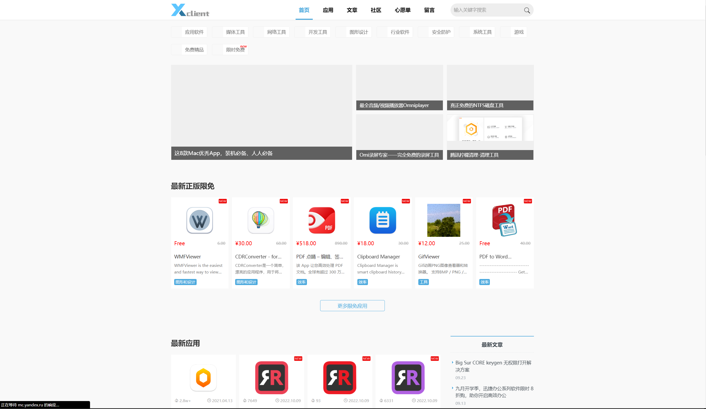
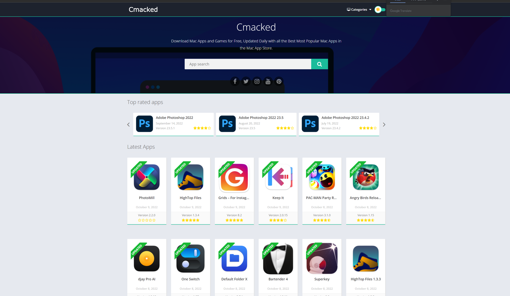
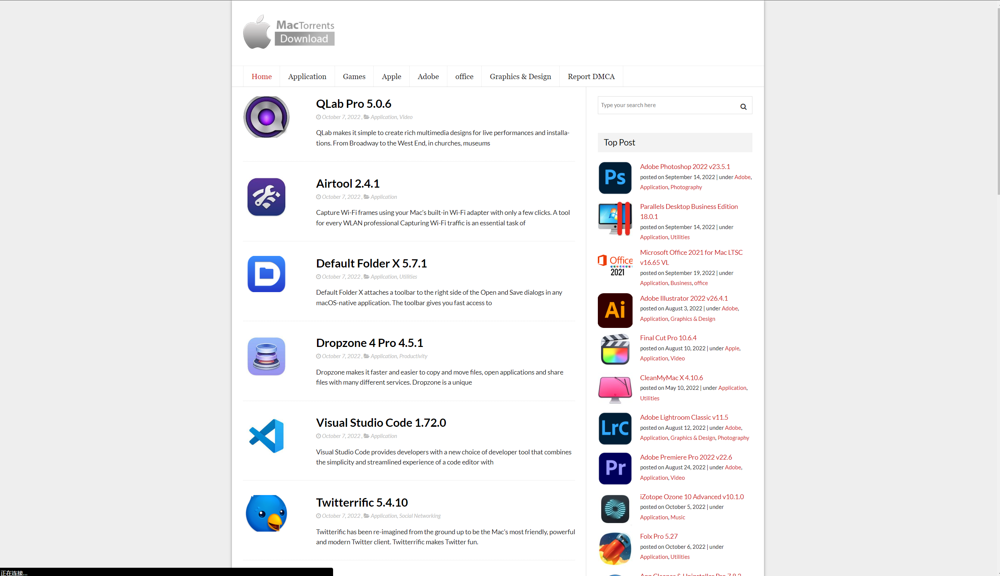

# 软件 Software

## Mac 软件下载网站 (2023.01.09)

**1，appstorrent**

https://appstorrent.ru/

这个需要部分需要魔法上网，默认俄语，需软件内转换，转换后语言是繁体且很多**翻译错误**，且下载速度较慢但资源很多

**2，mac-torrent-download**

http://mac-torrent-download.net/

访问速度极慢，在写笔记时无法打开

**3，xclient**

https://xclient.info/

界面稍微有点混乱，速度有点慢，软件资源多

**4，waitsun**

https://www.waitsun.com/

界面稍微有点混乱，首页大部分是安卓软件

**5，cmacked**

https://apps.cmacked.com/

网站默认英文，速度快，资源全

**6，torrentmac**

https://www.torrentmac.net/

速度快，软件界面比较老，**有广告**，全英文

## PotPlayer 快捷键

- 空格：播放/暂停
- Enter/Alt+Enter：全屏
- C:加速; x:减速;  z:恢复原速度
- Tab：显示当前播放视频信息
- H：书签管理器
- P：添加书签
- M：静音
- 第一行除[P]外：调整图像色彩、亮度、对比度、饱和度、复位
- D：定位上一帧，省去截屏与倒退的烦恼
- F：定位下一帧
- G：直接输入定位位置
- 0：设置屏幕尺寸
- Ctrl+Z：图像左右翻转开关
- Alt+K：图像旋转，每一次顺时针旋转90°
- Ctrl+C：截图当前屏幕，并复制到剪切板
- Ctrl+E：截图，并保存到安装目录下Capture
- Ctrl+S:屏幕捕捉