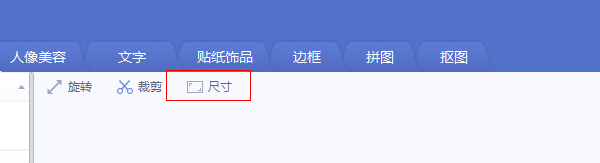
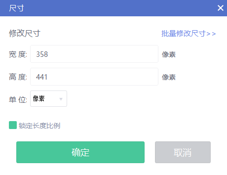
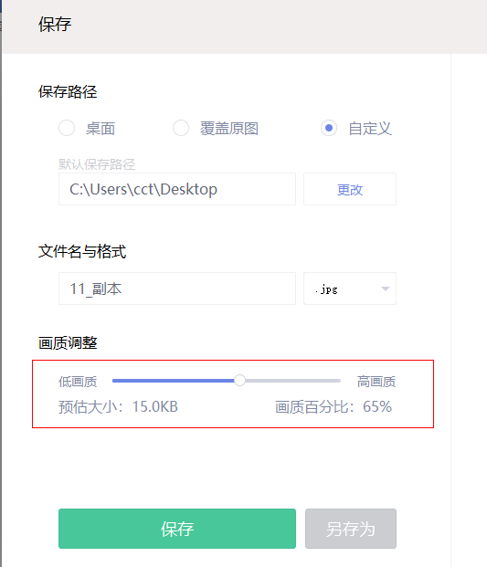
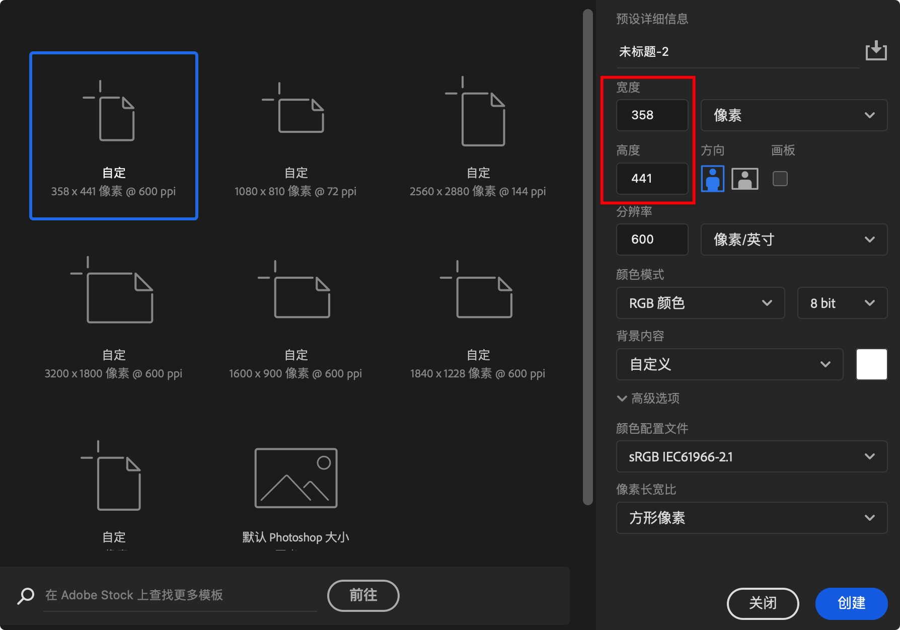
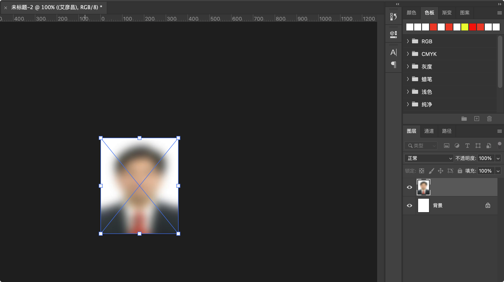

# 如何使用美图秀秀或 PS 修改证件照

## Additional Information

驾驶证上需要的照片为 1 寸白底，对应的像素为 `260px(宽) * 378px(高)`

- 数字相片为`.jpg`格式的压缩图像，压缩品质系数不小于70（取值0～100），一般相片的文件容量在14～30K (小于20kb)之间，该图像长宽规格为：378像素（高）×260像素（宽），分辨率300dpi，24位真彩色。

- 头像大小及位置：人像在相片矩形框内水平居中，头部宽 165 至 189 像素，头部长度为 224 至 260 像素，头顶发迹距相片上边沿 10px～20px

## Additional Info 2
小 1 寸: `260px(宽) * 378px(高)`
1 寸证件照的尺寸：`295px(宽) * 413px(高)`
2 寸证件照对应的像素尺寸为： `413px(宽) * 579px(高)`

蓝色底证件照的色彩值：
- RGB - R:60 G:140 B:220 
- CMYK - C:85 M:40 Y:0 K:0

白色底的色彩值：
- RGB - R: 255 G: 255 B:255

## 0. 证件照的要求

一般需要上传证件照的网站, 对证件照的要求主要有 2 点
+ (1) 尺寸为 `358 * 441`px
+ (2) 大小不能超过 20kb

## 1. 使用美图秀秀修改证件照
1. 打开美图秀秀，把图片拉入到主窗口， 点击下图中的 `尺寸`

2. 在当前的弹框中输入 `358 * 441` ，单位选择 `像素`，把 `锁定长度比例` 取消， 然后点击 `确定`。图示如下：

3. 然后点击当前窗口右上角的 `保存` 按钮， 在弹出窗口中 `画质调整` 中滑动按钮，来调节要保存图片的大小， 画质越高图片越大，反之越小。图示如下：

## 2. 使用 PS 修改证件照
上面已经可以使用美图秀秀修改证件照了, 那为什么还要使用 PS 呢? 答: 因为 PS 可以修改的地方更多, 假如现在证件照宽和高的比例为, `420px * 480px` , 如果我们使用美图秀秀修改到 `358px * 441px` 那么照片肯定是变形的, 此时如果使用 PS 就能轻松解决. 下面给出使用 PS 来修改证件照的步骤.

(1) 打开 PS , 我们新建一个 `358px * 441px` 大小的文件, 图示如下:

(2) 然后我们把图片拉入到新建的文件中,  默认新拉入的图片会成为一个处于选中状态的图层 (tip:  图层概念我不能清楚的下定义, 请自己百度或谷歌查看), 我们此时便可以按住下图中图片一圈的小方格自由编辑图层, 如果想等比例缩小/方法当前图片, (在 windows 下请按住 shift 键, macOS 中拉动每个小方格都是默认宽高等比例缩放, 请注意区别.) 编辑完毕后, 我们点击 `enter` 键即可.

(3) 最后一步为保存图片, 点击左上角的 `文件` --> `存储为 Web 所用格式`, 在当前弹框的右上部, 找到 `品质` 在其后把图片的品质设置为 50 - 60 之间, 此时点击 `存储` , 完事后查看图片应该已经小于 20kb 了.  (注意: macOS 系统的保存方式为: `文件` --> `导出` --> `存储为 Web 所用格式(旧版)`, 也是在图片的 `品质` 中设置 50 - 60 即可.)