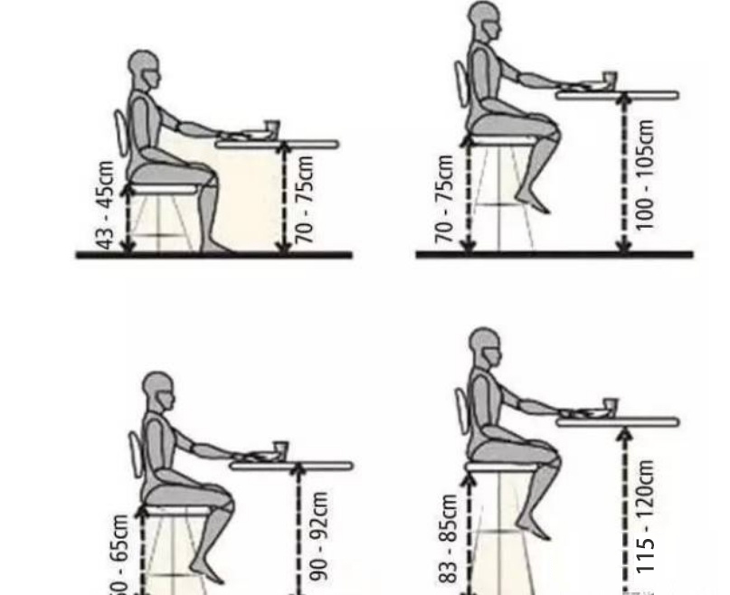
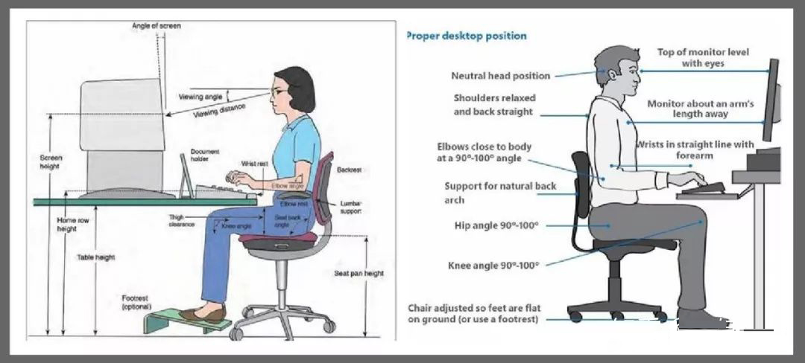
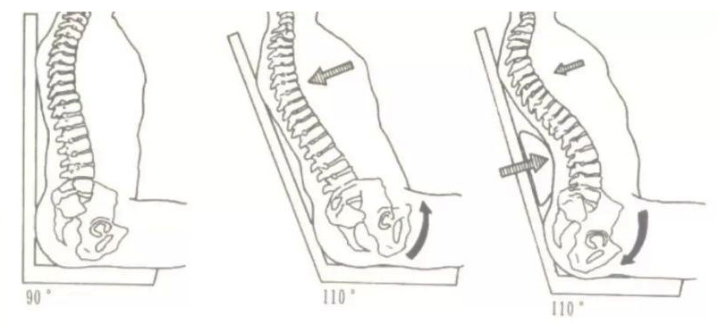

### 9. 人体工程学椅的调节和正确坐姿

- (1) **座椅高度要合适, 让大腿和小腿之间呈 90 度垂直, 这样才能把身体各个受力点化解.**

  如果座椅太高, 就会压迫大腿下侧的血液循环; 高度太低, 坐进去的感觉是'窝'着的,

  脊柱不能挺直, 腰部容易出现损伤, 甚至患上腰椎间盘突出的问题.

  

  

- (2) 坐的深浅也有讲究，要坐满座椅平面。**座椅边缘到膝部的空隙约为3个手指，这样才不会压迫腿部的血液循环。

- (3) 椅子的扶手，是很多人都忽略的一点。如果你把手放在扶手上，对尾椎骨就能减少20%的总负荷。所以尽可能的让手能够靠在扶手上分担重量。

- (4) 椅背要有支撑垫才可以维持正常弧度和减轻压力。越能倾斜的椅子其实是越舒服的，越能倾斜就越舒服，上身和下身的角度会变得更大。**而人最舒适的仰面角度是110°~130°**。

  

  第 1 个图 90 度的尾椎骨受力最大. 第 2 个图没有腰靠倾斜坐骨受力大, 第 3 个既有倾斜又有腰靠时, 最省力.

- (5) **头枕是枕颈锥的不是后脑勺**。所以能调节高度和方向的头枕好用，

  还有根据每人的颈锥情况选择柔性还是硬性的网布枕，还有是否需要灵活变动。

  一体化的椅要头后仰正颈锥.

- (6) 伏案工作时坐垫前倾要会调。坐深调节，这点可以大大提升臀部以及腿部的舒适度。没有坐深调节的椅子一般只照顾到了的腰部，正常情况下人体的上半身骨骼比例都基本一致，单独照顾腰部是很容易实现的事情

- (7) 椅背可以高度调节的要会使用。挑选的椅子要适应你的身体比例、身高体重、生活习惯等等，这样久坐才会感到舒适。简单地说是要根据自己的身高找准自己的腰位和靠背位。怎么舒服怎么调。

- (8) 会调节后仰的重力。依靠机械设计和物理定律，用人的自身重量转换成倾斜所需要的力，这样你就不需要各种旋钮和操作杆

##### 简单总结一下就是：

- (1) 大腿与上身保持或在 90° - 110° 之间。

- (2) 臀部坐满整个椅面，腰部紧贴椅背，不让腰部悬空。

- (3) 座椅高度适中，大腿与小腿保持或大于 90°，座椅边缘到膝部保持半个拳头的距离（避免压迫腿部造成血液不流通），脚底要贴地。

- (4) 肩膀放松，上臂与下臂保持保持或大于 90°，将手肘放在椅子扶手上可减少尾椎骨 20% 的总负荷。

  这三个关节处我理解为90-120°即为合适的坐姿，但也不必时刻保持，

  一个角度时间长了小幅度的调整下也是十分有益的。前倾 20° 弯腰坐，腰椎的负重是 185%，

  所以即使是换了一把不错的椅子，若是坐姿不正确，那么旧疾仍旧无法改善。

- 对于拥有正确坐姿习惯的小伙伴来说，购置一把人体工学椅就是锦上添花。但若是本身坐姿不正确，那么无论换上多贵的椅子也只是买个心理安慰.