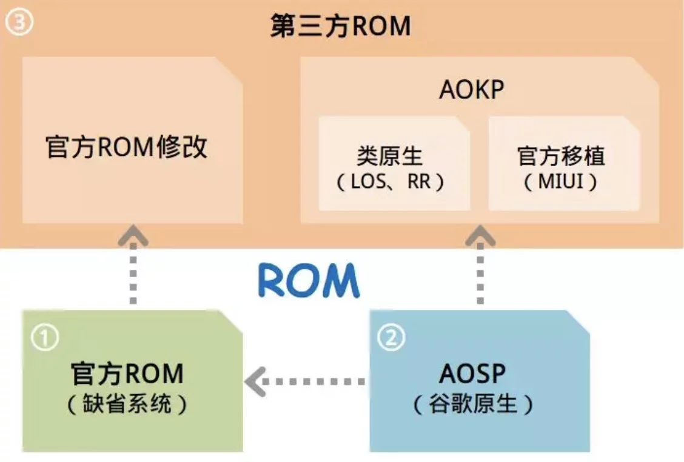

# 手机解锁 + Root 教程

笔记来源文章(部分更改)：
> 扒开 Android 刷机 Root 的衣服：https://liaoguoyin.com/2019/android-root
>
> Magisk 


## 目录
1. 为什么刷机
2. 刷机分类
    + 2.1 刷机方式
3. 刷机、Root 流程概述
    + 3.1 解锁 BootLoader
    + 3.2 刷入第三方 Recovery
4. Root 原理
    + 4.1 获取 Root 权限并管理
        - (1) 获取
        - (2) 管理
        - (3) Magisk
5. 数据清理
6. Tail
7. Refer


## 生词
- **tail `[teɪl]` --n.尾巴；踪迹. v.尾随, 跟踪**
    + Tail call 尾调用
    + tail gas 尾气
    + tail end 末端


## 文章正文

### 1. 为什么刷机
你可以在手机上自定义 ROM、Root 软件、自定义 Revocery、Xposed 框架、修改设备地址、系统字体、卸载预装 APPs ......

### 2. 刷机分类

从内容上可分为两类：

- 刷 ROM：重装一套系统
- 刷补丁：在原系统的基础上，拓展某些功能（获取 Root 权限、刷内核、安装 Xposed 框架、安装 Magisk 框架、安装谷歌服务等等）

> 关于 ROM iamge:
>
> - ROM 是 ROM image（只读内存镜像）的简称，常用于手机定制系统玩家的圈子中。 一般手机刷机的过程，就是将只读内存镜像（ROM image）写入只读内存（ROM）的过程。 
> 
> - 常见的 ROM image 有 img、zip 等格式。前者通常用 fastboot 程序通过数据线刷入（线刷）；后者通常用 recovery 模式从 sd 刷入（卡刷），固 img 镜像也被称为线刷包，zip 镜像也被称为卡刷包。
> 
> - ROM 分三种：作业系统开发者的原生版本、手机制造商、其他人或团队所开发。(依次：Google 开发的原生 Android One、小米的 MIUI 接口、Android 的 Lineage OS 团队）。固件一般是官方原厂包的叫法，ROM 一般是第三方刷机包的叫法。



#### 2.1 刷机方式
1. 卡刷：平时的手机系统升级，就是卡刷的一种。手机进入 Recovery 模式写入固件压缩包来更新、升级；或是直接进行 OTA 更新。
    + > 卡刷本质是 对系统文件替换的过程，不会重新刷写整个分区，只是替换部分系统分区文件实现软件版本升级、更换第三方操作系统。即 ROM 包，它一定是一个 zip 压缩文件，打开卡刷包后里面一般都会有 system 和 META-INF 、boot.img (内核) 等文件与文件夹。
2. 线刷：手机连接电脑，用 Android 调试桥接器 (ADB) 直接将 固件、系统底层、驱动程序 等等写入手机，如 Fastboot 模式。
    + > 线刷是通过数据线连接电脑来进行刷机、系统底包。是手机生产厂商的一种升级方式，针对智能手机系统问题或非硬件损坏的手机故障来刷写固件，** 替换和覆盖各个分区 ** ，使手机功能恢复正常。一般是 tg 压缩文件，里面是一大堆 img 文件，某些底包里也有文件夹。

一句话总结下：**卡刷可以进行简单的刷机和系统更新等操作，线刷则可以进行更深度、更敏感的操作。 线刷彻底，卡刷方便**

### 3. 刷机、Root 流程概述

通用 Root 流程是：`解锁 BL - 刷 REC - 线刷或卡刷刷入 SuperSU 或 Magisk`

详细一点就是：

1. 解锁 **Bootloader**
2. 用手机数据线连接手机按组合键进入 `Fastboot 模式`，使用 `adb` 命令行下刷入 第三方 Recovery：**TWRP**
3. 卡刷：按组合键进入 `Recovery 模式（TWRP）`，刷入 **SuperSU.zip** 或 **Magisk.zip** 获得 Root 权限，或者刷入 **ROM 包.zip** 重装手机系统
4. 或线刷：数据线连接手机、电脑，按组合键进入 `Recovery 模式（TWRP）`，在高级选项里开启 sideload 模式，在电脑上 cmd `adb sideload *.zip` 相比较优点是：不需要把包传到手机内存中）


#### 3.1 解锁 BootLoader
一般来说，对绝大多数手机而言。解除 BL 锁，一定是第一步。

解锁 BL 的具体步骤，各机型五花八门：

- 有些需要向官网申请解锁权限并用专用工具解锁（华为、小米），申请解锁码需要等上 n 天时，去某宝有惊喜。
- 有些一条命令 `fastboot oem unlock` 就能解锁（一加）
- 具体问搜索引擎

当然，并非所有机型都会锁 BL，有些机型出厂就是 BL 解锁状态。

划重点：**解锁 BL 会将手机重置为出厂状态，所有数据清空，务必做好备份**

既然能解锁，自然就能上锁，不过…… 务必确保当前 ROM 与 REC 均为官方原版，且未刷补丁的情况下，才能执行上锁操作。

> BootLoader 是什么？
>
> 在嵌入式操作系统中，[Bootloader（系统启动加载器）](https://zh.m.wikipedia.org/wiki/ 啟動程式) 是开机载入程式。
>
> 最主要的作用是引导系统正确启动，它是 Android 操作系统（包括控制台）和手机硬体联繫的桥樑，类似电脑裡面的 BIOS (Basic Input and Output System)。手机开机时，会启动 Bootloader 去启动放在 ROM 里面的核心完成手机的开机过程。
>
> 为了避免 Bootloader 读到非官方 ROM, 一般会在 ROM 里面加密、或是有特殊的程序，让 Bootloader 可以藉此分办是不是官方 ROM，限制你直接从 Fastboot 模式下加载、改写系统分区的一个锁定。
>
> 解锁就是就是让 Bootloader 跳过这个流程。解锁 Bootloader 后，还可以刷新内核、刷 ROM、修改超频...
>
> 一旦放开 BL，OEM 厂商（Original Equipment Manufacturer）会遇到一些麻烦：
> - 合约机的运营商在这部分的利益会受到极大挑战
> - 用户自行刷第三方固件后，厂商将在一定程度上沦为纯粹的制造商，而丢失自己的研发基因
> - 用户刷的 ROM 的稳定性难以保证
>
> 所以，OEM 厂商通常在出厂时锁定手机的 BL。
>
> 有些人将 Unlock Bootloader 说成刷机模式，但准确来说解锁 Bootloader 是刷机的基础，Bootloader 正好处在开机与进系统的中间阶段，真正实现刷机的是在解锁 Bootloader 之后安装 Recovery（类似于 Ghost）


> Fastboot 是什么？
> Fastboot 的功能与 REC 相似，但是要更为高级，更为接近系统的底层。更为高级的意思就是 Fastboot 能够执行的操作要比 REC 更多，比如我们之前的使用 ADB 刷入 REC 就是进入了 fastboot 模式执行的操作。


##### 索尼手机申请 Bootloader 解锁
索尼手机官网查看和申请 bootloader 解锁, 官网网址：https://developer.sony.com/develop/open-devices/get-started/unlock-bootloader/
- 自己手机从 Sony 官网取得 bootloader 解锁码
    + 手机的 IMEI: 354985090874805
    + 取得的解锁码：**BEAE7F44BA177F18**

#### 3.2 刷入第三方 Recovery

所谓第三方 Recovery，也就 CWM 与 TWRP 两款 REC，以及坊间基于它们的各种改款。不过 CWM 已在几年前停摆，目前刷机界是开源的 TWRP 家族独大。TWRP 全称 Team Win Recovery Project，是一个开源社区项目。

> Recovery 是什么？
> Recovery（以下简称 REC） 是 Android 手机备份功能，官方的 Recovery 在系统更新时都会启用。
> 
> 为什么刷入第三方的 REC？
> 1. 在使用 REC 装系统的过程中，会对刷机包的数字签名进行校验。因而第三方 ROM 是无法通过官方 Recovery 刷入的。
> 2. 官方的 REC 一般限制较多 (只能刷入官方的固件、补丁、更新等等), 而第三方的 REC 除了能任意刷入第三方 ROM ，还能调整分区大小。

给手机刷第三方 Recovery, 我们使用从 Androis SDK 提取出来的一个工具 - `ADB`:

- 下载并配置 [ADB_platform-tools](https://developer.android.com/studio/releases/platform-tools)
	+ 将手机和数据线连接，点击手机版本号 n 次，打开开发者模式的 `USB 调试状态`
    + (通常是找到 “设置”>>“关于手机”>>“版本号”，多次点击版本号后即出现开发人员选项，再进去：`USB 调试模式`。

> ADB 是什么？
> ADB（Android Debug Bridge）是从 Android SDK 里提出来的一个工具，使用 ADB 命令行可以直接操作管理 Android 模拟器或者真实的 Andriod 设备。 ADB 主要功能有:
> - 在 Android 设备上运行 Shell (命令行)
> - 管理模拟器或设备的端口映射
> - 在计算机和设备之间上传 / 下载文件
> - 将电脑上的本地 APK 软件安装至 Android 模拟器或设备上
>
> 安装涉及到环境变量的部署. 可以参照教程: https://pa.ci/52.html
>
> - 将下载下来的软件包解压到某个位置，比如直接把解压后的 `platform-tools`  放在 D 盘。
> - 理论上，这时候我们就可以直接使用了，但是由于缺少“环境变量”，在 cmd 和 powershell 中并不能识别你的 adb 命令。这时候就需要配置一下环境变量。
>     - (1) 搜索 “高级系统设置”>>点击“高级”标签>>点击“环境变量”选项。
>     - (2) 在下方的“系统变量”找到名叫“path”的变量，将 adb 文件的路径加入即可。如果是win8.1及一下系统，输入`;D:\platform-tools`即可；如果是win10，只需要点击新建，输入`D:\platform-tools`。
> - 一定要记得逐层点击应用和确认，少了一步就会无法正常调用adb。除此之外，由于一些手机的驱动比较特殊，还需要自行去手机官网下载对应的驱动。

接着我们下载合适版本的 TWRP：
- 进入 [TWRP Recovery 官网](https://twrp.me/Devices/)，选机型
    - tip: TWRP 官网没有 Xperia xz2 premium 的 TWRP，经过多次 google 后找到了一个下载地址：https://androidfilehost.com/?w=devices&uid=11410963190603893035 在这个界面中选择 Xperia XZ2 Premium.  下载之后是 rar 格式， 解压后把 *.img 的文件重名为 `twrp.img` 并导入 SD 卡 或 手机内存中。

请导航至 `D:\platform-tools`目录并打开命令提示符（Shift +右键单击>打开命令提示符）或终端。打开 cmd，敲入以下命令：

- 使手机进入 Fastboot 模式：`adb reboot bootloader`
- 线刷刷入 REC：`fastboot flash recovery *.img`
- 重启手机进入 Android 正常模式：`fastboot reboot`


2. 下载用来获取 root 权限的软件 Magisk.zip 

3. 刷机方式：
    + (1) 卡刷：按组合键进入 Recovery 模式（TWRP），刷入 SuperSU.zip 或 Magisk.zip 获得 Root 权限，或者刷入 ROM 包.zip 重装手机系统。
    + (2) 线刷：数据线连接手机、电脑，按组合键进入 Recovery 模式（TWRP），在高级选项里开启 sideload 模式，在电脑上 cmd adb sideload *.zip 相比较优点是：不需要把包传到手机内存中）


### 4. Root 原理

#### 4.1 获取 Root 权限并管理
##### (1) 获取
##### (2) 管理

##### (3) Magisk

Download: 

### 5. 数据清理


### 6. Tail


### 7. Refer


```
 ✘ macos@1033-MAC  ~/Downloads/platform-tools  ./fastboot getvar all
(bootloader) parallel-download-flash:yes
(bootloader) hw-revision:20001
(bootloader) unlocked:no
(bootloader) off-mode-charge:0
(bootloader) charger-screen-enabled:0
(bootloader) battery-soc-ok:yes
(bootloader) battery-voltage:4197
(bootloader) version-baseband:1311-7919_52.1.A.3.49
(bootloader) version-bootloader:1310-7079_X_Boot_SDM845_LA2.0.1_Q_207
(bootloader) erase-block-size: 0x1000
(bootloader) logical-block-size: 0x1000
(bootloader) variant:SDM UFS
(bootloader) partition-type:xbl_config_b:raw
(bootloader) partition-size:xbl_config_b: 0x20000
(bootloader) partition-type:xbl_b:raw
(bootloader) partition-size:xbl_b: 0x3D5000
(bootloader) partition-type:xbl_config_a:raw
(bootloader) partition-size:xbl_config_a: 0x20000
(bootloader) partition-type:xbl_a:raw
(bootloader) partition-size:xbl_a: 0x3D5000
(bootloader) partition-type:rddata:raw
(bootloader) partition-size:rddata: 0x1400000
(bootloader) partition-type:userdata:ext4
(bootloader) partition-size:userdata: 0xBFA96C000
(bootloader) partition-type:fsc:raw
(bootloader) partition-size:fsc: 0x20000
(bootloader) partition-type:fsmetadata:raw
(bootloader) partition-size:fsmetadata: 0x101000
(bootloader) partition-type:Qnovo:raw
(bootloader) partition-size:Qnovo: 0x1800000
(bootloader) partition-type:diag:raw
(bootloader) partition-size:diag: 0x2000000
(bootloader) partition-type:appslog:raw
(bootloader) partition-size:appslog: 0x1000000
(bootloader) partition-type:frp:raw
(bootloader) partition-size:frp: 0x80000
(bootloader) partition-type:keystore:raw
(bootloader) partition-size:keystore: 0x80000
(bootloader) partition-type:misc:raw
(bootloader) partition-size:misc: 0x100000
(bootloader) partition-type:cdt:raw
(bootloader) partition-size:cdt: 0x20000
(bootloader) partition-type:fsg:raw
(bootloader) partition-size:fsg: 0x200000
(bootloader) partition-type:modemst2:raw
(bootloader) partition-size:modemst2: 0x200000
(bootloader) partition-type:modemst1:raw
(bootloader) partition-size:modemst1: 0x200000
(bootloader) partition-type:logdump:raw
(bootloader) partition-size:logdump: 0x4000000
(bootloader) partition-type:logfs:raw
(bootloader) partition-size:logfs: 0x800000
(bootloader) partition-type:toolsfv:raw
(bootloader) partition-size:toolsfv: 0x100000
(bootloader) partition-type:limits:raw
(bootloader) partition-size:limits: 0x1000
(bootloader) partition-type:spunvm:raw
(bootloader) partition-size:spunvm: 0x800000
(bootloader) partition-type:msadp:raw
(bootloader) partition-size:msadp: 0x40000
(bootloader) partition-type:apdp:raw
(bootloader) partition-size:apdp: 0x40000
(bootloader) partition-type:sec:raw
(bootloader) partition-size:sec: 0x4000
(bootloader) partition-type:system_b:ext4
(bootloader) partition-size:system_b: 0xFC000000
(bootloader) partition-type:vendor_b:raw
(bootloader) partition-size:vendor_b: 0x40000000
(bootloader) partition-type:oem_b:raw
(bootloader) partition-size:oem_b: 0x19000000
(bootloader) partition-type:dtbo_b:raw
(bootloader) partition-size:dtbo_b: 0x800000
(bootloader) partition-type:vbmeta_b:raw
(bootloader) partition-size:vbmeta_b: 0x10000
(bootloader) partition-type:rdimage_b:raw
(bootloader) partition-size:rdimage_b: 0x1400000
(bootloader) partition-type:boot_b:raw
(bootloader) partition-size:boot_b: 0x4000000
(bootloader) partition-type:dsp_b:raw
(bootloader) partition-size:dsp_b: 0x2000000
(bootloader) partition-type:bluetooth_b:raw
(bootloader) partition-size:bluetooth_b: 0x100000
(bootloader) partition-type:modem_b:raw
(bootloader) partition-size:modem_b: 0xF000000
(bootloader) partition-type:system_a:ext4
(bootloader) partition-size:system_a: 0xFC000000
(bootloader) partition-type:vendor_a:raw
(bootloader) partition-size:vendor_a: 0x40000000
(bootloader) partition-type:oem_a:raw
(bootloader) partition-size:oem_a: 0x19000000
(bootloader) partition-type:dtbo_a:raw
(bootloader) partition-size:dtbo_a: 0x800000
(bootloader) partition-type:vbmeta_a:raw
(bootloader) partition-size:vbmeta_a: 0x10000
(bootloader) partition-type:rdimage_a:raw
(bootloader) partition-size:rdimage_a: 0x1400000
(bootloader) partition-type:boot_a:raw
(bootloader) partition-size:boot_a: 0x4000000
(bootloader) partition-type:dsp_a:raw
(bootloader) partition-size:dsp_a: 0x2000000
(bootloader) partition-type:bluetooth_a:raw
(bootloader) partition-size:bluetooth_a: 0x100000
(bootloader) partition-type:modem_a:raw
(bootloader) partition-size:modem_a: 0xF000000
(bootloader) partition-type:tzxfl_b:raw
(bootloader) partition-size:tzxfl_b: 0x80000
(bootloader) partition-type:tzxflattest_b:raw
(bootloader) partition-size:tzxflattest_b: 0x80000
(bootloader) partition-type:xfl_b:raw
(bootloader) partition-size:xfl_b: 0x1E00000
(bootloader) partition-type:qupfw_b:raw
(bootloader) partition-size:qupfw_b: 0x10000
(bootloader) partition-type:devcfg_b:raw
(bootloader) partition-size:devcfg_b: 0x20000
(bootloader) partition-type:cmnlib64_b:raw
(bootloader) partition-size:cmnlib64_b: 0x80000
(bootloader) partition-type:cmnlib_b:raw
(bootloader) partition-size:cmnlib_b: 0x80000
(bootloader) partition-type:keymaster_b:raw
(bootloader) partition-size:keymaster_b: 0x80000
(bootloader) partition-type:abl_b:raw
(bootloader) partition-size:abl_b: 0x180000
(bootloader) partition-type:hyp_b:raw
(bootloader) partition-size:hyp_b: 0x80000
(bootloader) partition-type:tz_b:raw
(bootloader) partition-size:tz_b: 0x200000
(bootloader) partition-type:aop_b:raw
(bootloader) partition-size:aop_b: 0x80000
(bootloader) partition-type:tzxfl_a:raw
(bootloader) partition-size:tzxfl_a: 0x80000
(bootloader) partition-type:tzxflattest_a:raw
(bootloader) partition-size:tzxflattest_a: 0x80000
(bootloader) partition-type:xfl_a:raw
(bootloader) partition-size:xfl_a: 0x1E00000
(bootloader) partition-type:qupfw_a:raw
(bootloader) partition-size:qupfw_a: 0x10000
(bootloader) partition-type:devcfg_a:raw
(bootloader) partition-size:devcfg_a: 0x20000
(bootloader) partition-type:cmnlib64_a:raw
(bootloader) partition-size:cmnlib64_a: 0x80000
(bootloader) partition-type:cmnlib_a:raw
(bootloader) partition-size:cmnlib_a: 0x80000
(bootloader) partition-type:keymaster_a:raw
(bootloader) partition-size:keymaster_a: 0x80000
(bootloader) partition-type:abl_a:raw
(bootloader) partition-size:abl_a: 0x180000
(bootloader) partition-type:hyp_a:raw
(bootloader) partition-size:hyp_a: 0x80000
(bootloader) partition-type:tz_a:raw
(bootloader) partition-size:tz_a: 0x200000
(bootloader) partition-type:aop_a:raw
(bootloader) partition-size:aop_a: 0x80000
(bootloader) partition-type:ddr:raw
(bootloader) partition-size:ddr: 0x100000
(bootloader) partition-type:devinfo:raw
(bootloader) partition-size:devinfo: 0x1000
(bootloader) partition-type:ssd:raw
(bootloader) partition-size:ssd: 0x2000
(bootloader) partition-type:persist:raw
(bootloader) partition-size:persist: 0x2000000
(bootloader) partition-type:xflkeystorebak:raw
(bootloader) partition-size:xflkeystorebak: 0x20000
(bootloader) partition-type:xflkeystore:raw
(bootloader) partition-size:xflkeystore: 0x20000
(bootloader) partition-type:LTALabel:raw
(bootloader) partition-size:LTALabel: 0x1000000
(bootloader) partition-type:TA:raw
(bootloader) partition-size:TA: 0x200000
(bootloader) has-slot:modem:yes
(bootloader) has-slot:system:yes
(bootloader) current-slot:b
(bootloader) has-slot:boot:yes
(bootloader) slot-retry-count:b:6
(bootloader) slot-unbootable:b:no
(bootloader) slot-successful:b:yes
(bootloader) slot-retry-count:a:6
(bootloader) slot-unbootable:a:no
(bootloader) slot-successful:a:yes
(bootloader) slot-count:2
(bootloader) secure:yes
(bootloader) serialno:CB512G2V99
(bootloader) serial:a9e05ae4
(bootloader) product:H8166
(bootloader) max-download-size:805306368
(bootloader) kernel:uefi
all:
Finished. Total time: 0.025s
```


