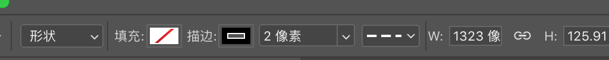

# PhotoShop 

磨皮插件 Portraiture 3
+ 

## 目录(Catalog)
1. 推荐几个配色网站
2. PS 选框工具(M)怎么填充颜色
3. PS 绘制多条等间距的直线/矩形
4. PS 画单弧度曲线
5. PS 画多个折点的曲线
6. PS 如何快速画出三角形
7. PS 插件
8. PS 制作九宫格方法

## 生词(New Words)

## 内容(Content)
### 1. 推荐几个配色网站
- [Color Hex - ColorHexa.com](http://www.colorhexa.com/)
- [colourcode - find your colour scheme](http://www.colourco.de/)
- [Colours](http://webcolourdata.com/)
- [Color Safe - accessible web color combinations](http://colorsafe.co/)
- [NIPPON COLORS - 日本の伝統色](http://nipponcolors.com/#jinzamomi)
- [配色网-致力色彩搭配方案的交流与学习](http://www.peise.net/)
- [色見本と配色サイト - color-sample.com](http://www.color-sample.com/)
- [豆豆猫的窝 &gt; 配色手册 &gt; 关于颜色](http://www.ddcat.net/sheji/peise/menu01.htm)
- [Color Scheme Designer 3_高级在线配色器_配色网](http://www.peise.net/tools/web/)
- [147 Colors | CSS Color Names](http://www.colors.commutercreative.com/grid/)

### 2. PS `矩形选框工具(M)` 怎么填充颜色
- Note: 在选框工具上右键, 可以看到其包含:
    + 矩形选框工具
    + 椭圆选框工具
    + 单行选框工具
    + 单列选框工具
- 1st method: 
    + 使用矩形选框工具创建选框后, 单击右键, 下拉菜单里面点击 `填充`: 
        - 矩形选框工具:
          
- 2nd method: 使用拾色器填充
- 3rd method: 使用油漆桶填充
- 4th method: 使用前景色和背景色 (快捷键见: `./PS-快捷键.md`)

### 3. PS 绘制多条等间距的直线/矩形
- tip: Mac 几个重要的快捷键
    + `⌘` == Command
    + `⇧` == Shift
    + `⌥` == Alt/Option
        - 
- (1) 首先使用 `矩形工具 (U)` 下的 `圆角矩形工具` 画出一个自定义的圆角矩形;
- (2) 
    + (a) 接着使用 `Command/Control` + `J` 快捷键复制一个图层;
    + (b) 在当前复制的图层上按下`Command` + `T`(也可以通过顶部的导航栏 `编辑` -->
      `自由变换` 来实现), 使用鼠标向右拖动一个想要的距离, 完成后按下
      `Command + Enter` 确定.
- (3) 仍然选中当前复制的图层, 按下 `Command/Control` + `J` 再复制一个图层,
  此时按下 `Command` + `Shift` + `T`(即是: `编辑` --> `变换` --> `再次`),
  这个快捷键实现的操作就是第 (2) 步 (b) 的操作. 
- (4) 重复第 (3) 步的操作, 直到创建完所有你想要的数量.

### 4. PS 画单弧度曲线.
- (1) 在文件中, 新建图层.(不然画完了曲线是在背景图层里, 不能调整)
- (2) 选中`钢笔工具`, 把大致的路线画出来. 在 2 步之间拉出一个自己想要的曲线,
  上面 `选项` 栏的设置如下图:

  

    + (1) 工具模式选择: 形状;
    + (2) 填充: 红色斜线表示不填充;
    + (3) 描边: 为描边颜色;
    + (4) 2像素: 为自己设置的曲线宽度;
    + (5) 描边类型: 可自己设置, 有 "实线"/"虚线" 或 自定义.
- (3) 然后 `Ctrl` + `回车` 把路径变成形状. 此时当前仍会有虚线的路径框,
  按下 `Ctrl` + `D` 去除.
  

### 5. PS 画多个折点的曲线:
- (1) 和 `### 4` 的步骤 (1) 相同
- (2) 选中`钢笔工具`, 把大致的路线画出来. 主要是建立多个折点,
  上面选项设置和 `### 4` 中步骤(2)的图片一样. 下面是一个画出多个折点的形状:
  
  
- (3) 点击 `钢笔工具` 右键, 选择 `转换点工具`, 把鼠标放在画的每个折点上, 就可以调整了.
- (4) 调整好后 `Ctrl` + `回车` 把路径变成形状. 此时当前仍会有虚线的路径框,
  按下 `Ctrl` + `D` 去除.

### 6. PS 如何快速画出三角形
- (1) 在 `矩形选框` 工具上右键, 选择 `多边形工具`;
- (2) 在上面 `选项` 栏中把, `边` 设置为 `3` 即可.

### 7. PS 插件

### 8. PS 制作九宫格方法
- (1) 新建一个 1800 * 1800px 空白文件
- (2) 找到顶部导航中的 `视图` --> ``新建参考线版面` 列: 数字填 3,装订线 30px(自定义) 行数: 数字填 3, 装订线自定义; 下面的边距: 上下左右 默认和装订线的设置相同, 但也可以根据自己的需求来.
- (3) 拉入图片, 调整大小和位置, 即可. 

