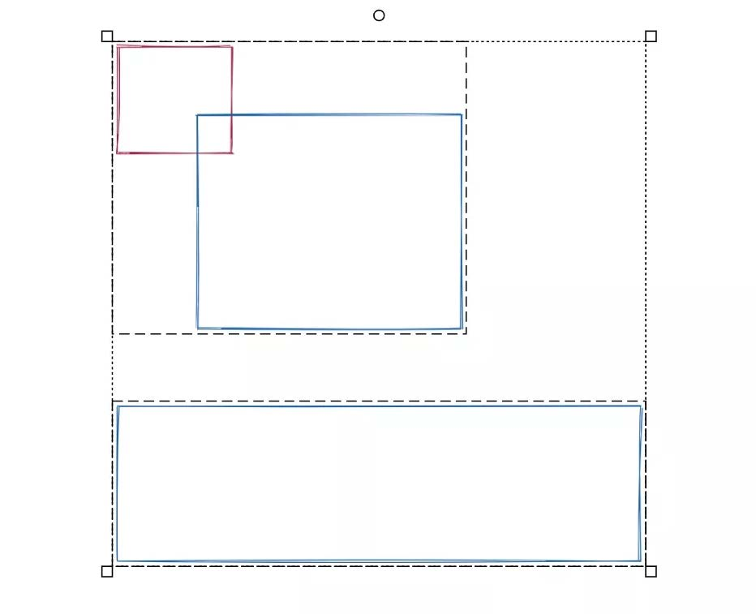

# 用 Excalidraw 更好地记录和表达


> 图形库： https://libraries.excalidraw.com/


## New Words
### 2021.07.13
#### 1. Excalibur `/ekˈskæləbə $ -bər/` n.亚瑟王的神剑
属于亚瑟王的剑的名字(the name of the sword belonging to King Arthur)

#### 2. Excalidraw `/ekˈskælədrɔ/` 神器

## Content

我写过一些关于画图的工具，比如《那些年，我追过的绘图工具》，《那些年，我追过的绘图
语言》，详细介绍过 graphviz，plantuml 等一些工具。这些工具能解决特定场合下的特定问
题，比如 plantuml 可以很方便地撰写时序图，或者描述状态迁移，但更加通用的图形，尤其
是用来捕获思维灵感的图形，就不适用。很长一段时间里，对于这样的需求，我偏爱使用
iPad 上的 notability 和 explain everything，效果很好，可是要把画出来的内容放在我用笔
记本写出来的文稿中，就涉及到设备之间内容的倒腾，如果反复修改的话，不得不在两个屏幕
之前切来切去，非常麻烦。在桌面上，虽说有一些还不错的工具，但它们有的过于笨重，启动
缓慢，使用费劲，比如 visio；有的功能速度都还不错，但三天两头催你付费，价格还贵得离
谱，比如 lucid chart，所以我一直都不太愿意用。去年年底到今年年初，我偶然发现了
excalidraw 这个免费的神器，开始我觉得它界面简陋，谁知用起来便一发不可收拾。短短六
七个月，我自己的私人仓库已经积攒了十多个文件，上百个各种各样的流程图，架构图和设计
图：


我用 excalidraw 来绘制流程图：


也用它梳理自己的一些架构思路：


用它来讲解概念：


让难懂的知识跃然纸上：


在一幅图中表达架构和架构背后的代码：


也可以做更加灵活的思维导图：


或者组织知识：


从宏观上把握 big picture：


揭示概念间的联系：


甚至，来点心灵鸡汤：


总之，只有你想不到的，没有你做不到的。今天，我们就来聊聊，如何让 excalidraw 也能成为你的效率工具。我们会讲这些内容：
- (1) 基本使用技巧
- (2) 高级技巧：组合，对齐和使用 library
- (3) 小贴士：代码高亮，制作曲线
- (4) 如何用 excalidraw 助力你的工作

### 1. Excalidraw 的基本使用
excalidraw 可以通过其官网 excalidraw.com 免费访问，你也可以 clone 其源代码，编译并本地运行。因为 excalidraw 是用 react 撰写的，所以本地运行需要有基本的前端开发的工具链。

如果不使用协作功能，excalidraw 完全是纯前端的工具，你不用担心数据的泄露问题。在 excalidraw 的界面下，你绘制的所有内容会临时存储在 localstorage 中，所以建议你经常 cmd/ctrl + S 将内容保存在本地文件里。你最好建立一个 github repo，然后把本地的 excalidraw 文件放在其中，定期 commit/sync 到 github，这样可以避免数据丢失，还可以随时在多个设备上访问之前的工作。excalidraw 的文件格式是 JSON，每个图形的大致结构如下，描述了图形的大小，位置，类型等信息：
```json
{
    type: type,
    x: x,
    y: y,
    width: width,
    height: height,
    ...
}
```
所以它很适合保存在 git 中（不过 diff 有点大）。

如果你对它如何实现很感兴趣，你可以看看：https://codesandbox.io/s/loving-hill-hzise，这是它最初的一百多行代码。

目前 excalidraw 已经被集成到很多工具中，比如 obisidian，roam。当然，我钟爱的 Notion 对其也有还不错的支持。你可以 `/excalidraw` 贴入 excalidraw.com 的网址，就可以在 Notion 中直接作图；


大部分时候，我们通过 excalidraw.com 作图即可。打开 excalidraw 后，其整体界面非常清爽，除了寥寥无几的工具按钮外，就是可以随意伸缩，到处都可以作图的 canvas 了。


#### 基本操作
屏幕中间最顶上的一排按钮，提供最常用的图形，建议你记住 1-8 这个 8 个快捷键对应的图形：

1. 指针。可以用来选择图形。
2. 方框。
3. 菱形。这个我用得不多。
4. 圆形。
5. 连接。在两个图形中建立一个连接线。连接线会随着两端图形的位置变化而变化。
6. 直线。
7. 随意绘制。我用得也不多。
8. 文字。在任意位置添加文字。
9. library。你可以将常用的图形储存在此，日后使用。

每个图形都有很多属性，其中边框，填充，颜色，字体大小都以最后一次的设置为准。比如你画了一个圆形，将其边框设置为虚线，那么你创建下一个图形的时候边框就自动是虚线了。

当你要绘制正方形，正圆，或者比较规矩的直线时，可以绘制的时候按住 Shift。

当你选中一个图形时，左侧的工具栏就会打开，你可以设置图形的各种属性，我就不详述了，你可以挨个试试，自己体验。

选中的图形上面会出现一个小圆圈，悬浮在上面会出现一只小手，你可以转动它，使它旋转相应的角度，同样的，按住 Shift 会得到比较正规的角度。

如果你在选中的图形上点击右键，可以打开一个上下文菜单，其中最有用的是更改层和层的位置，所以，记住 `cmd/ctrl + [/]` 可以把图形放在下面一层/上面一层，这经常会用到。

最后，如果你想把图形导出，可以选中一部分，然后点击左侧工具栏上的 Save as image：


根据需要，你可以导出成 PNG/SVG。

有了这些知识，你就可以做出大部分的图形了。当然，你肯定不想就此止步。我们继续往下读。


### 2. 高级技巧：组合，对齐和使用 library

#### 组合
当你选中多个图形时，可以将其组合在一起。你可以用 `Cmt/Ctrl + G` 将若干个图形组合，也可以 `Cmd/Ctrl + Shift + G` 将组合好的图形打散。注意 excalidraw 下组合好的图形，你依旧可以通过双击来选择其中一个图形，并对其做任何想做的修改，这一点很人性，省得你还需要打散（`Cmd/Ctrl + Shift + G`），修改，再从新组合（`Cmt/Ctrl + G`）。


#### 对齐
很多人在使用 excalidraw 时都不知如何进行对齐，这也是我被问到最多的问题。其实对齐相关的按钮就在左侧工具栏（看到 Align 了么），只不过它只有在你选择多个图形的时候有意义。对齐的快捷键很简单，`Cmd/Ctrl + Shift + 四个方向键`，分别对应左右上下对齐。一般而言，同时选择几个具有上下关系的图形，你想做的是左右对齐，绝对不会想做上下对齐（图形会都凑到一块），反之同理。如果你不小心搞乱了，没关系，可以用 `Cmd/Ctrl + Z` 一路恢复。



#### 使用 library
你自己经常使用的图形，做好后，可以组合起来，选中后点右键，然后 "Add to library"，之后你就可以用快捷键 9 调出 library 使用这个图形了。除了我自己的图形外，我还在网上找了不少图形，放在 library 里备用。


### 3. 小贴士：代码高亮，制作曲线

#### 合理搭配颜色字体等属性
绘图的时候注意合理地搭配颜色，字体大小，填充与否，边框是实线还是虚线。excalidraw 预置的颜色非常舒服，建议你使用这几种即可，顶多再使用一些 999/eee 这样的浅灰色用在公隔线上或者虚线框。

#### 代码高亮的小技巧
有朋友经常问我图中的代码使用不同颜色高亮是怎么做到的， 比如上面例子中的这段代码:


说出来真实很简单，就是两个文本框而己，第一个文本框我把要高亮的代码去掉， 用一个空行留足位置，然后另一个文本框焕个颜色，把代码放进去就可以了。

#### 制作曲线
当你使用快捷键 5 在两个图形中建立链接时， 你可能不想一条直线连过去， 而是想做类似下图的曲线。这真实不难一一你先从左边的图形出发画一条向上的线， 然后双击这条线，使其头尾出现红色的小圆圈，此时，按下 `option/alt` 键， 移动鼠标， 你就会发现从之前的路径到鼠标的新位置，延伸出一条新的线段。当你确定好位置后，点击鼠标，就完成了。你可以重复这个动作，在起点和终点间生成蜿蜒曲折的路径：


如果你不小心加了太多的点， 可以双击后，点击其中某个要删除的店，然后按 Delete 建。你可以选择右键菜单里的 Delecte 进行操作：


### 4. 如何用 excalidraw 助力你的工作
通过上面大概 10-20 分钟的介绍，你应该对 excalidraw 有一个不锚的认识。excalidraw 真
的很容易使用， 尤真是熟悉了快捷键之后，你的手速可以几乎相思维速度保持一致。那么接
下来， 如何在工作中用好 excalidraw 呢?

大部分时候，你可能需要想清楚你怎样把信息尽可能清晰地送达你的听众。你是要画一个流程图，还是一个架构图，还是数据结构的示意图，还是其他的什么。在绘图的时候，尽量用不同的颜色表述不同的流程，这样让别人比较容易 follow ，如下图：


当你画数据结构时，你可以用传统的方式展开它们的结构：


也可以铺平来揭示数据之间的联系(逻辑上的和物理上的引用关系):


如有必要，你也可以把架构，代码，流程和数据结构组织在一起，共同说明一件事情：


一般来说，如果你能够用白板阐述一个东西，那么你也能用 excalidraw 很好地阐述它。

如果你不善于自极表达怎么办?

没关系。excalidraw 是一个无边的白板，所以你可以先把思绪中有的的信息先一般脑 dump 到 excalidraw 里，然后再进行组织。我一般是这么来做的:
1. 首先把信息分成大致的几个部分， 用方框(快捷键 2)把它们框起来
2. 用快捷键 5， 把几个框起来的部分联系起来
    - b. 如果连接线有先后顺序，那么为其标上序号
    - c. 如果连接线可以分组，那么用不同的颜色标识不同的分组
3. 在每个大框内，重复 1-2 步，直到感觉分得足够细或者把问题能够阐述清楚
4. 考虑对不同的部分使用不罔的字体颜色
5. 对于连续，考虑哪些要加重，哪些可以用较轻的颜色表述，甚至，用虚线
6. 看着整个图形是不是方框太多，也许可以删掉一些方框让图形更简洁一些
7. 把确定下来的子图用 `cmd/crl + G` 组合起来
8. 导出

这个流程只是一个例子，你可以逐渐形成自己的风格。如果你依然觉得通过这种方式来组织你的思想还是很难把事情表述清楚，那么，你可以多看看别人画的图， 用 excalidraw 抄一抄，在抄的过程中感受别人是如何把事情解释清楚，他们的思维模式是什么样子的。当你抄得多了，见识了各种各样的表述方式， 你就会越来越有感觉的。
最后， exca l i draw 是个表达工具，你不一定非要将冥用在相软件开发有关的场合。在你阅读
书籍的时候也可以用它来记录你自己的心得或者厘清作者的思路。所以， 除了可以将冥作为
一个表达工具去表达你自己的思想，还可以将莫作为一个记录工翼，记录你学习过程中对事
物的理解。很多场合下，它筐至可以取代思维导图。
希望通过本文的学习，你可以I11页畅地使用excalidraw ，并爱上这个工具!

