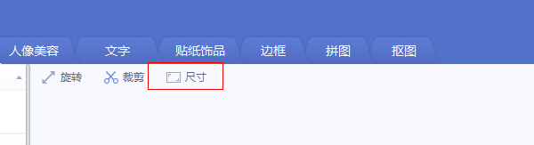

# 如何使用美图秀秀或 PS 修改证件照

## 0. 证件照的要求
一般需要上传证件照的网站, 对证件照的要求主要有 2 点
+ (1) 尺寸为 `358 * 441`px
+ (2) 大小不能超过 20kb

## 1. 使用美图秀秀修改证件照
1. 打开美图秀秀，把图片拉入到主窗口， 点击下图中的 `尺寸`

2. 在当前的弹框中输入 `358 * 441` ，单位选择 `像素`，把 `锁定长度比例` 取消， 然后点击 `确定`。图示如下：

3. 然后点击当前窗口右上角的 `保存` 按钮， 在弹出窗口中 `画质调整` 中滑动按钮，来调节要保存图片的大小， 画质越高图片越大，反之越小。图示如下：

## 2. 使用 PS 修改证件照
