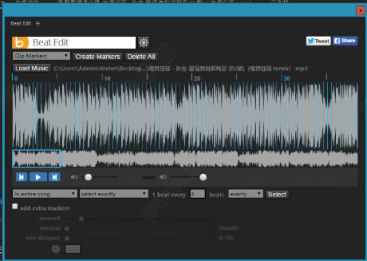
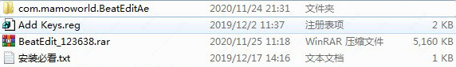
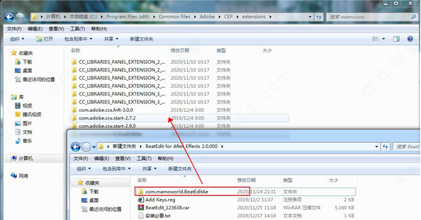
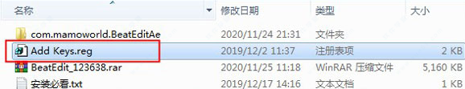
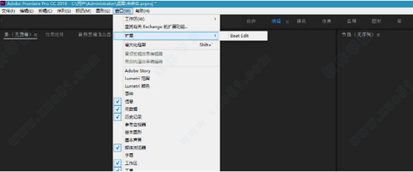

# Beat Edit 使用

BeatEdit插件是一款可以帮助pr软件增加新功能的一款实用插件，大家对于pr软件想必知道的挺多的吧，它是一款可以进行各种[视频编辑](http://www.xue51.com/zt/spbjgj/)的强大剪辑软件，功能十分好用，基本上能够满足各位用户们的使用需求，轻轻松松就能制作出非常厉害的视频大片。但是再怎样肯定有些功能是它所没有的，所以它是可以配合各种插件来使用，而小编带来的这款插件就能够非常适用于pr软件，它的功能就是能够根据音乐不同的节点去进行智能的剪辑作用，通俗点来说就能够根据你提供的音频文件去进行踩点剪辑，并且这个过程中是全自动完成的非常的省心省时，当然了用户们想要自己去手动编辑的话也是可以进行设置的，听起来是不是非常的方便，对于有需要这方面的朋友们来说这绝对非常的不错，小编给大家带来的是**BeatEdit插件2020汉化版**，支持简体中文更加方便我们进行工作，感兴趣的朋友们快来下载试试吧！

### 软件特色

1、强大的，先进的节拍检测。

2、创建序列标记或剪辑标记。

3、与[Premiere](http://www.xue51.com/zt/Premierebbdq/) Pro中的Automate to Sequence功能兼容。

4、随机选择节拍以创建更多变化。

5、除了节拍之外，还可以选择在其他有节奏的相关点创建额外的标记。

### BeatEdit插件使用教程

1、将下载好的压缩包进行解压得到以下文件

2、将 "com.mamoworld.BeatEditAe" 文件夹复制到 `C:Program Files(x86)/Common Files/Adobe/CEP/extensions`

3、双击运行"Add Keys.reg"

4、打开Adobe Premiere，在顶部菜单，窗口-扩展，即可打开脚本使用

### 软件功能

1、稳健的节拍跟踪技术
BeatEdit插件依赖于全球音乐研究团队开发的高度稳健的节拍跟踪技术。使用的节拍跟踪器（IBT）由波士顿INESC大学的声音和音乐计算组开发。还依赖于在维多利亚大学副教授George Tzanetakis的指导下开发的MARSYAS（音频信号的音乐分析，检索和综合）框架。

2、Premiere Pro时间线示例
在节拍检测发生后，我们在Premiere Pro时间轴中为某些节拍生成序列标记

+ （1）然后，我们使用Premiere Pro中的Automate To Sequence功能自动生成基于这些标记的切割
+ （2）除了序列标记之外，我们还为音轨
+ （3）中的所有节拍生成剪辑标记。如果我们想要稍后手动修改任何剪辑，同时仍然确保它们准确地[放置](http://www.xue51.com/zt/fzyxph/)在节拍的位置，这些作为指南很有用。

3、用户界面
 使用节拍是非常直观的：在用户界面中，它们可视化为蓝色条，并在播放期间听到咔嗒声。用户界面还提供灵活的工具来选择特定的节拍，以及在其他有节奏的相关点添加额外的标记。

### 常见问题

1、我可以将Beats导入[After Effects](http://www.xue51.com/zt/afterefftsdq/)吗？
是。在Premiere Pro中使用BeatEdit生成剪辑标记时，它们存储在实际的音频文件中。当您使用After Effects（或在另一个Premiere Pro项目中）打开相同的音频文件时，标记仍然存在。此外，如果生成序列标记并将序列从Premiere拖放到[AE](http://www.xue51.com/zt/AEbbhj/)，则序列标记将与序列一起导入。

2、与After Effects的击败助手有什么区别？
用于Premiere Pro和用于After Effects的Beat Assistant非常不同。

3、适用于Premiere Pro
有一种更健壮和准确的节拍检测引擎。与Ae工具相比，它不仅预测每分钟的节拍，而且预测每个节拍的实际位置（以及其他节奏相关点）。
有一个非常强大和直观的界面，可视化和选择个人节拍

4、After Effects的节拍助手
与CS4以来的所有After Effects版本兼容，而Premiere Pro仅与CC 2014和CC 2015兼容
也可以生成关键帧和交错层
因此，如果您使用旧版本的After Effects（或者如果它对您生成关键帧或交错图层非常重要），After Effects的Beat Assistant可能是您的最佳选择。但在大多数情况下，Premiere Pro将是一个更好，更强大，更准确和灵活的解决方案。。
