# PR 有哪些常用快捷键

作者：影视设计师
链接：https://www.zhihu.com/question/34471615/answer/1887504027
来源：知乎
著作权归作者所有。商业转载请联系作者获得授权，非商业转载请注明出处。

## 单按键列表
- `V`（鼠标选择键）
- `C`（刀片工具）
- `A`（向前选择轨道工具）
- `I`（开头定位）
- `O`（结尾定位）
- `D`（选择当下时间线的轨道）
- `方向键`（可以跳到上**/**下剪辑点）
- `鼠标涡轮`（调整序列位置）
- `HOME`（跳到序列第一帧）
- `END`（跳到序列最后一帧）
- `M`（序列上的标签）
- `T`（添加文本框） 

## 组合按键列表

- `Ctrl + \`（全屏）
- `Ctrl+Alt+K`（键盘快捷键设置界面）
- `Shift+delete`（波纹删除）
- `Ctrl+左键`（拉动视频）
- `Alt+鼠标涡轮`及 `+，-`（比例调整）

## 常用快捷键之单按键

**单按键介绍：**

### 1、“V”（鼠标选择键）

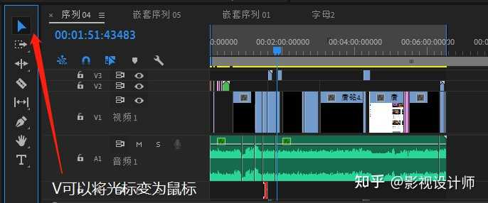

最简单也是最常用的一个按键就是“V”了，无论你选择插件又或者是选择视频都需要用的的鼠标选择键。
只需轻点V，就可以自动将光标切换过来再也不用慢慢的去点击切换，是不是很方便呢！

### 2、“C”（刀片工具)

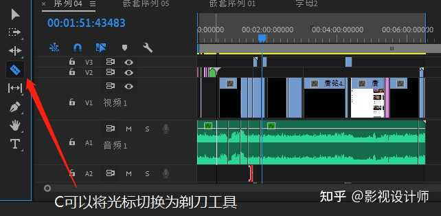

刀片工具可以说是PR的核心所在了，没有了刀片工具，我就不用秃头了，PR就没有了灵魂，更是剪辑不了视频。
与刚才提到的“鼠标工具相同道理，也只是轻敲键盘“C”就可以快速简单的实现将鼠标转换成刀片进行剪辑。

### 3、“A”（向前选择轨道工具）

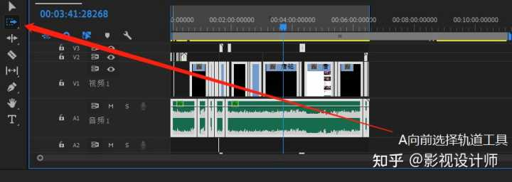

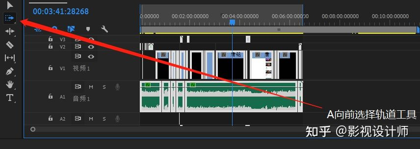

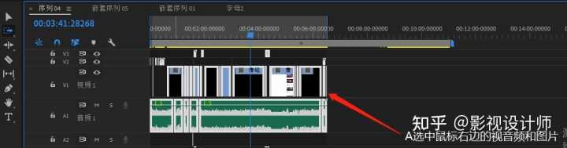

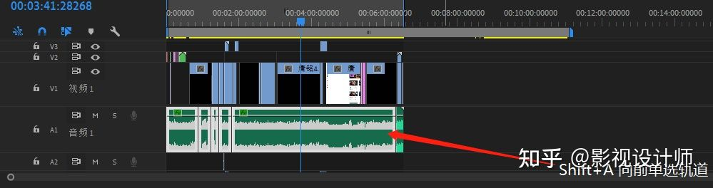

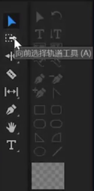

有多少人现在选择剪辑片段还是用鼠标慢慢的框起来呢，哎不用这么麻烦，我们只需要按一下键盘“A”就可以实现将鼠标所在的视频、音频片段选择起来了。
而当我们需要选取单轨道视频片段的时候，我们只需要按住Shift+A就可以实现了，是不是简单又实用呢 ！

### 4、 “I”（开头定位）/“O”（结尾定位）

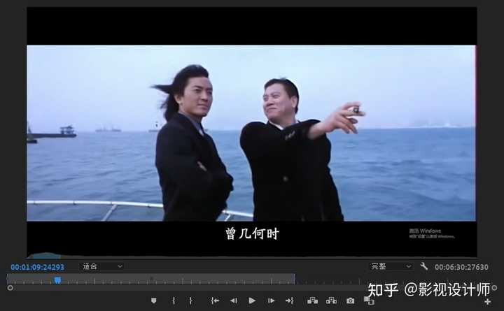

[img](pr 有哪些常用快捷键.assets/v2-613db61f066252b4d53d94e60d36aeab_1440w.jpg)

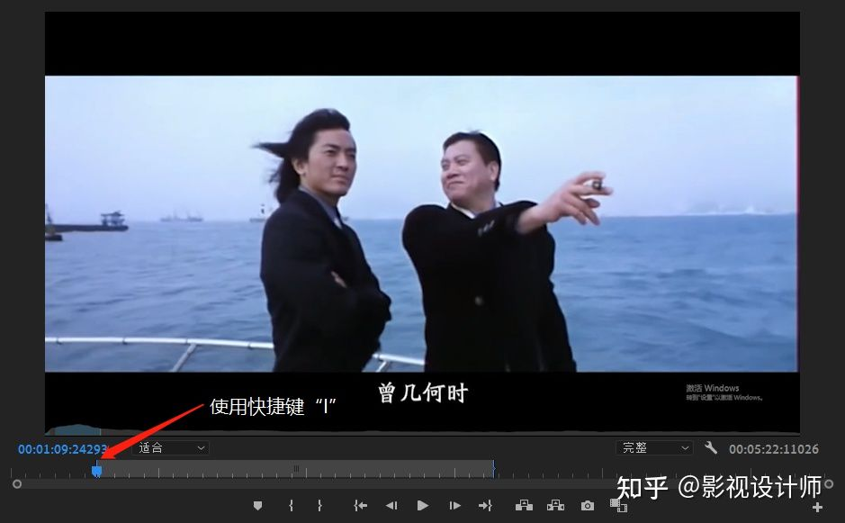

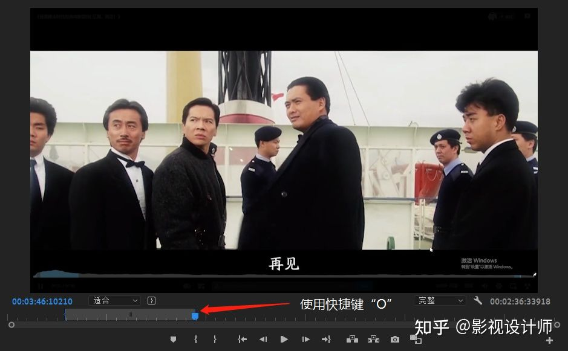

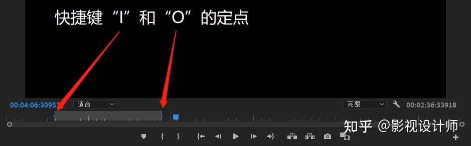

"I"和"O"是一组相对的工具，“I”代表的是IN，就是指你在视频剪辑时为你做出定点为视频剪辑的开始点，“O”代表的就是out，指的是你在视频剪辑时为你做出视频剪辑的结束点。
简单运用“I”和“O”可以帮助你快速定位视频的重要核心部分，再也不用看着视频拿着剃刀工具一点一点剪辑啦！

### 5、“D”（自动选择当下时间线的轨道）

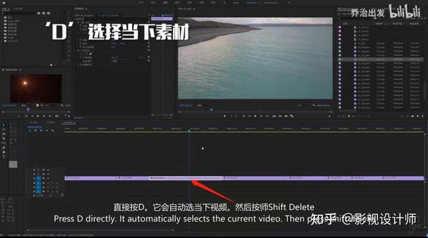

在我们在观看剪辑的视频的同时，刚好想对视频片段进行修改和剪辑的时候，我们只是需要按D键便可以直接自动选择当下的素材。

### 6、“方向键”（可以跳到上/下一个剪辑点）

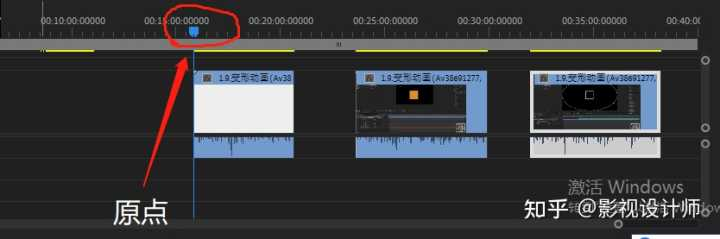

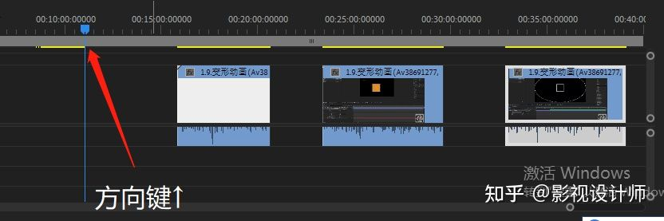

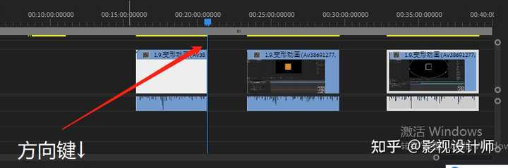

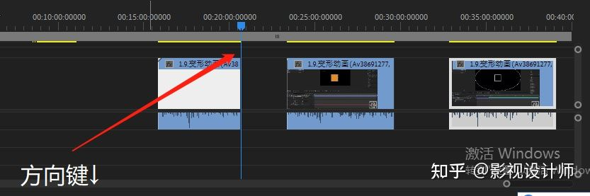

在我们剪辑视频的时候为图方便，我们可以通过方向键来进行简单的操作，如通过上下来操控跳到下一个剪辑点，这些基础操作是不是既简单又方便呢？

### 7、"HOME" 键和 "END" 键

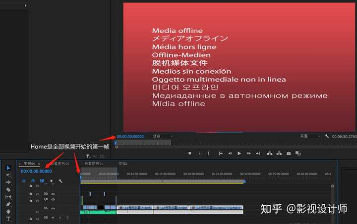

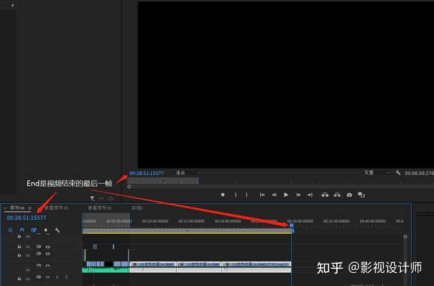

关于[Home和End](https://www.zhihu.com/search?q=Home和End&search_source=Entity&hybrid_search_source=Entity&hybrid_search_extra={"sourceType"%3A"answer"%2C"sourceId"%3A1887504027})，相信大家从字面意思就可以知道用处，要是不太清楚的话也没有关系，简单来说Home便是跳到你所选的序列里的第一帧也可以理解为开头，而相对的End便是跳到你所选序列里的最后一帧，理解为结尾即可。这样说是不是简单方便不少了呢！

### 8、“M”（序列上的标签）

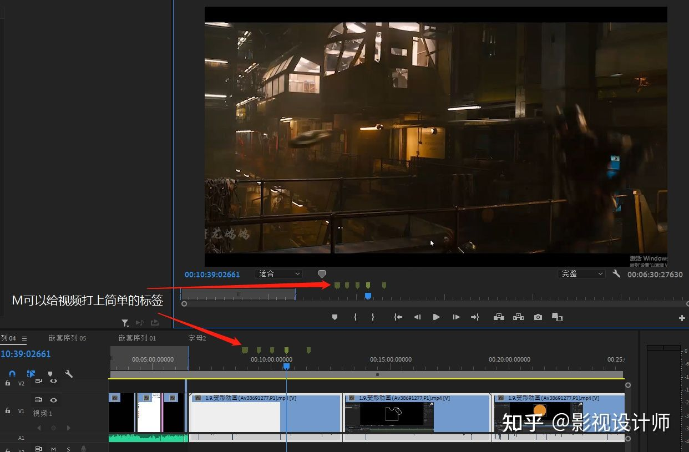

当我们的视频剪辑中有许多的画面以及专场等，剪辑起来思路繁杂草率，要是在加上背景或者音乐的情况下，剪辑更是显得无从下手。
这时候我们就可以给我们的素材打上标签，我们使用M按键在音频上便会出现一个个的小点点。这时候根据自己喜爱的节奏进行转场、剪辑、衔接就更加有节奏感了。特别适合新手小白上手，剪辑有节奏的视频再也不是梦！！

### 9、“T”（添加文本框）

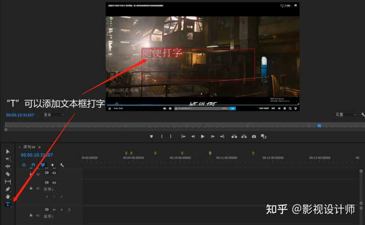

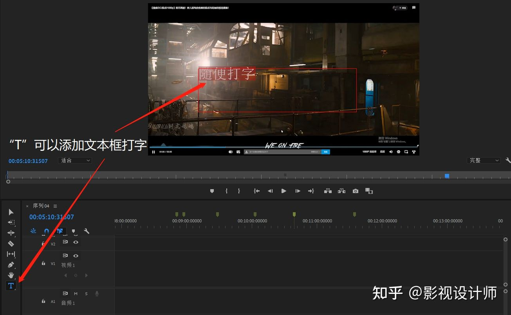

在剪视频的时候，总避免不了要给视频配音输入文字，这时候我们只需要简单按"T"就可以将鼠标光标替换成文本框工具，不仅简单操作而且还高效 ！！

------

## 常用快捷键之组合键：

### 1、 `ctrl + \`（全屏）

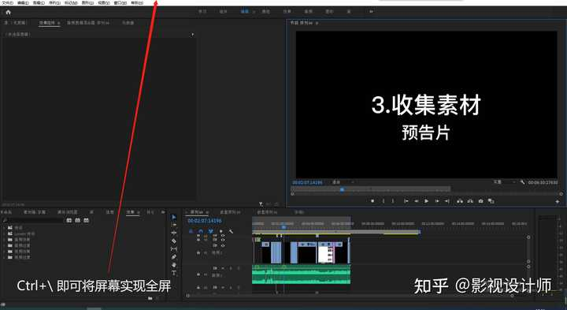

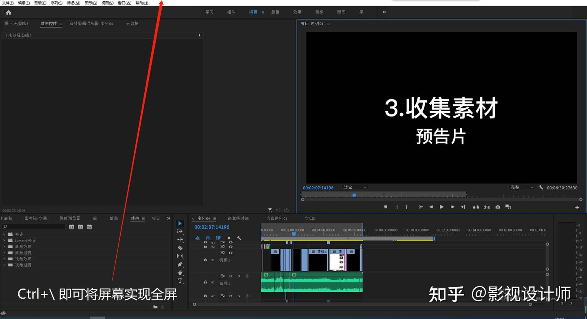

在我们剪辑视频的过程中，一定有大大小小不同的页面布局，剪视频的素材资源多了，也就容易看得眼花撩乱，一个不小心删错了东西可就大麻烦了。
用Ctrl+/ 全屏模式，页面清晰简洁，乱杂问题一键搞定！

### 2、`Ctrl + Alt + K` （键盘快捷键设置界面）

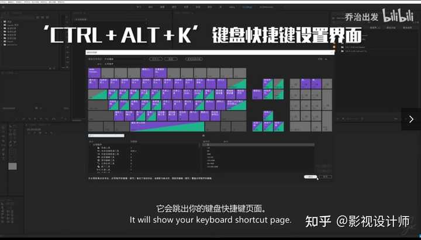

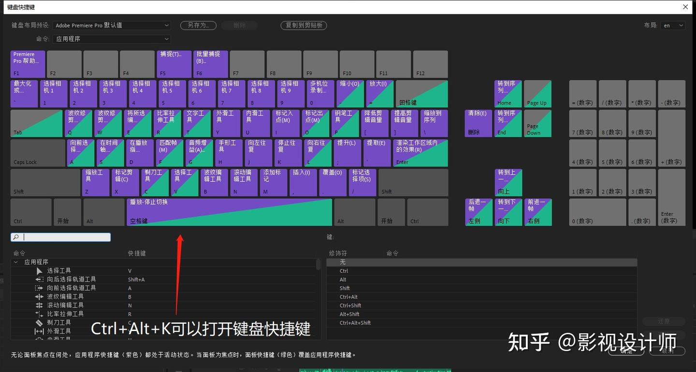

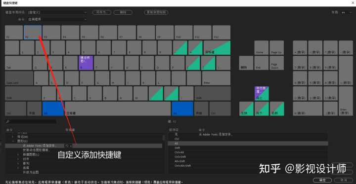

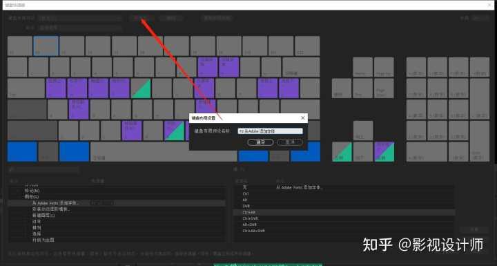

在我们剪辑的过程中，有许多复杂的按键，为了提高剪辑速率我们可以不妨试一下Ctrl+Alt+K，打开键盘快捷键设置界面，我们就可以自定义按键来方便我们剪辑，当然千万要记得保存！！

### 3、`Shift + delete`（波纹删除）

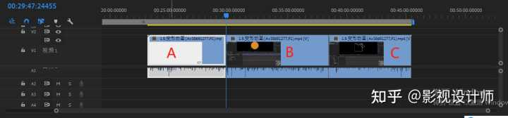

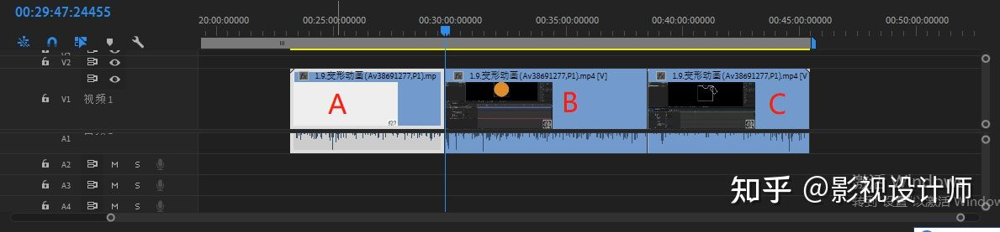

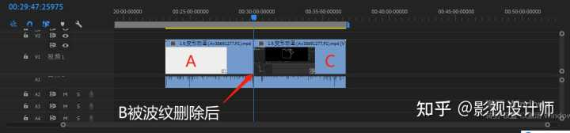

我相信不少小伙伴在剪辑视频的时候都遇到过这种问题，将前面一个视频片段删除后会在原地留下一个空位，这时候就需要把后面剪好的视频一点一点的往前移动，主要是麻烦还不说，一个不小心要是按错删除了，可就得不偿失了。
对此告诉大家一个小技巧，只要按住Shift+Delete，便是波纹删除，删除片段后是不是神奇的发现后面衔接的片段便自己往前凑了呢，如图将B使用波纹删除后A和C自己就靠在一起了。感觉自己的视频瞬间长大成熟了让人省心了不少。

### 4、`Ctrl + 左键`（拉动视频）

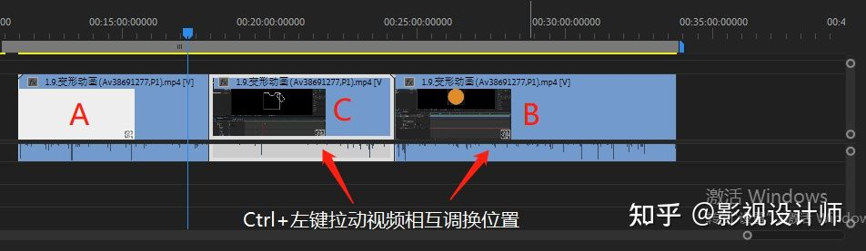

如图上所述，我们要拖动视频的时候一个一个的进行拉动，总不能精准的做到百分百的完全贴合，又要花时间一点一点的进行调整，不仅花费了很多时间不说，还要忍得下心来一点一点的拉扯视频片段。
面对这一问题，这时候我们只需要按住Ctrl+鼠标左键，便可以将两个视频片段的位置相互调换而且中间还不会出现小间隙和小空白区域。简直不要太方便了。

### 5、`Alt + 鼠标涡轮` 及 `+，-`（比例调整）

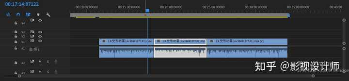

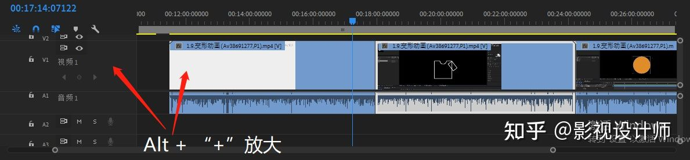

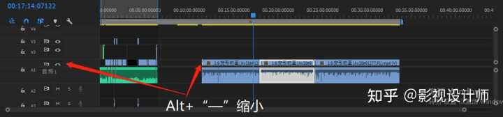

通过使用鼠标中间的小滑轮，我们就可以调整视频的长度前后，即调整序列位置。

当我们按住 Alt + 鼠标滑轮 或者 “+ / -” 的时候我们便可以控制面板的比例大小。

